# Проектирование мобильного приложения

<!-- 
Тема 3.2 
4
Промежуточная аттестация
2 
-->

>Содрано в основном [отсюда](https://sites.google.com/site/anisimovkhv/learning/pris/lecture)

## UML

**Унифицированный язык моделирования** (UML) в настоящий момент является стандартом де-факто при описании (документирования) результатов проектирования и разработки объектно-ориентированных систем. Начало разработки UML было положено в 1994 г. Гради Бучем и Джеймсом Рамбо, работавшим в компании Rational Software. Осенью 1995 г. к ним присоединился Ивар Якобсон и в октябре того же года была выпущена предварительная версия 0.8 унифицированного метода. С этого времени было выпущено несколько версий спецификации UML.

### Нотация UML

Нотация представляет собой графическую интерпретацию семантики для ее визуального представления.

В UML определено три **типа сущностей**:

- структурная – абстракция, являющаяся отражением концептуального или физического объекта;
- группирующая – элемент, используемый для некоторого смыслового объединения элементов диаграммы;
- поясняющая (аннотационная) – комментарий к элементу диаграммы.

**Диаграмма** представляет собой группировку элементов нотации для отображения некоторого аспекта разрабатываемой информационной системы. Диаграммы представляют собой, как правило, связный граф, в котором сущности являются вершинами, а отношения – дугами. В следующей таблице дана краткая характористика диаграмм UML:

Диаграмма | Назначение
----------|-----------
[Вариантов использования](#диаграмма-вариантов-использования) (use case) | Отображает функции системы, взаимодействие между акторами и функциями
Классов (class) | Отображает набор классов, интерфейсов и отношений между ними
Пакетов (package) | Отображает набор пакетов и отношений между ними
Автоматов (state machine) | Отображает состояния сущности и переходы между ними в процессе ее жизненного цикла
Деятельности (activity) | Отображает бизнес-процессы в системе (описание алгоритмов поведения)
[Последовательности](#диаграмма-последовательности) (sequence) | Отображает последовательность передачи сообщений между объектами и акторами
Коммуникации (communication) | Аналогична диаграмме последовательности, но основной акцент делается на структуру взаимодействия между объектами
Компонентов (component) | Отображает компоненты системы (программы, библиотеки, таблицы и т.д.) и связи между ними
Развертывания (deployment) | Отображает размещение компонентов по узлам сети, а также ее конфигурацию

Часть диаграмм после их построения требует развития и уточнения в рамках разработки следующей модели (технологического процесса). Так, например, диаграммы вариантов использования должны быть уточнены при разработке модели анализа. В моделях вариантов использования и анализа разрабатывается и уточняется диаграмма классов анализа, а в модели проектирования – итоговая детализированная диаграмма классов. Как правило, диаграмма классов анализа и диаграмма классов существуют независимо.

### Диаграмма вариантов использования

>Используемые материалы:
>
>* [Диаграмма прецедентов (простенько, но не полно)](https://planerka.info/item/diagramma-precedentov-variantov-ispolzovaniya-uml/)
>* [Более полное описание](https://intuit.ru/studies/courses/32/32/lecture/1004)
>* [Конспект лекции (с видео) от WorldSkills](https://nationalteam.worldskills.ru/skills/proektirovanie-use-case-diagrammy-opredelenie-funktsionalnykh-vozmozhnostey-sistemy/)

#### Общие понятия

**Диаграмма вариантов использования** (use case diagram) — диаграмма, на которой изображаются отношения между *акторами* и *вариантами использования* (*прецедентами*).

>Актор это калька с английского *Actor* что расшифровывается как *действующее лицо* (**Act** - действие, суффикс **-or** - человек, осуществляющий действие) 

**Диаграмма вариантов использования** - это исходное концептуальное представление или концептуальная модель системы в процессе ее проектирования и разработки. Создание диаграммы вариантов использования имеет следующие цели:

* Определить общие границы и контекст моделируемой предметной области на начальных этапах проектирования системы
* Сформулировать общие требования к функциональному поведению проектируемой системы
* Разработать исходную концептуальную модель системы для ее последующей детализации в форме логических и физических моделей
* Подготовить исходную документацию для взаимодействия разработчиков системы с ее заказчиками и пользователями

Назначение данной диаграммы состоит в следующем: проектируемая информационная система представляется в форме так называемых *вариантов использования*, с которыми взаимодействуют внешние сущности или *акторы*. При этом *актором* или действующим лицом называется любой объект, субъект или система, взаимодействующая с моделируемой бизнес-системой извне. Это может быть человек, техническое устройство, программа или любая другая система, которая служит источником воздействия на моделируемую систему так, как определит разработчик. *Вариант использования* служит для описания сервисов, которые система предоставляет *актору*. Другими словами каждый *вариант использования* определяет набор действий, совершаемый системой при диалоге с *актором*. При этом ничего не говорится о том, каким образом будет реализовано взаимодействие акторов с системой и собственно выполнение *вариантов использования*.

Рассматривая диаграмму *вариантов использования* в качестве модели бизнес-системы, можно ассоциировать ее с "черным ящиком". Концептуальный характор этой диаграммы проявляется в том, что подробная детализация диаграммы или включение в нее элементов физического уровня представления на начальном этапе проектирования скорее имеет отрицательный характор, поскольку предопределяет способы реализации поведения системы. Эти аспекты должны быть сознательно скрыты от разработчика на диаграмме *вариантов использования*.

В самом общем случае, диаграмма *вариантов использования* представляет собой граф специального вида, который является графической нотацией для представления конкретных *вариантов использования*, *акторов* и отношений между этими элементами. При этом отдельные элементы диаграммы заключают в прямоугольник, который обозначает границы проектируемой системы. В то же время отношения, которые могут быть изображены на данном графе, представляют собой только фиксированные типы взаимосвязей между *акторами* и *вариантами использования*, которые в совокупности описывают сервисы или функциональные требования к моделируемой системе.

Базовыми элементами диаграммы вариантов использования являются *вариант использования* и *актор*.

**Вариант использования** (use case) — последовательность действий, которые система или другая сущность могут выполнять в процессе взаимодействия с *акторами* (во многих источниках *вариант использования* называют *прецедентом*, не надо пугаться и путаться - это одно и то же).

*Вариант использования* представляет собой спецификацию общих особенностей поведения или функционирования моделируемой системы без рассмотрения внутренней структуры этой системы. Несмотря на то, что каждый вариант использования определяет последовательность действий, которые должны быть выполнены проектируемой системой при взаимодействии ее с соответствующим актором, сами эти действия не изображаются на рассматриваемой диаграмме.

Содержание *варианта использования* может быть представлено в форме дополнительного пояснительного текста, который раскрывает смысл или семантику действий при выполнении данного *варианта использования*. Такой пояснительный текст получил название текста-сценария или просто сценария. Далее рассматривается один из шаблонов, который может быть рекомендован для написания сценариев вариантов использования.

Отдельный *вариант использования* обозначается на диаграмме эллипсом, внутри которого содержится его краткое имя в форме **отглагольного существительного** с пояснительными словами. Сам **текст** имени варианта использования должен начинаться **с заглавной буквы**.

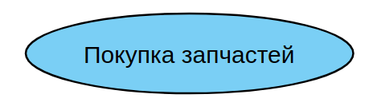

Цель *варианта использования* заключается в том, чтобы зафиксировать некоторый аспект или фрагмент поведения проектируемой системы без указания особенностей реализации данной функциональности. В этом смысле каждый *вариант использования* соответствует отдельному сервису, который предоставляет моделируемая система по запросу *актора*, т.е. определяет один из способов применения системы. Сервис, который инициализируется по запросу *актора*, должен представлять собой **законченную последовательность действий**. Это означает, что после того как система закончит обработку запроса *актора*, она должна возвратиться в исходное состояние, в котором снова готова к выполнению следующих запросов.

Диаграмма *вариантов использования* содержит конечное множество *вариантов использования*, которые в целом должны определять все возможные стороны ожидаемого поведения системы. Для удобства множество *вариантов использования* может рассматриваться как отдельный пакет. Применение *вариантов использования* на всех этапах работы над проектом позволяет не только достичь требуемого уровня унификации обозначений для представления функциональности подсистем и системы в целом, но и является мощным средством последовательного уточнения требований к проектируемой системе на основе их итеративного обсуждения со всеми заинтересованными специалистами.

Примерами *вариантов использования* могут быть следующие действия: проверка состояния текущего счета клиента, оформление заказа на покупку товара, получение дополнительной информации о кредитоспособности клиента, отображение графической формы на экране монитора и другие действия.

**Актор (actor)** — согласованное множество ролей, которые играют внешние сущности по отношению к *вариантам использования* при взаимодействии с ними.

*Актор* представляет собой любую внешнюю по отношению к моделируемой системе сущность, которая взаимодействует с системой и использует ее функциональные возможности для достижения определенных целей или решения частных задач. Каждый *актор* может рассматриваться как некая отдельная роль относительно конкретного варианта использования. Стандартным графическим обозначением актора на диаграммах является фигурка "человечка", под которой записывается имя актора

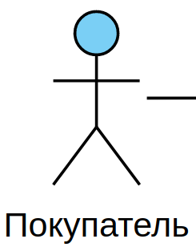

Имена *акторов* должны начинаться с заглавной буквы и следовать рекомендациям использования имен для типов и классов модели.

Имя *актора* должно быть достаточно информативным с точки зрения семантики. Для этой цели подходят наименования должностей в компании (например, Продавец, Кассир, Менеджер, Президент).

*Акторы* используются для моделирования внешних по отношению к проектируемой системе сущностей, которые взаимодействуют с системой. В качестве *акторов* могут выступать другие системы, в том числе подсистемы проектируемой системы или ее отдельные классы. Важно понимать, что каждый *актор* определяет согласованное множество ролей, в которых могут выступать пользователи данной системы в процессе взаимодействия с ней. В каждый момент времени с системой взаимодействует вполне определенный пользователь, при этом он играет или выступает в одной из таких ролей. Наиболее наглядный пример *актора* — конкретный покупатель в магазине автозапчастей.

Поскольку в общем случае *актор* всегда находится вне системы, его внутренняя структура никак не определяется. Для *актора* имеет значение только его внешнее представление, т.е. то, как он воспринимается со стороны системы. *Акторы* взаимодействуют с системой посредством передачи и приема сообщений от *вариантов использования*. Сообщение представляет собой запрос актором сервиса от системы и получение этого сервиса. Это взаимодействие может быть выражено посредством ассоциаций между отдельными акторами и вариантами использования. Кроме этого, с *акторами* могут быть связаны интерфейсы, которые определяют, каким образом другие элементы модели взаимодействуют с этими *акторами*.

#### Отношения на диаграмме вариантов использования

Между элементами диаграммы *вариантов использования* могут существовать различные *отношения*, которые описывают взаимодействие экземпляров одних *акторов* и *вариантов использования* с экземплярами других *акторов* и *вариантов*. Один *актор* может взаимодействовать с несколькими *вариантами использования*. В этом случае этот *актор* обращается к нескольким сервисам данной системы. В свою очередь один *вариант использования* может взаимодействовать с несколькими *акторами*, предоставляя для всех них свой сервис.

В то же время два *варианта использования*, определенные в рамках одной моделируемой системы, также могут взаимодействовать друг с другом, однако характор этого взаимодействия будет отличаться от взаимодействия с *акторами*. В обоих случаях способы взаимодействия элементов модели предполагают обмен сигналами или сообщениями, которые инициируют реализацию функционального поведения моделируемой системы.

В языке UML имеется несколько стандартных видов отношений между акторами и вариантами использования:

* ассоциации (association relationship)
* включения (include relationship)
* расширения (extend relationship)
* обобщения (generalization relationship)

**Отношение ассоциации** – одно из фундаментальных понятий в языке UML и в той или иной степени используется при построении всех графических моделей систем в форме канонических диаграмм. Применительно к диаграммам *вариантов использования* *ассоциация* служит для обозначения специфической роли *актора* при его взаимодействии с отдельным *вариантом использования*. На диаграмме вариантов использования *отношение ассоциации* обозначается сплошной линией между *актором* и *вариантом использования*. Эта линия может иметь некоторые дополнительные обозначения, например, *имя* и *кратность*.

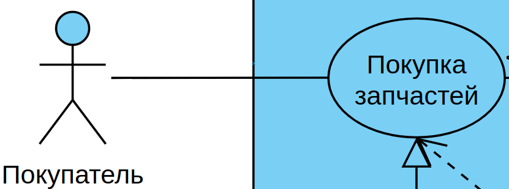

В контексте диаграммы *вариантов использования* **отношение ассоциации** между *актором* и *вариантом использования* может указывать на то, что *актор* инициирует соответствующий *вариант использования*. Такого актора называют главным. В других случаях подобная ассоциация может указывать на актора, которому предоставляется справочная информация о результатах функционирования моделируемой системы. Таких акторов часто называют второстепенными.

**Включение (include)** в языке UML — это разновидность отношения зависимости между базовым вариантом использования и его специальным случаем. При этом отношением зависимости (dependency) является такое отношение между двумя элементами модели, при котором изменение одного элемента (независимого) приводит к изменению другого элемента (зависимого).

Отношение включения устанавливается только **между двумя вариантами использования** и указывает на то, что заданное поведение для одного варианта использования включается в качестве составного фрагмента в последовательность поведения другого варианта использования.

Так, например, отношение включения, направленное от варианта использования "Предоставление кредита в банке" к варианту использования "Проверка платежеспособности клиента", указывает на то, что каждый экземпляр первого варианта использования **всегда** включает в себя функциональное поведение или выполнение второго варианта использования. В этом смысле поведение второго варианта использования является частью поведения первого варианта использования на данной диаграмме. Графически данное отношение обозначается как отношение зависимости в форме пунктирной линии со стрелкой, направленной от базового варианта использования к включаемому варианту использования. При этом данная линия помечается стереотипом "include".

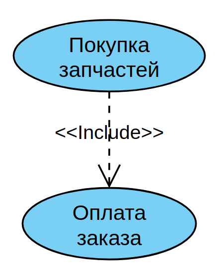

Семантика этого отношения определяется следующим образом. Процесс выполнения базового варианта использования включает в себя, как собственное, подмножество последовательность действий, которая определена для включаемого варианта использования. При этом выполнение включаемой последовательности действий происходит всегда при инициировании базового варианта использования.

Один вариант использования может входить в несколько других вариантов, а также содержать в себе другие варианты. Включаемый вариант использования является независимым от базового варианта в том смысле, что он предоставляет последнему инкапсулированное поведение, детали реализации которого скрыты от последнего и могут быть легко перераспределены между несколькими включаемыми вариантами использования. Более того, базовый вариант зависит только от результатов выполнения включаемого в него варианта использования, но не от структуры включаемых в него вариантов.

В нашем случае *прецедент* "оплатить заказ" на входе получает список товаров (причем не важно откуда, от клиента в магазине или от онлайн-покупателя на сайте).

**Отношение расширения** (extend) определяет взаимосвязь базового варианта использования с другим вариантом использования, функциональное поведение которого задействуется базовым не всегда, а только при выполнении дополнительных условий.

В языке UML отношение расширения является зависимостью, направленной к базовому варианту использования и соединенной с ним в так называемой точке расширения. Отношение расширения между вариантами использования обозначается как отношение зависимости в форме пунктирной линии со стрелкой, направленной от того варианта использования, который является расширением для базового варианта использования. Данная линия со стрелкой должна быть помечена стереотипом "extend".

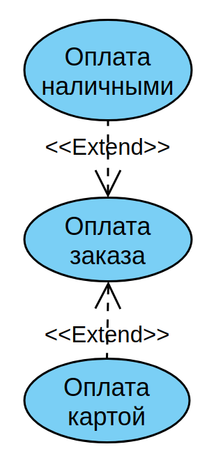

В нашем случае, при оплате в магазине доступны оба расширения, а при оплате на сайте только оплата картой (на самом деле второй вариант сложнее: нужно выделить отдельный прецедент "онлайн оплата" с расширениями "оплата картой", "оплата при получении" и т.п.)

Два и более актора могут иметь общие свойства, т.е. взаимодействовать с одним и тем же множеством вариантов использования одинаковым образом. Такая общность свойств и поведения представляется в виде **отношения обобщения** с другим, возможно, абстрактным актором, который моделирует соответствующую общность ролей.

Графически *отношение обобщения* обозначается сплошной линией со стрелкой в форме незакрашенного треугольника, которая указывает на родительский вариант использования.

**Границы проектируемой системы**. В начале лекции про них упоминалось - прямоугольник, который ограничивает проектируемкю модель (т.е. наши варианты использования). Еще раз обращаю внимание, акторы не входят в модель и рисуются за пределами системы.

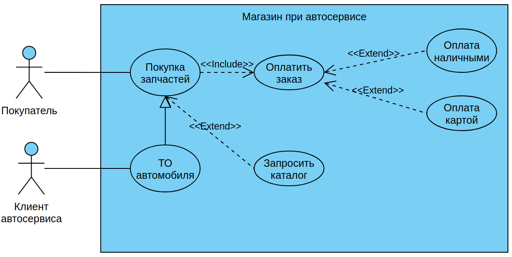

Мы рассмотрели только базовые элементы для диаграммы вариантов использования, на самом деле их больше. Но для нашего уровня обучения этого достаточно.

#### Разбор скринкаста семинара "Системный анализ и проектирование"

Текст задания:

>Пользователь устанавливает приложение и регистрируется, указав ФИО и лицевой счёт, пароль. Так же пользователь может прикрепить данные банковской карты для быстрой оплаты, но не обязательно.
>
>Работа возможна только для авторизованного пользователя.
>
>Пользователь может оплатить услуги за электроэнергию, введя показания индивидуального прибора учёта. При введении показаний пользователь может запросить отчёт по оплате своего лицевого счёта, указав период для отчёта.
>
>Если карта не "привязана" к аккаунту, то пользователь вводит данные банковской карты и подтверждает оплату. Если карта "привязана", пользователь подтверждает оплату. После оплаты приложение генерирует квитанцию об оплате, которую пользователь может скачать. При закрытии приложения квитанция не сохраняется.

В **Visio** создаёте новый документ и открываете *Дополнительные фигуры* -> *Программы и базы данных* -> *Программное обеспечение* -> *Сценарии выполнения UML*

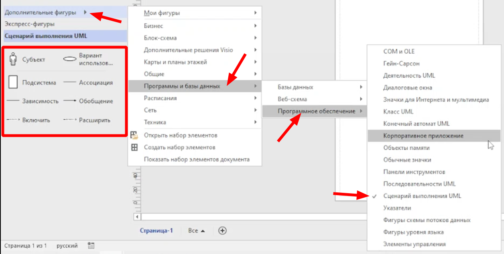

>Цвет моих диаграмм отличается от сделанных в **Visio**, т.к. я делаю в [visual-paradigm онлайн](https://online.visual-paradigm.com)

Порядок работы:

* определяем акторов
* определяем варианты использования
* определяем виды взаимодействия
* строим диаграмму

1. Рисуем прямоугольник подсистемы:

    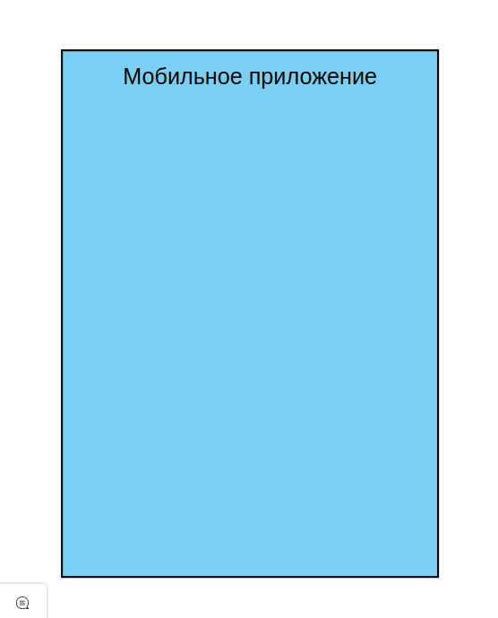

2. Определяем акторов

    В нашей системе это обычный **пользователь** и **авторизованный пользователь**. Рисуем их рядом с нашей подсистемой, причём учитываем, что **авторизованный пользователь** наследует (обобщает) свойства обычного **пользователя** (может прикрепить карту) и рисуем связь "обобщение":

    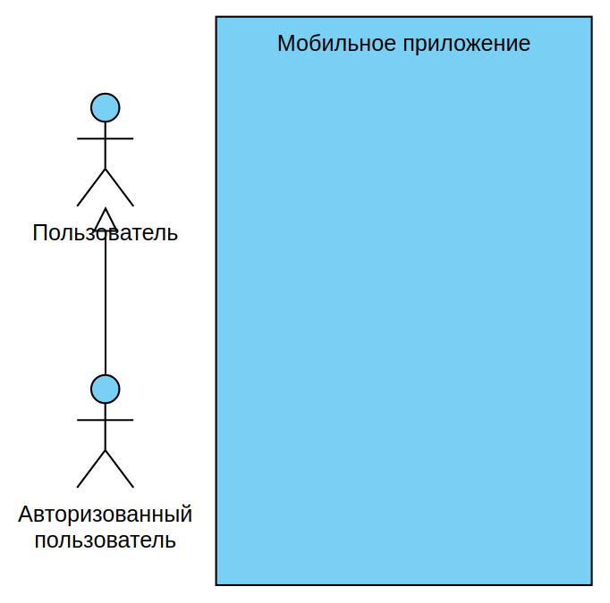

3. Определение вариантов использования

    >Обратите внимание: связи между акторами и прецедентами **прямые** и рисуются без всяких стрелок

    * **установка приложения** - такой вариант использования есть в описании предметной области, но т.к. он не относится к подсистеме, то его рисуем за пределами подсистемы

        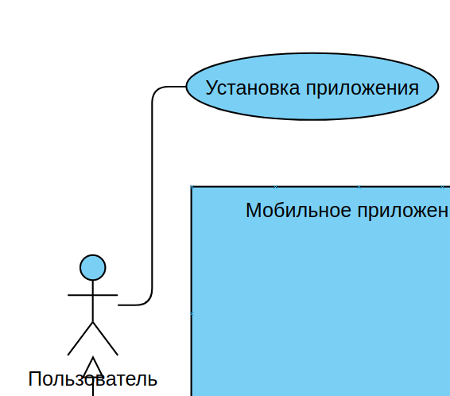

    * у обычного пользователя есть только один вариант использования: **регистрация**

        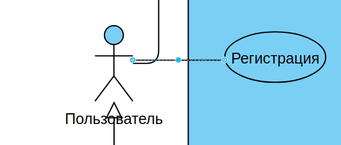

        Но при регистрации возникают дополнительные действия (прецеденты): ввод ФИО, лицевого счёта и пароля, и не обязательный ввод данных карты.

        Для обязательных прецедентов используется отношение **включения**, для не обязательных - **расширения**

        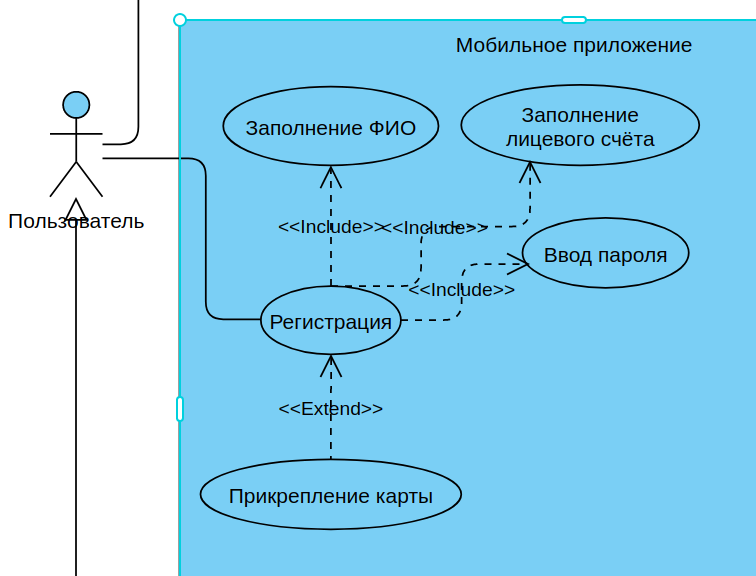

    * **оплата услуг** авторизованным пользователем. Причём пользователь **должен** внести показания прибора учета. И **может** запросить отчет с **возможным** выбором периода

        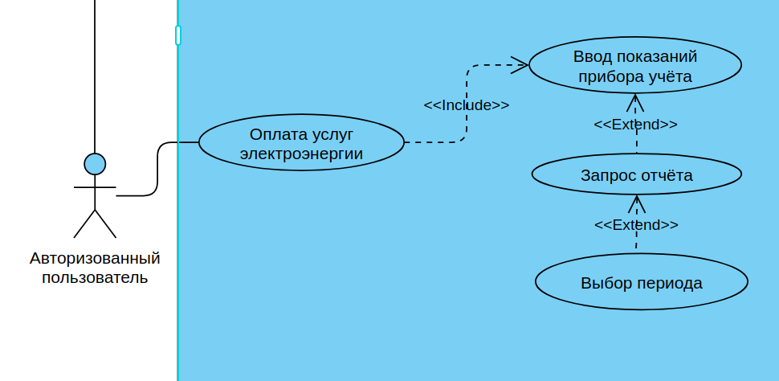

        После ввода показаний прибора учёта пользователь **должен** подтвердить оплату (обязательное действие, поэтому делаем включение). Если карта не была привязана в личном кабинете, то добавляем через включение действие **ввод данных карты**. **Visio** не полностью реализует стандарт UML - для альтернативных действий там есть специальные формы прецедентов. Но можно альтернативность прецедента акцентировать надписью на стрелке (тип ассоциации и так понятен по направлению стрелки)        

        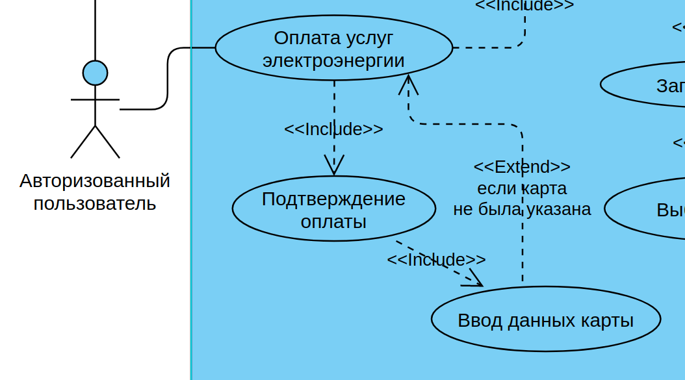

        После подтверждения оплаты система **генерирует квитанцию** (делает это всегда, поэтому включение). Действия пользователя в этом случае не описаны, но т.к. сказано, что система не хранит квитанции, то напрашивается расширение для **сохранения квитанции**

        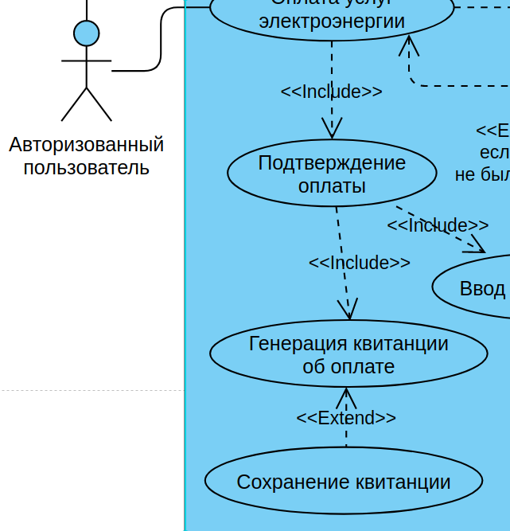
     
    * после всего вспомнили, что обычному пользователю для превращения в авторизованного нужно **авторизоваться** и, хотя этого нет в описании предметной области, добавляем этот прецедент:

        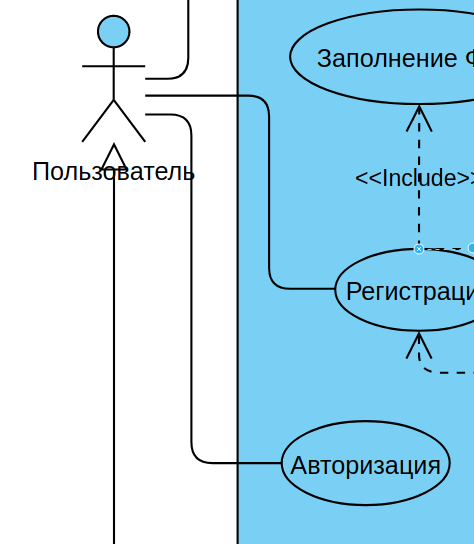

Итоговый вариант диаграммы прецедентов:

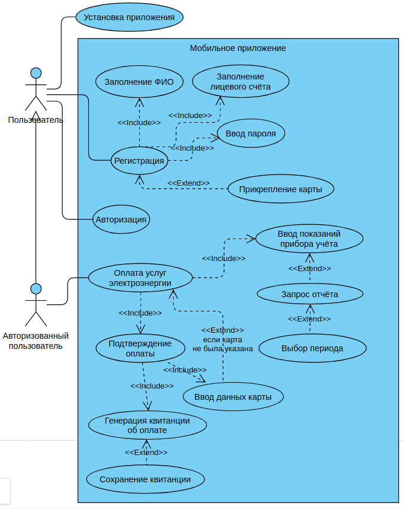

## Диаграмма последовательности

### Общие сведения

Реализация отдельного варианта использования требует участия и взаимодействия определенных экземпляров акторов и классов. Наиболее подходящий инструмент для описания такого взаимодействия – это диаграммы последовательности и коммуникации, которые, по сути, отображают одну и ту же информацию. В связи с этим большинство Case-средств позволяет после построения одной из диаграмм автоматически получить другую, а также выполнять синхронизацию этих диаграмм между собой.

Общими элементами диаграмм являются:

- экземпляры акторов и объекты, участвующие во взаимодействии;
- сообщения, передаваемые между экземплярами акторов и объектами.

Экземпляры сущностей отображаются стандартно (экземпляр актора – человечком, экземпляр класса (объект) – прямоугольником или графическим стереотипом класса анализа). В то же время следует помнить, что экземпляр – это конкретная реализация соответствующей сущности (актора, класса, узла и т. д.). Чтобы учесть этот нюанс на диаграммах, имя экземпляра подчеркивается и может обозначаться следующими способами.

Способ обозначения | Характористика | Пример
-------------------|----------------|--------
Имя объекта`:`Имя класса | Полное обозначение. | Вася`:`Программист
`:`Имя класса | Анонимный объект. | `:`Программист
Имя объекта | Предполагается, что имя класса известно. | Вася
Имя объекта`:` | Объект-сирота. | Считается, что имя класса неизвестно.	Вася`:`

Для объектов, кроме имени, могут указываться также некоторые важные для взаимодействия атрибуты и их значения.

Взаимодействие между экземплярами акторов и объектами моделируется посредством передачи сообщений. Сообщение (англ. message) – это спецификация факта передачи информации между сущностями с ожиданием выполнения определенных действий со стороны принимающей сущности. Сущность, отправляющую сообщение, называют клиентом, а принимающую – сервером. Таким образом, сообщения не только передают некоторую информацию, но и требуют или предполагают выполнения сервером определенных действий или передачу (возврат) клиенту необходимой информации. Если принимающей сообщение сущностью является объект, то оно представляет собой операцию (метод) объекта-сервера. Прием сообщения обычно трактуется, как возникновение события на сервере. Сообщения изображаются стрелкой с обязательным указанием направления (остриё стрелки указывает на принимающую сторону) и спецификации.

Ниже рассматриваются особенности построения диаграмм взаимодействия.

### Назначение и состав диаграммы последовательности

**Диаграмма последовательности (sequence diagram)** наглядно отображает **временной** аспект взаимодействия. Она имеет два измерения. Одно измерение (слева-направо) указывает на порядок вовлечения экземпляров сущностей во взаимодействие. Крайним слева на диаграмме отображается экземпляр актора или объект, который является инициатором взаимодействия. Правее отображается другой экземпляр сущности, который непосредственно взаимодействует с первым и т.д. Второе измерение (сверху-вниз) указывает на порядок обмена сообщениями. Начальному моменту времени соответствует самая верхняя часть диаграммы. Масштаб на оси времени не указывается, поскольку диаграмма отображает лишь временную упорядоченность взаимодействия типа «раньше-позже».

На диаграмме последовательности отображается ряд специфичных элементов, которые отсутствуют на диаграмме коммуникации.

1. **Линия жизни** (англ. lifeline) отображается штриховой вертикальной линией, соединенной с соответствующим экземпляром сущности. Линия жизни служит для обозначения периода времени, в течение которого экземпляр может потенциально участвовать во взаимодействии. Если он существует в течение всего взаимодействия, то и его линия жизни должна продолжаться от самой верхней части диаграммы до самой нижней.

    Не обязательно создавать все объекты в начальный момент времени. Отдельные объекты в системе могут создаваться по мере необходимости, существенно экономя ресурсы системы и повышая ее производительность. В этом случае объект изображается не в верхней части диаграммы, а в том месте, где он создается. Для обозначения факта уничтожения объекта в UML используется специальный символ **X**. Как правило, уничтожаются объекты, созданные на основе граничных и управляющих классов. Экземпляры акторов и объекты классов сущностей остаются в системе после окончания взаимодействия.

    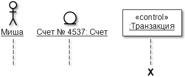

2. Как было отмечено выше, взаимодействие между экземплярами моделируется через обмен **сообщениями**. Сообщения могут быть следующих видов:

     – синхронное сообщение (англ. synchronous message). Клиент посылает сообщение серверу и **ждёт**, пока тот примет и обработает сообщение. Как правило, один объект передает синхронное сообщение второму, второй – третьему и т.д., образуя вложенный поток сообщений. В любом случае клиент, инициирующий поток сообщений, должен дождаться его завершения, т.е. возврата управления. Это самый распространенный тип сообщений;

    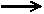 – асинхронное сообщение (англ. asynchronous message). Клиент посылает сообщение серверу и, не дожидаясь ответа, продолжает выполнять следующие операции;

    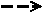 – возвращающее сообщение (англ. reply message), обозначающее возврат значения или управления от сервера обратно клиенту. Стрелки этого вида зачастую отсутствуют на диаграммах, поскольку неявно предполагается их существование после окончания процесса выполнения операции.

    В отдельных случаях объект может посылать сообщения самому себе (вызывать собственные методы), инициируя так называемые **рефлексивные** сообщения.

    Сообщения, получаемые от внешнего источника (англ. found message) и передаваемые внешнему приемнику (англ. lost message), должны, соответственно, начинаться и заканчиваться закрашенным кружком.

    UML регламентирует также два часто встречаемых вида сообщений - на создание и уничтожение объектов. Первое отображается как возвращающее сообщение со стереотипом «create», второе - как синхронное сообщение со стереотипом «destroy». После получения сообщения на уничтожение объекта его линия жизни заканчивается символом X.

    Каждое сообщение должно иметь имя по одному из следующих вариантов:

    - произвольная строка текста. Применяется на начальных стадиях проектирования или концептуальных диаграммах;
    - указание стереотипа для некоторых стандартных действий:
        * «create» (англ. – создать) – возвращающее сообщение, требующее создания объекта;
        * «destroy» (англ. – уничтожить) – синхронное сообщение с требованием уничтожить соответствующий объект;
        * «call» (англ. – вызвать) – синхронное сообщение, требующее выполнения операции принимающего объекта;
        * «send» (англ. – послать) – асинхронное сообщение, обозначающее посылку сигнала серверу;
        * «return» (англ. – возвратить) или «reply» (англ. – ответить)– возвращающее сообщение;
    - указание спецификации вызываемого метода объекта-получателя в формате:

        `[переменная =] имя([список параметров]) [:возвращаемое значение]`.

    **Переменная** - переменная или атрибут объекта-отправителя, которому будет присвоен результат вызываемого метода.

    **Имя сообщения** (обязательный параметр) – имя вызываемого метода объекта-получателя.

    **Список аргументов** – список аргументов, разделенных запятыми и передаваемых для выполнения метода.

    **Возвращаемое значение** – константа или имя переменной, являющиеся результатом вызываемого метода.

3. Отправка и прием сообщений сопровождаются активностью объектов. Для явного выделения этого факта, на диаграмме можно использовать **фокус управления** (англ. focus of control). Он изображается в форме вытянутого узкого прямоугольника, верхняя сторона которого обозначает начало получения фокуса управления объекта (начало активности), а нижняя сторона – окончание фокуса управления (окончание активности). Условные операторы, циклы, рекурсия и вызов собственных методов (отправка рефлексивных сообщений) инициируют вложенные потоки управления у одного и того же объекта, что можно отобразить на диаграмме с помощью вложенных фокусов управления.

    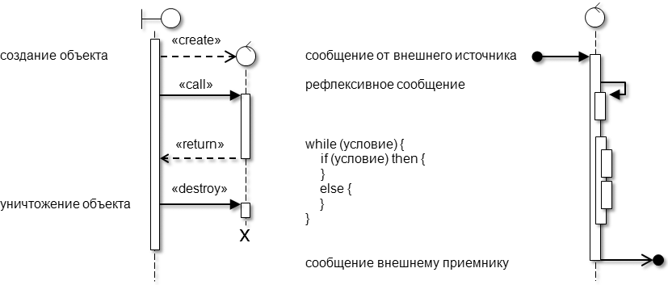

4. Для моделирования особенностей взаимодействия (условных операторов, циклов и т.п.) вместо вложенных фокусов управления лучше использовать **фрагменты** (англ. fragments). Фрагмент отображается прямоугольной рамкой вокруг сообщения (группы сообщений) с указанием в левом верхнем углу типа фрагмента.

    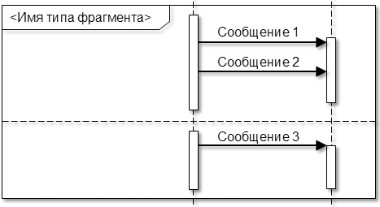

    UML определяет следующие типы фрагментов:

    - alt (alternatives) - вызовы альтернативных сообщений (выполнение взаимоисключающих операций). Альтернативные сообщения (группы сообщений) отделяются друг от друга горизонтальными штриховыми линиями. Используется для моделирования условного оператора (if-then-else) и операторов выбора (case или switch);

    - opt (option) - вызов дополнительного сообщения (группы сообщений) при некотором условии. Аналогичен фрагменту с типом «alt» для случая, когда используется сокращенный условный оператор (if-then);

    - par (parallel) - параллельная обработка сообщений. Параллельно обрабатываемые сообщения (группы сообщений) отделяются друг от друга горизонтальными штриховыми линиями;

    - loop - циклическая обработка сообщений. Используется для моделирования циклов;

    - break - досрочное прерывание обработки сообщений при некотором условии. Используется как составная часть других фрагментов (как правило, «loop»);

    - critical - эксклюзивно обрабатываемое сообщение (группа сообщений). Используется как составная часть других фрагментов (как правило, «par»). Подразумевает приостановку обработки любых сообщений в более общем фрагменте на время обработки сообщений внутри подфрагмента «critical»;

    - neg (negative) - сообщение или событие, сгенерированное в результате невозможности обработки другого принятого сообщения. Например, если при запросе пароля getPassword() истекло время на его ввод, то вместо возврата пароля будет сгенерировано сообщение «время вышло» (англ. «timeout»);

    - assert (assertion) - сообщение (группа сообщений), выполняемое после предварительной проверки некоторого условия. Если условие отрицательно, то сообщение не посылается. В программировании такой прием часто используется для локализации ошибок;

    - strict - строгая последовательная обработка сообщений. Последовательно обрабатываемые сообщения (группы сообщений) отделяются друг от друга горизонтальными штриховыми линиями и обрабатываются строго по очереди сверху-вниз;

    - seq (sequencing) - нестрогая последовательная обработка сообщений. Сообщения (группы сообщений) отделяются друг от друга горизонтальными штриховыми линиями и могут обрабатываться в произвольном порядке за исключением сообщений, принимаемых одним объектом;

    - ignore - игнорирование сообщений. После слова «ignore» в фигурных скобках перечисляются сообщения, возникновение которых во фрагменте потенциально возможно наряду с явно отображенными и которые должны быть проигнорированы;

    - consider - игнорирование других сообщений. После слова «consider» в фигурных скобках перечисляются сообщения, которые явно отображены во фрагменте, а также возникновение которых во фрагменте потенциально возможно наряду с явно отображенными. Остальные потенциально возможные сообщения должны быть проигнорированы;

    - ref (reference) - ссылка на часть взаимодействия, определенную в другом месте (на другой диаграмме). Данный элемент подобен предопределенным процессам на блок-схемах или скрытым составным состояниям на диаграммах автоматов.

### Рекомендации по разработке диаграмм взаимодействия

При разработке диаграмм следует придерживаться следующих правил и рекомендаций.

1. Для выбранного варианта использования необходимо перенести с диаграммы классов анализа все участвующие в нем классы, а с диаграммы вариантов использования – акторов.

2. На диаграмме коммуникации между классами следует отобразить ассоциации, перенесенные с диаграммы классов анализа, а также добавить ассоциации, связывающие акторов с граничными классами.

3. Для отображения основного и альтернативного потоков событий (наборов сообщений) в рамках варианта использования следует использовать фрагмент с типом «alt».

4. На стадии анализа имена сообщениям можно давать произвольно (например, «Записать данные о клиенте») или в виде стереотипов. В дальнейшем (в модели проектирования) имена сообщений должны соответствовать методам классов.

5. Имена сущностей на диаграммах (экземпляры акторов и объекты) должны быть подчеркнуты и обозначены соответствующим образом.

6. На диаграммах последовательности символ уничтожения объектов следует задавать только для тех объектов, которые во время взаимодействия действительно уничтожаются. Экземпляры акторов и объекты классов сущностей (долгоживущая информация), как правило, существуют до начала и после окончания взаимодействия. Для них символ уничтожения не показывается. Объекты граничных и управляющих классов, напротив, в большинстве случаев создаются на момент взаимодействия и по его окончанию уничтожаются. В связи с этим для них требуется отображать символ уничтожения.

### Примеры построения диаграмм взаимодействия

На следующем рисунке с помощью диаграммы последовательности показано взаимодействие при выполнении процедуры идентификации/аутентификации пользователя, которая возможна двумя способами: путем ввода имени и пароля или с использованием ID-карты.

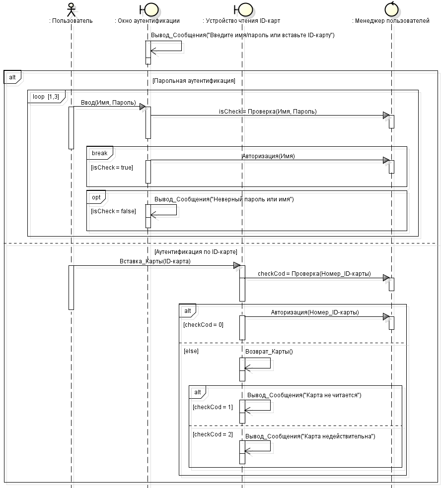

На следующих рисунках показаны диаграммы последовательности и коммуникации, показывающие процесс загрузки данных из таблицы с сервера БД в оперативную память клиента (кэширование). Диаграммы созданы методом обратного проектирования (реинжиниринга) на основе реального программного кода. На диаграмме последовательности некоторые программные конструкции отображены не с помощью фрагментов, а с помощью вложенных фокусов управления.

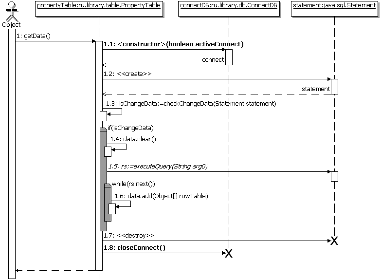

Инициировать загрузку могут объекты разных классов, поэтому объект **Object** не сопоставлен с каким-либо классом. Остальные объекты относятся к конкретным классам. После двоеточия у этих объектов показана вложенность по пакетам, а после последней точки – имя класса, экземпляром которого они являются.

Во взаимодействии следующая последовательность сообщений (вызова методов):

- Object инициирует загрузку данных getData();
- создается соединение с БД в виде объекта connectDB посредством вызова конструктора класса ConnectDB. Созданный объект запоминается в переменной connect;
- создается объект statement для выполнения запросов к БД и запоминается в переменной statement;
- посредством вызова метода checkChangeData() проверяется признак изменения данных на сервере. Если данные изменились, то;
    * из атрибута data объекта propertyTable удаляются старые данные clear();
    * выполняется запрос к БД executeQuere() и запрошенные данные запоминаются в переменной rs;
    * в цикле while() записи из переменной rs переносятся в атрибут data с помощью метода add();
- удаляется объект statement – на диаграмме указано стереотипное сообщение «destroy»;
- закрывается соединение с БД closeConnect().

В качестве иллюстрации правил построения диаграммы последовательности на ней показаны:

- два варианта создания объекта – с помощью конструктора `<constructor>()` для объекта connectDB и с помощью стереотипного сообщения «create» для объекта statement;
- два варианта уничтожения объекта – с помощью вызова деструктора closeConnect() для объекта connectDB и с помощью стереотипного сообщения «destroy» для объекта statement;
- два варианта вызова методов, возвращающих значения – вызов конструктора объекта connectDB с занесением результата (созданного объекта) в переменную connect с помощью двух сообщений и выполнением запроса к БД executeQuere() с занесением результата в переменную rs с помощью одного сообщения.

# Задание для самостоятельной работы:

Разработать диаграмму *прецедентов* для мобильного приложения "каршеринг" (аренда автомобилей) и диаграмму последовательности для одного из её прецедентов.