# Знакомство с *Android Studio*, структура проекта, *activity*, жизненный цикл, элементы пользовательского интерфейса, *layouts*

>Основано на [этих лекциях](https://metanit.com/java/android/1.2.php) (адаптировано под Kotlin)

* [Создание первого приложения, структура проекта](#создание-первого-приложения-структура-проекта)
* [Запуск проекта](#запуск-проекта)
* [Файл разметки (activity_main.xml)](#файл-разметки-activity_mainxml)
* [Определение интерфейса в файле XML. Файлы layout](#определение-интерфейса-в-файле-xml-файлы-layout)
* [Внутренние и внешние отступы](#внутренние-и-внешние-отступы)
* [Общие понятия](#общие-понятия)
* [Жизненный цикл Activity](#жизненный-цикл-activity)
* [Палитра компонентов](#палитра-компонентов)
    * [TextView](#textview)
    * [EditText](#edittext)
        * [Plain Text](#plain-text)
        * [Password и Password (Numeric)](#password-и-password-numeric)
        * [E-mail](#e-mail)
        * [Phone](#phone)
        * [Multiline Text](#multiline-text)
        * [Текст-подсказка](#текст-подсказка)
        * [Вызов нужной клавиатуры](#вызов-нужной-клавиатуры)
        * [Заблокировать текстовое поле](#заблокировать-текстовое-поле)
        * [Другие свойства](#другие-свойства)
        * [Обработка нажатий клавиш](#обработка-нажатий-клавиш)
    * [Кнопка (Button)](#кнопка-button)
        * [Три способа обработки событий нажатий на кнопку](#три-способа-обработки-событий-нажатий-на-кнопку)
        * [Сделать кнопку плоской](#сделать-кнопку-плоской)
        * [Получить текст с кнопки](#получить-текст-с-кнопки)
    * [ImageButton (Кнопка-изображение)](#imagebutton-кнопка-изображение)
        * [Продолжительное нажатие](#продолжительное-нажатие)
    * [CheckBox (Флажок)](#checkbox-флажок)
    * [RadioButton и RadioGroup](#radiobutton-и-radiogroup)
    * [ToggleButton (Кнопка-переключатель)](#togglebutton-кнопка-переключатель)
    * [Switch](#switch)

## Создание первого приложения, структура проекта

Cоздадим первое приложение в среде **Android Studio**. Откроем **Android Studio** и на начальном экране выберем пункт New Project (либо, если какой-то проект уже открыт, через главное меню File - New Project)

При создании проекта **Android Studio** вначале предложит нам выбрать шаблон проекта:

>Внешний вид может немного отличаться, т.к. я пишу лекции под Linux

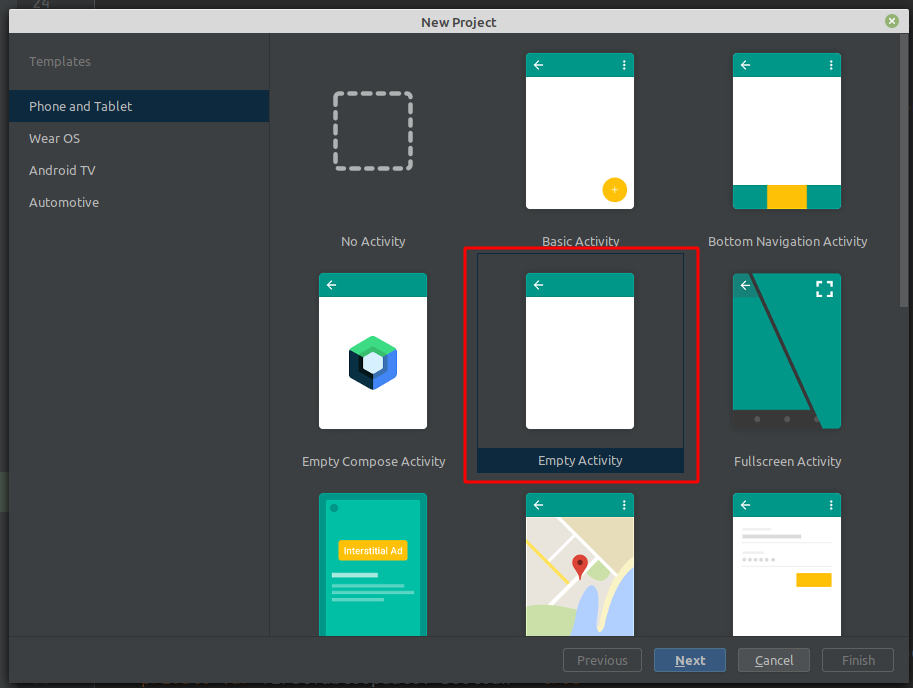

**Android Studio** предоставляет ряд шаблонов для различных ситуаций. Выберем в этом списке шаблон ***Empty Activity***, который предоставляет самый простейший фукционал, необходимый для начала, и нажмем на кнопку Next.

После этого отобразится окно настроек нового проекта:

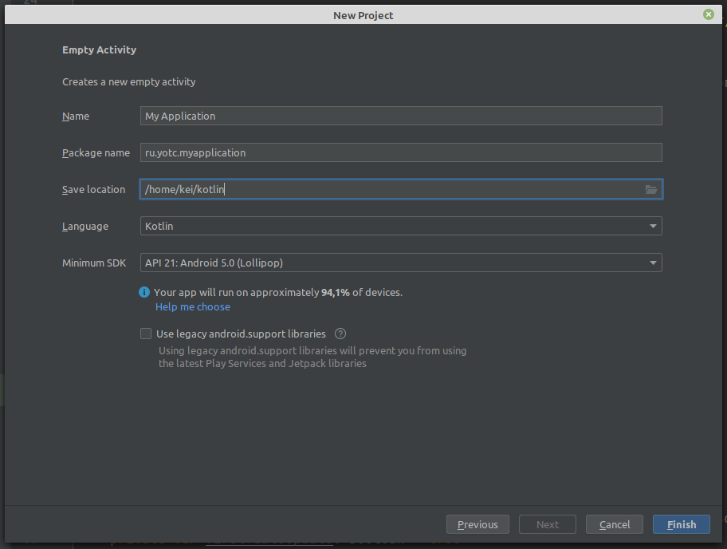

В окне создания нового проекта мы можем установить его начальные настройки:

* В поле **Name** вводится название приложения.

* В поле **Package Name** указывается имя пакета, где будет размещаться главный класс приложения. Для тестовых проектов это значение не играет большого значения.

* В поле **Save Location** установливается расположение файлов проекта на жестком диске. Можно оставить значение по умолчанию.

* В поле **Language** указывается используемый язык программирования, по умолчанию в этом поле стоит Kotlin (поддерживается и Java).

* В поле **Minimum SDK** указывается самая минимальная поддерживаемая версия SDK. Оставим значение по умолчанию - API 21: Android 5.0 (Lollipop), которая означает, что наше приложение можно будет запустить начиная с Android 5.0, а это 94% устройств. На более старых устройствах запустить будет нельзя.

Стоит учитывать, что чем выше версия SDK, тем меньше диапазон поддерживаемых устройств.

Далее нажмем на кнопку Finish, и **Android Studio** создаст новый проект (процесс создания достаточно долгий):

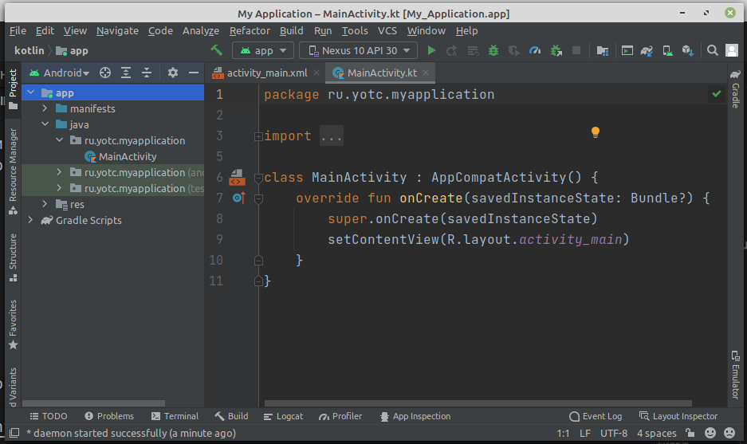

Вначале вкратце рассмотрим структуру проекта, что он уже имеет по умолчанию

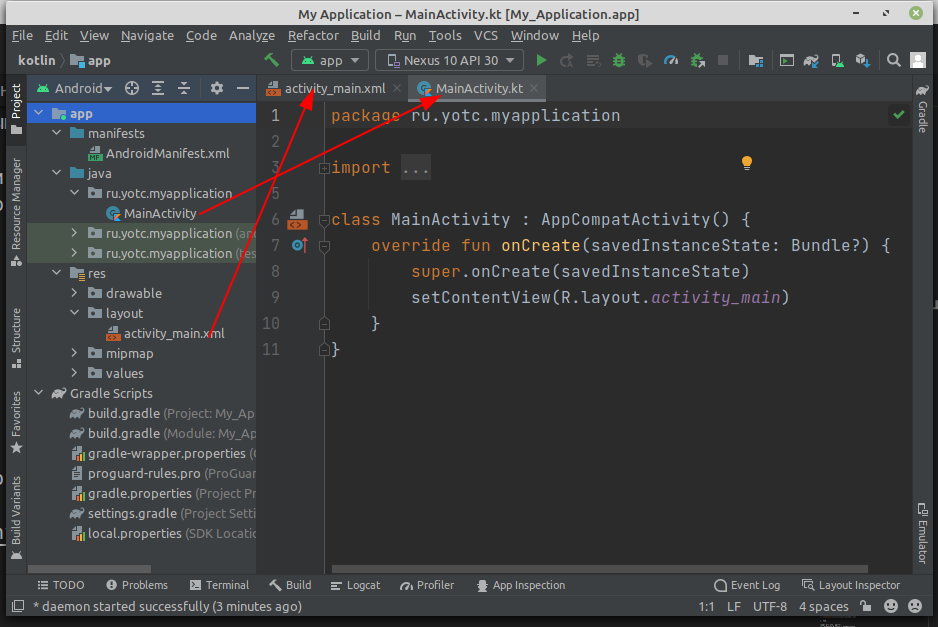

Проект Android может состоять из различных модулей. По умолчанию, когда мы создаем проект, создается один модуль - **app**. Модуль имеет три подпапки:

* **manifests**: хранит файл манифеста `AndroidManifest.xml`, который описывает конфигурацию приложения и определяет каждый из компонентов данного приложения.

* **java**: хранит файлы кода (всегда называется Java, хотя мы и пишем на Kotlin), которые структурированы по отдельным пакетам. Так, в папке ru.yotc.myapplication (название которого было указано на этапе создания проекта) имеется по умолчанию файл `MainActivity.kt` с кодом на языке Kotlin, который представляет класс MainActivity, запускаемый по умолчанию при старте приложения

* **res**: содержит используемые в приложении ресурсы. Все ресурсы разбиты на подпапки.

    * папка **drawable** предназначена для хранения изображений, используемых в приложении

    * папка **layout** предназначена для хранения файлов, определяющих графический интерфейс. По умолчанию здесь есть файл `activity_main.xml`, который определяет интерфейс для класса MainActivity в виде xml

    * папки **mipmap** содержат файлы изображений, которые предназначены для создания иконки приложения при различных разрешениях экрана.

    * папка **values** хранит различные xml-файлы, содержащие коллекции ресурсов - различных данных, которые применяются в приложении. По умолчанию здесь есть два файла и одна папка:

        * файл **colors.xml** хранит описание цветов, используемых в приложении

        * файл **strings.xml** содержит строковые ресурсы, используемые в приложении

        * папки **themes** хранит две темы приложения - для светлую (дневную) и темную (ночную)

Отдельный элемент **Gradle Scripts** содержит ряд скриптов, которые используются при построении приложения.

Во всей этой структуре следует выделить файл **MainActivity.kt**, который открыт в **Android Studio** и который содержит логику приложения и собственно с него начинается выполнение приложения. И также выделим файл **activity_main.xml**, который определяет графический интерфейс - по сути то, что увидит пользователь на своем устройстве после загрузки приложения.

## Запуск проекта

Созданный выше проект уже содержит некоторый примитивный функционал. Правда, этот функционал почти ничего не делает, только выводит на экран строку "Hello world!". Тем не менее это уже фактически приложение, которое мы можем запустить.

Для запуска и тестирования приложения мы можем использовать эмуляторы или реальные устройства. Но в идеале лучше тестировать на реальных устройствах. К тому же эмуляторы требуют больших аппаратных ресурсов, и не каждый компьютер может потянуть требования эмуляторов. А для использования мобильного устройства для тестирования может потребоваться разве что установить необходимый драйвер.

Запустим проект, нажав на зеленую стрелочку на панели инструментов.

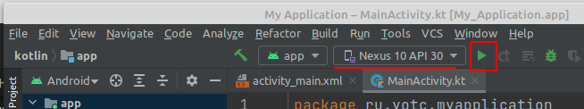

И после запуска мы увидим наше приложение на экране, которое просто выводит на экран строку Hello World.

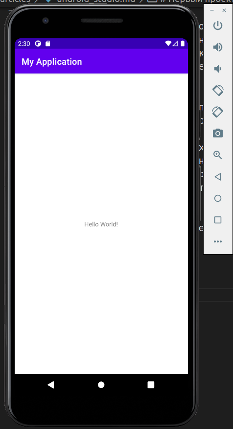

Но почему у нас выводится именно эта строка? Почему у нас вообще создается именно такой визуальный интерфейс?

Выполнение приложения Android по умолчанию начинается с класса **MainActivity**, который по умолчанию открыт в Android Studio:

```kt
package ru.yotc.myapplication

import androidx.appcompat.app.AppCompatActivity
import android.os.Bundle

class MainActivity : AppCompatActivity() {
    override fun onCreate(savedInstanceState: Bundle?) {
        super.onCreate(savedInstanceState)
        setContentView(R.layout.activity_main)
    }
}
```

Каждый отдельный экран или страница в приложении описывается таким понятием как **activity**. В литературе могут использоваться различные термины: экран, страница, активность. В данном случае я буду использовать понятие "activity". Так вот, если мы запустим приложение, то на экране мы по сути увидим определенную activity, которая предсталяет данный интерфейс.

Класс **MainActivity** по сути представляет обычный класс, в начале которого идет определение пакета данного класса:

```kt
package ru.yotc.myapplication
```

Далее идет импорт классов из других пакетов, функциональность которых используется в MainActivity:

```kt
import androidx.appcompat.app.AppCompatActivity
import android.os.Bundle
```

По умолчанию **MainActivity** наследуется от класса **AppCompatActivity**, который выше подключен с помощью директивы импорта. Класс **AppCompatActivity** по сути представляет отдельный экран (страницу) приложения или его визуальный интерфейс. И **MainActivity** наследует весь этот функционал.

По умолчанию **MainActivity** содержит только один метод *onCreate()*, который вызывается при запуске activity:

```kt
override fun onCreate(savedInstanceState: Bundle?) {
    super.onCreate(savedInstanceState)
    setContentView(R.layout.activity_main)
}
```

Здесь `super.onCreate(savedInstanceState)` вызов аналогичного метода предка.

В метод *setContentView()* передается ресурс разметки графического интерфейса:

Именно здесь и решается, какой именно визуальный интерфейс будет иметь **MainActivity**. Но что в данном случае представляет ресурс **R.layout.activity_main**? Это файл `activity_main.xml` из папки `res/layout` (в принципе можно заметить, что название ресурса соответствует названию файла), который также по умолчанию открыт в Android Studio:

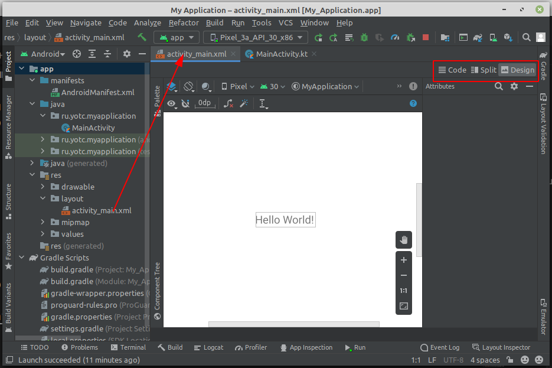

## Файл разметки (activity_main.xml)

Android Studio позволяет работать с визуальным интерфейсом как в режиме кода, так и в графическом режиме. Так, по умолчанию файл открыт в графическом режиме, и мы наглядно можем увидеть, как у нас примерно будет выглядеть экран приложения. И даже набросать с панели инструментов какие-нибудь элементы управления, например, кнопки или текстовые поля.

Но также мы можем работать с файлом в режиме кода, поскольку `activity_main.xml` - это обычный текстовый файл с разметкой xml. Для переключения к коду нажмём на кнопку **Code** над графическим представлением. (Дополнительно с помощью кнопки **Split** можно переключиться на комбинированное представление код + графический дизайнер)

Здесь мы увидим, что на уровне кода файл **activity_main.xml** содержит следующую разметку:

```xml
<?xml version="1.0" encoding="utf-8"?>
<androidx.constraintlayout.widget.ConstraintLayout xmlns:android="http://schemas.android.com/apk/res/android"
    xmlns:app="http://schemas.android.com/apk/res-auto"
    xmlns:tools="http://schemas.android.com/tools"
    android:layout_width="match_parent"
    android:layout_height="match_parent"
    tools:context=".MainActivity">

    <TextView
        android:layout_width="wrap_content"
        android:layout_height="wrap_content"
        android:text="Hello World!"
        app:layout_constraintBottom_toBottomOf="parent"
        app:layout_constraintLeft_toLeftOf="parent"
        app:layout_constraintRight_toRightOf="parent"
        app:layout_constraintTop_toTopOf="parent" />

</androidx.constraintlayout.widget.ConstraintLayout>
```

Весь интерфейс представлен элементом-контейнером `androidx.constraintlayout.widget.ConstraintLayout`. **ConstraintLayout** позволяет расположить вложенные элементы в определенных местах экрана. 

Атрибут `android:layout_width` определяет ширину контейнера.

Значением атрибута `android:layout_width` является "match_parent". Это значит, что элемент (ConstraintLayout) будет растягиваться по всей ширине контейнера (экрана устройства).

Атрибут `android:layout_height="match_parent"` определяет высоту контейнера. Значение "match_parent" указывает, что ConstraintLayout будет растягивается по всей высоте контейнера (экрана устройства).

Атрибут `tools:context` определяет, какой класс activity (экрана приложения) связан с текущим определением интерфейса. В данном случае это класс **MainActivity**. Это позволяет использовать в ***Android Studio*** различные возможности в режиме дизайнера, которые зависят от класса activity.

Внутри контейнера **ConstraintLayout** расположен текстовый блок:

**TextView**

* `android:layout_width` устанавливает ширину виджета. Значение "wrap_content" задает для виджета величину, достаточную для отображения в контейнере.

* `android:layout_height` устанавливает высоту виджета. Значение wrap_content аналогично установке ширины задает для виджета высоту, достаточную для отображения в контейнере

* `android:text` устанавливает текст, который будет выводиться в TextView (в данном случае это строка "Hello World!")

* `app:layout_constraintLeft_toLeftOf="parent"`: указывает, что левая граница элемента будет выравниваться по левой стороне контейнера **ConstraintLayout**

* `app:layout_constraintTop_toTopOf="parent"`: указывает, что верхняя граница элемента будет выравниваться по верхней стороне контейнера **ConstraintLayout**

* `app:layout_constraintRight_toRightOf="parent"`: указывает, что правая граница элемента будет выравниваться по правой стороне контейнера **ConstraintLayout**

* `app:layout_constraintBottom_toBottomOf="parent"`: указывает, что нижняя граница элемента будет выравниваться по нижней стороне контейнера **ConstraintLayout**

Стоит отметить, что последние четыре атрибута вместе будут приводить к расположению **TextView** по центру экрана.

Таким образом, при запуске приложения сначала запускается класс **MainActivity**, который в качестве графического интерфейса устанавливает разметку из файла `activity_main.xml`. И поскольку в этой разметке прописан элемент **TextView**, который представляет некоторый текст, то мы и увидим его текст на экране.

## Определение интерфейса в файле XML. Файлы layout

Как правило, для определения визуального интерфейса в проектах под Android используются специальные файлы xml. Эти файлы являются ресурсами разметки и хранят определение визуального интерфейса в виде кода XML. Подобный подход напоминает создание веб-сайтов, когда интерфейс определяется в файлах html, а логика приложения - в коде javascript.

Объявление пользовательского интерфейса в файлах XML позволяет отделить интерфейс приложения от кода. Что означает, что мы можем изменять определение интерфейса без изменения кода. Например, в приложении могут быть определены разметки в файлах XML для различных ориентаций монитора, различных размеров устройств, различных языков и т.д. Кроме того, объявление разметки в XML позволяет легче визуализировать структуру интерфейса и облегчает отладку.

Файлы разметки графического интерфейса располагаются в проекте в каталоге `res/layout`. По умолчанию при создании проекта с пустой activity уже есть один файл ресурсов разметки **activity_main.xml**

В файле определяются все графические элементы и их атрибуты, которые составляют интерфейс. При создании разметки в XML следует соблюдать некоторые правила: каждый файл разметки должен содержать один корневой элемент, который должен представлять объект **View** или **ViewGroup**.

В нашем случае корневым элементом является элемент **ConstraintLayout**, который содержит элемент **TextView**.

При компиляции каждый XML-файл разметки компилируется в ресурс View. Загрузка ресурса разметки осуществляется в методе Activity.onCreate. Чтобы установить разметку для текущего объекта activity, надо в метод setContentView() в качестве параметра передать ссылку на ресурс разметки.

```kt
setContentView(R.layout.activity_main)
```

Для получения ссылки на ресурс в коде необходимо использовать выражение `R.layout.[название_ресурса]`. Название ресурса layout будет совпадать с именем файла.

Но у нас может быть и несколько различных ресурсов layout. Как правило, каждый отдельный класс Activity использует свой файл layout. Либо для одного класса Activity может использоваться сразу несколько различных файлов layout.

### Добавление файла layout

К примеру, добавим в проект новый файл разметки интерфейса. Для этого нажмем на папку `res/layout` правой кнопкой мыши и в появившемся меню выберем пункт **New -> Layout Resource File**

После этого в специальном окошке будет предложено указать имя и корневой элемент для файла layout:

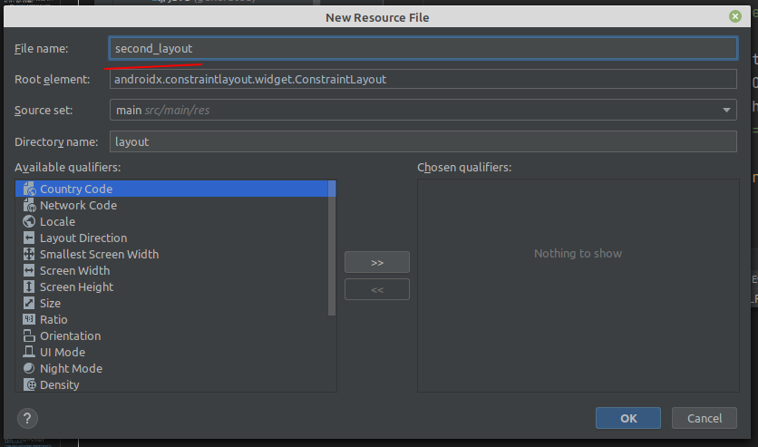

В качестве названия укажем *second_layout*. Все остальные настройки оставим по умолчанию:

* в поле **Root element** указывается корневой элемент. По умолчанию это androidx.constraintlayout.widget.ConstraintLayout.

* поле **Source set** указывает, куда помещать новый файл. По умолчанию это main - область проекта, с которой мы собственно работаем при разаботке приложения.

* поле **Directory name** указывает папку в рамках каталога, выбранного в предыдущей опции, в который собственно помещается новый файл. По умолчанию для файлов с разметкой интерфейса это layout.

После этого в папку `res/layout` будет добавлен новый файл **second_layout.xml**, с которым мы можем работать точно также, как и с **activity_main.xml**.

При создании он содержит только корневой элемент:

```xml
<?xml version="1.0" encoding="utf-8"?>
<androidx.constraintlayout.widget.ConstraintLayout
    xmlns:android="http://schemas.android.com/apk/res/android"
    android:layout_width="match_parent"
    android:layout_height="match_parent">

</androidx.constraintlayout.widget.ConstraintLayout>
```

Добавим в него текстовое поле:

```xml
<TextView
    android:id="@+id/header"
    android:text="Welcome to Android"
    android:textSize="26sp"
    android:layout_width="match_parent"
    android:layout_height="match_parent" />
```

Здесь определено текстовое поле **TextView**, которое имеет следующие атрибуты:

* **android:id** - идентификатор элемента, через который мы сможем ссылаться на него в коде. В записи *android:id="@+id/header"* символ @ указывает XML-парсеру использовать оставшуюся часть строки атрибута как идентификатор. А знак + означает, что если для элемента не определен id со значением header, то его следует определить.

* **android:text** - текст элемента - на экран будет выводиться строка "Welcome to Android".

* **android:textSize** - высота шрифта (здесь 26 единиц)

* **android:layout_width** - ширина элемента. Значение "match_parent" указывает, что элемент будет растягиваться по всей ширине контейнера ConstraintLayout

* **android:layout_height** - высота элемента. Значение "match_parent" указывает, что элемент будет растягиваться по всей высоте контейнера ConstraintLayout

Применим этот файл в качестве определения графического интерфейса в классе MainActivity:

```kt
override fun onCreate(savedInstanceState: Bundle?) {
    super.onCreate(savedInstanceState)
    // setContentView(R.layout.activity_main)
    setContentView(R.layout.second_layout)
}
```

Файл интерфейса называется `second_layout.xml`, поэтому по умолчанию для него будет создаваться ресурс **R.layout.second_layout**. Соответственно, чтобы его использовать, мы передаем его в метода setContentView. В итоге мы увидим на экране следующее:

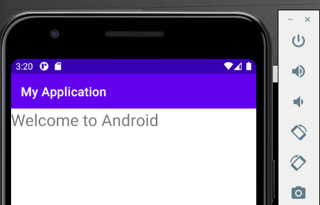

### Получение и управлене визуальными элементами в коде

Выше определенный элемент **TextView** имеет один очень важный атрибут - **id** или **идентификатор элемента**. Этот идентификатор позволяет обращаться к элементу, который определен в файле xml, из кода. Например, перейдем к классу MainActivity и изменим его код:

```kt
...
setContentView(R.layout.second_layout)

val textView = findViewById<TextView>(R.id.header)
textView.text = "Hello from Kotlin!"
```

Для получения элементов по **id** класс Activity имеет метод *findViewById()*. В этот метод передается идентификатор ресурса в виде `R.id.[идентификатор_элемента]`. Этот метод возвращает объект **View** - объект базового класса для всех элементов, поэтому результат метода еще необходимо привести к типу **TextView**.

Выше мы приводили тип указывая нужный в угорвых скобках метода, но можно явно определить тип переменной:

```kt
val textView: TextView = findViewById(R.id.header)
```

Далее мы можем что-то сделать с этим элементом, в данном случае изменяем его текст.

Причем что важно, получение элемента происходит после того, как в методе setContentView был установлен файл разметки, в котором этот визуальный элемент был определен.

И если мы запустим проект, то увидим, что TextView выводит новый текст:

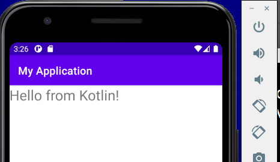

### Определение размеров

При разработке приложений под Android мы можем использовать различные типы измерений:

* px: пиксели текущего экрана. Однако эта единица измерения не рекомендуется, так как реальное представление внешнего вида может изменяться в зависимости от устройства; каждое устройство имеет определенный набор пикселей на дюйм, поэтому количество пикселей на экране может также меняться

* dp: (device-independent pixels) независимые от плотности экрана пиксели. Абстрактная единица измерения, основанная на физической плотности экрана с разрешением 160 dpi (точек на дюйм). В этом случае 1dp = 1px. Если размер экрана больше или меньше, чем 160dpi, количество пикселей, которые применяются для отрисовки 1dp соответственно увеличивается или уменьшается. Например, на экране с 240 dpi 1dp=1,5px, а на экране с 320dpi 1dp=2px. Общая формула для получения количества физических пикселей из dp: px = dp * (dpi / 160)

* sp: (scale-independent pixels) независимые от масштабирования пиксели. Допускают настройку размеров, производимую пользователем. Рекомендуются для работы со шрифтами.

* pt: 1/72 дюйма, базируются на физических размерах экрана

* mm: миллиметры

* in: дюймы

Предпочтительными единицами для использования являются **dp**. Это связано с тем, что мир мобильных устройств на Android сильно фрагментирован в плане разрешения и размеров экрана.

### Ширина и высота элементов

Все визуальные элеметы, которые мы используем в приложении, как правило, упорядочиваются на экране с помощью контейнеров. В Android подобными контейнерами служат такие классы как **RelativeLayout**, **LinearLayout**, **GridLayout**, **TableLayout**, **ConstraintLayout**, **FrameLayout**. Все они по разному располагают элементы и управляют ими, но есть некоторые общие моменты при компоновке визуальных компонентов, которые мы сейчас рассмотрим.

Для организации элементов внутри контейнера используются параметры разметки. Для их задания в файле xml используются атрибуты, которые начинаются с префикса layout_. В частности, к таким параметрам относятся атрибуты **layout_height** и **layout_width**, которые используются для установки размеров и могут использовать одну из следующих опций:

* Растяжение по всей ширине или высоте контейнера с помощью значения **match_parent** (для всех контейнеров кроме ConstraintLayout) или 0dp (для ConstraintLayout)

* Растяжение элемента до тех границ, которые достаточны, чтобы вместить все его содержимое с помощью значения **wrap_content**

* Точные размеры элемента, например 96 dp

**match_parent**

Установка значения **match_parent** позволяет растянуть элемент по всей ширине или высоте контейнера. Стоит отметить, что данное значение применяется ко всем контейнерам, кроме ConstraintLayout. Например, рястянем элемент TextView по всей ширине и высоте контейнера LinearLayout:

```xml
<?xml version="1.0" encoding="utf-8"?>
<LinearLayout
    xmlns:android="http://schemas.android.com/apk/res/android"
    android:layout_width="match_parent"
    android:layout_height="match_parent">
 
    <TextView
        android:layout_width="match_parent"
        android:layout_height="match_parent"
        android:text="Hello World!"
        android:textSize="30sp"
        android:background="#e0e0e0" />
     
</LinearLayout>
```

Контейнер самого верхнего уровня, в качестве которого в данном случае выступает **LinearLayout**, для высоты и ширины имеет значение **match_parent**, то есть он будет заполнять всю область для activity - как правило, весь экран.

И **TextView** также принимает подобные атрибуты. Значение **android:layout_width="match_parent"** обеспечивает растяжение по ширине, а **android:layout_height="match_parent"** - по вертикали. Для наглядности в **TextView** применяет атрибут **android:background**, который задает фон элемента и в данном случае окрашивает фон в цвет "#e0e0e0", благодаря чему мы можем увидеть занимаемую им область.

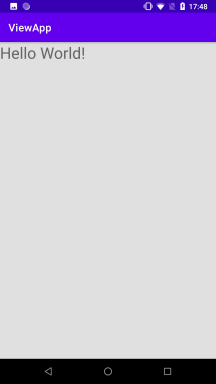

**wrap_content**

Значение **wrap_content** устанавливает те значения для ширины или высоты, которые необходимы, чтобы разместить на экране содержимое элемента:

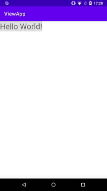

## Внутренние и внешние отступы

Параметры разметки позволяют задать отступы как от внешних границ элемента до границ контейнера, так и внутри самого элемента между его границами и содержимым.

**Padding**

Для установки внутренних отступов применяется атрибут **android:padding**. Он устанавливает отступы контента от всех четырех сторон контейнера. Можно устанавливать отступы только от одной стороны контейнера, применяя следующие атрибуты: **android:paddingLeft**, **android:paddingRight**, **android:paddingTop** и **android:paddingBottom**.

Стоит отметить, что вместо атрибутов **android:paddingLeft** и **android:paddingRight** можно применять атрибуты **android:paddingStart** и **android:paddingEnd**, которые разработаны специально адаптации приложения для работы как для языков с левосторонней ориентацией, так и правосторонней ориентацией (арабский, фарси).

**Margin**

Для установки внешних отступов используется атрибут **layout_margin**. Данный атрибут имеет модификации, которые позволяют задать отступ только от одной стороны: **android:layout_marginBottom**, **android:layout_marginTop**, **android:layout_marginLeft** и **android:layout_marginRight**.


## Общие понятия

Самые важных понятия в интерфейсе Android — это Activity и View.

Activity — это та часть приложения, с которой взаимодействует пользователь. Можно назвать ее окном в терминологии десктопных ОС. Внутри Activity расположены дочерние элементы интерфейса.

View — элемент интерфейса. То же самое, что и в любой другой ОС. Это может быть кнопка, поле для ввода текста, контейнер для картинки, контейнер для других View и т.д.

Так же немаловажный элемент — ViewGroup. Напрямую начинающие с ним не сталкиваются, обычно с этим классом работают более опытные разработчики. Фактически, ViewGrop — это модифицированный View, созданный для того, чтобы служить контейнером для других View. Тут мы уже знакомимся с понятием Layout.

Ключевым компонентом для создания визуального интерфейса в приложении Android является activity (активность). Нередко *активность* ассоциируется с отдельным экраном или окном приложения, а переключение между окнами будет происходить как перемещение от одной *активности* к другой. Приложение может иметь одну или несколько *активностей*. 

*Активность*, которая запускается первой, считается главной. Из нее можно запустить другую *активность*. Причем не только ту, которая относится к нашему приложению, но и другого приложения. Пользователю будет казаться, что все запускаемые им *активности* являются частями одного приложения, хотя на самом деле они могут быть определены в разных приложениях и работают в разных процессах. Попробуйте воспринимать *активности* как страницы разных сайтов, открываемых в браузерах по ссылке.

Все объекты *активность* представляют собой объекты класса ``android.app.Activity``, которая содержит базовую функциональность для всех *активностей*. В приложении мы напрямую с этим классом не работали, а MainActivity наследовалась от класса AppCompatActivity. Однако сам класс AppCompatActivity, хоть и не напрямую, наследуется от базового класса Activity.

```kt
class MainActivity : AppCompatActivity() {
  ...
}    
```

## Жизненный цикл Activity.

Все приложения Android имеют строго определенный системой жизненный цикл. При запуске пользователем приложения система дает этому приложению высокий приоритет. Каждое приложение запускается в виде отдельного процесса, что позволяет системе давать одним процессам более высокой приоритет, в отличие от других. Благодаря этому, например, при работе с одними приложениями не блокировать входящие звонки. После прекращения работы с приложением, система освобождает все связанные ресурсы и переводит приложение в разряд низкоприоритетного и закрывает его.

Все объекты *активность*, которые есть в приложении, управляются системой в виде стека *активностей*, который называется **back stack**. При запуске новой *активности* она помещается поверх стека и выводится на экран устройства, пока не появится новая *активность*. Когда текущая *активность* заканчивает свою работу (например, пользователь уходит из приложения), то она удаляется из стека, и возобновляет работу та *активность*, которая ранее была второй в стеке.

Обычно *активность* занимает весь экран устройства, но это не является обязательным требованием. Вы можете создавать полупрозрачные и плавающие окна *активностей*.

Чтобы создать *активность*, нужно унаследоваться от класса Activity и вызвать метод onCreate(). В результате мы получим пустой экран. Толку от такого экрана никакого. Поэтому в *активность* добавляют компоненты, фрагменты с помощью разметки.

После запуска *активности* проходит через ряд событий, которые обрабатываются системой и для обработки которых существует ряд методов обратных вызовов:

```kt
protected fun onCreate(saveInstanceState: Bundle?);
protected fun onStart();
protected fun onRestoreInstanceState(saveInstanceState: Bundle?);
protected fun onRestart();
protected fun onResume();
protected fun onPause();
protected fun onSaveInstanceState(saveInstanceState: Bundle?);
protected fun onStop();
protected fun onDestroy();
```

> Модификатор ``protected`` означает видимость метода только внутри класса (и его наследников). При реализации своего кода мы должны переопределить метод предка, используя модификатор ``override``
>```kt
>override fun onCreate(savedInstanceState: Bundle?) {...}
>```

Схематично взаимосвязь между всеми этими обратными вызовами можно представить следующим образом

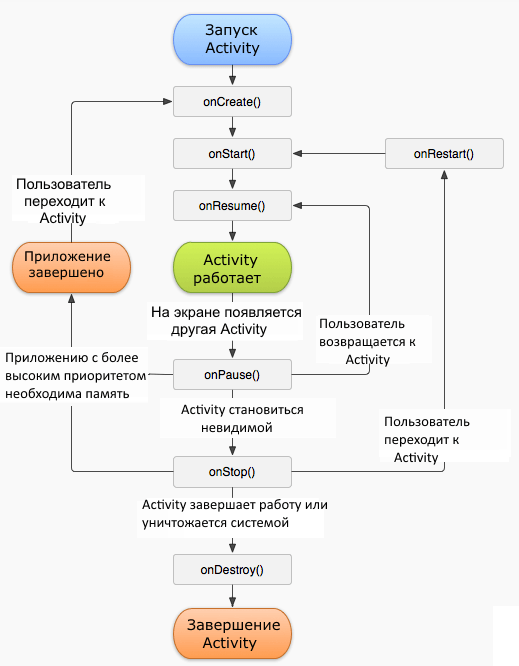

* **onCreate** - первый метод, с которого начинается выполнение *активности*. В этом методе *активность* переходит в состояние Created. **Этот метод обязательно должен быть определен в классе**. В нем производится первоначальная настройка *активности*. В частности, создаются объекты визуального интерфейса. Этот метод получает объект Bundle, который содержит прежнее состояние *активности*, если оно было сохранено. Если *активность* заново создается, то данный объект имеет значение null. Если же *активность* уже ранее была создана, но находилась в приостановленном состоянии, то bundle содержит связанную с *активностью* информацию.

* В методе **onStart** осуществляется подготовка к выводу *активности* на экран устройства. Как правило, этот метод не требует переопределения, а всю работу производит встроенный код. После завершения работы метода *активность* отображается на экране, вызывается метод onResume, а *активность* переходит в состояние Resumed.

* После завершения метода onStart вызывается метод **onRestoreInstanceState**, который призван восстанавливать сохраненное состояние из объекта Bundle, который передается в качестве параметра. Но следует учитывать, что этот метод вызывается только тогда, когда Bundle не равен null и содержит ранее сохраненное состояние. Так, при первом запуске приложения этот объект Bundle будет иметь значение null, поэтому и метод onRestoreInstanceState не будет вызываться.

* А при вызове метода **onResume** *активность* переходит в состояние Resumed, а пользователь может с ней взаимодействовать. И собственно *активность* остается в этом состоянии, пока она не потеряет фокус, например, вследствии переключения на другую *активность* или просто из-за выключения экрана устройства.

* Если пользователь решит перейти к другой *активности*, то система вызывает метод **onPause**. В этом методе можно освобождать используемые ресурсы, приостанавливать процессы, например, воспроизведение аудио, анимаций, останавливать работу камеры (если она используется) и т.д., чтобы они меньше сказывались на производительность системы.<br/><br/>
Но надо учитывать, что на работу данного метода отводится очень мало времени, поэтому не стоит здесь сохранять какие-то данные, особенно если при этом требуется обращение к сети, например, отправка данных по интернету, или обращение к базе данных.<br/><br/>
После выполнения этого метода *активность* становится невидимой, не отображается на экране, но она все еще активна. И если пользователь решит вернуться к этой *активности*, то система вызовет снова метод onResume, и *активность* снова появится на экране.<br/><br/>
Другой вариант работы может возникнуть, если вдруг система видит, что для работы активных приложений необходимо больше памяти. И система может сама завершить полностью работу *активности*, которая невидима и находится в фоне. Либо пользователь может нажать на кнопку Back (Назад). В этом случае у *активности* вызывается метод onStop.

* Метод **onSaveInstanceState** вызывается после метода onPause, но до вызова onStop. В onSaveInstanceState производится сохранение состояния приложения в передаваемый в качестве параметра объект Bundle.

* В методе **onStop** *активность* переходит в состояние Stopped. В методе onStop следует особождать используемые ресурсы, которые не нужны пользователю, когда он не взаимодействует с *активностью*. Здесь также можно сохранять данные, например, в базу данных.<br/><br/>
При этом во время состояния Stopped *активность* остается в памяти устройства, сохраняется состояние всех элементов интерфейса. К примеру, если в текстовое поле EditText был введен какой-то текст, то после возобновления работы *активности* и перехода ее в состояние Resumed мы вновь увидим в текстовом поле ранее введенный текст.<br/><br/>
Если после вызова метода onStop пользователь решит вернуться к прежней *активности*, тогда система вызовет метод onRestart. Если же *активность* вовсе завершила свою работу, например, из-за закрытия приложения, то вызывается метод onDestroy().

* Ну и завершается работа активности вызовом метода **onDestroy**, который возникает либо, если система решит убить *активность*, либо при вызове метода finish().

Также следует отметить, что при изменении ориентации экрана система завершает *активность* и затем создает ее заново, вызывая метод onCreate.

В целом переход между состояниями *активности* можно выразить следующей схемой:

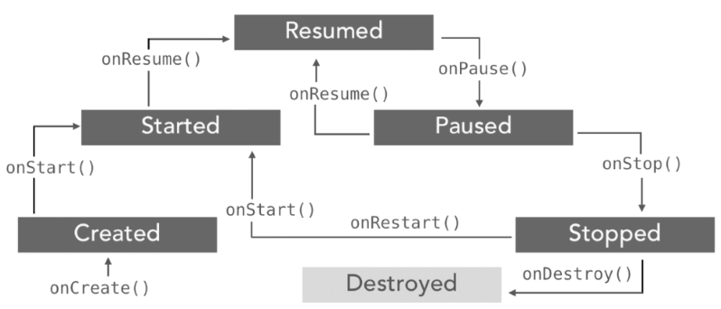

Расмотрим несколько ситуаций. Если мы работаем с *активностью* и затем переключаемся на другое приложение, либо нажимаем на кнопку Home, то у *активности* вызывается следующая цепочка методов: ``onPause -> onStop``. *Активность* оказывается в состоянии Stopped. Если пользователь решит вернуться к *активности*, то вызывается следующая цепочка методов: ``onRestart -> onStart -> onResume``.

Другая ситуация, если пользователь нажимает на кнопку Back (Назад), то вызывается следующая цепочка ``onPause -> onStop -> onDestroy``. В результате *активность* уничтожается. Если мы вдруг захотим вернуться к *активности* через диспетчер задач или заново открыв приложение, то *активность* будет заново пересоздаваться через методы ``onCreate -> onStart -> onResume``.


Мы можем отследить эти события жизненного цикла, переопределив соответствующие методы. Для этого возьмем класс MainActivity и изменим его следующим образом:

```kt
private val TAG = "MainActivityDebug"

override fun onCreate(savedInstanceState: Bundle?) {
  super.onCreate(savedInstanceState)
  setContentView(R.layout.activity_main)
  Log.d(TAG, "onCreate")
}

override fun onDestroy(){
  super.onDestroy()
  Log.d(TAG, "onDestroy")
}

override fun onStop(){
  super.onStop();
  Log.d(TAG, "onStop");
}

override fun onStart(){
  super.onStart()
  Log.d(TAG, "onStart")
}

override fun onPause(){
  super.onPause()
  Log.d(TAG, "onPause")
}

override fun onResume(){
  super.onResume()
  Log.d(TAG, "onResume")
}
 
override fun onRestart(){
  super.onRestart()
  Log.d(TAG, "onRestart")
}
 
override fun onSaveInstanceState(outState: Bundle?){
  super.onSaveInstanceState(outState)
  Log.d(TAG, "onSaveInstanceState")
}
 
override fun onRestoreInstanceState(savedInstanceState: Bundle?){
  super.onRestoreInstanceState(savedInstanceState)
  Log.d(TAG, "onRestoreInstanceState")
}
```

> Для логгирования событий здесь используется класс android.util.Log.

В данном случае обрабатываются все ключевые методы жизненного цикла. Вся обработка сведена к вызову метода Log.d(), в который передается TAG - строковое значение и строка, которая выводится в консоли logcat, выполняя роль отладочной информации. Если эта консоль по умолчанию скрыта, то мы можем перейти к ней через пункт меню ``View -> Tool Windows -> Logcat`` (Или используя комбинацию клавиш ``Alt+6``).

И при запуске приложения мы сможем увидеть в окне logcat отладочную информацию, которая определяется в методах жизненного цикла *активности*

> В logcat пишутся все логи отладчика, чтобы не утонуть в куче логов можно в окне фильтра ввести ``MainActivityDebug`` - ту строку которую мы определили как TAG.

## Палитра компонентов

### TextView

Компонент **TextView** предназначен для отображения текста без возможности редактирования его пользователем, что видно из его названия (Text - текст, view - просмотр).

**TextView** - один из самых используемых компонентов. С его помощью пользователю удобнее ориентироваться в программе. По сути, это как таблички: *Руками не трогать*, *По газону не ходить*, *Вход с собаками воспрещен*, *Часы работы с 9.00 до 18.00* и т.д., и служит для представления пользователю описательного текста.

Для отображения текста в TextView в файле разметки используется атрибут android:text, например:

```xml
android:text="Погладь кота, ...!" 
```

Такой подход является нежелательным. Рекомендуется всегда использовать текстовые ресурсы. В будущем эта привычка позволит вам обеспечить многоязыковую поддержку:

```xml
android:text="@string/hello"
```

#### Программная установка текста

Программно текст можно задать методом setText() или сеттером text:

```kt
// задаём текст
textView.text = "Hello Kitty!"

// или с использованием текстовых ресурсов
textView.text = getText(R.string.hello)
```

#### Атрибуты

* ``android:textsize`` - размер текста. При установке размера текста используется несколько единиц измерения: px (пиксели), dp, sp, in (дюймы), pt, mm. Для текстов рекомендуется использовать sp: android:textSize="48sp", аналог - метод setTextSize()

* ``android:textstyle`` - стиль текста. Используются константы: normal, bold, italic. Например, ``android:textStyle="bold"`` выводит текст жирным

* ``android:textcolor`` - цвет текста. Используются четыре формата в шестнадцатеричной кодировке: #RGB; #ARGB; #RRGGBB; #AARRGGBB, где R, G, B — соответствующий цвет, А — прозрачность (alpha-канал). Значение А, установленное в 0, означает прозрачность 100%.

Для всех вышеперечисленных атрибутов в классе TextView есть соответствующие методы для чтения или задания соответствующих свойств.

Программно установим размеры текста при помощи setTextSize() с различными единицами измерения.

```kt
// 20 DIP (Device Independent Pixels)
textView.setTextSize(TypedValue.COMPLEX_UNIT_DIP, 20);

// 0.5 inch
textView.setTextSize(TypedValue.COMPLEX_UNIT_IN, 0.5f);

// 10 millimeter
textView.setTextSize(TypedValue.COMPLEX_UNIT_MM, 10);

// 30 points
textView.setTextSize(TypedValue.COMPLEX_UNIT_PT, 30);

// 30 raw pixels
textView.setTextSize(TypedValue.COMPLEX_UNIT_PX, 30);

// 30 scaled pixels
textView.setTextSize(TypedValue.COMPLEX_UNIT_SP, 30);
```

По умолчанию у компонентов **TextView** отсутствует фоновый цвет. Чтобы задать цвет, укажите значение Drawable для атрибута android:background. В качестве значения Drawable может использоваться изображение или XML-представление фигуры, включающий ресурс Drawable (поместить в папку res/drawable).

#### Программная установка фона

В некоторых случаях программисты из-за невнимательности неправильно меняют фон элемента программным способом и удивляются, почему ничего не работает.

Предположим, у вас определён в ресурсах зелёный цвет:

```xml
<color name="tvBackground">#337700</color>
```

Следующий код будет ошибочным:

```kt
// не работает
textview.setBackgroundColor(R.color.tvBackground) 
```

Нужно так (два варианта):

```kt
// первый вариант
simple_string.setBackgroundResource(R.color.green)
// второй вариант
simple_string.setBackgroundColor(resources.getColor(R.color.green))
```

#### Реагируем на событие onClick

Если вы хотите, чтобы TextView обрабатывал нажатия (атрибут android:onClick), то не забывайте также использовать в связке атрибут android:clickable="true". Иначе работать не будет!

#### Многострочный текст

Если вы хотите создать многострочный текст в **TextView**, то используйте символы ``\n`` для переноса строк.

Например, в ресурсах:

```xml
<string name="about_text">
    У лукоморья дуб зелёный;\n
    Златая цепь на дубе том:\n
    И днём и ночью <b>кот учёный</b>\n
    Всё ходит по цепи кругом;\n
    Идёт <b>направо</b> - песнь заводит,\n
    <b>Налево</b> - сказку говорит.</string>
```

Обратите внимание, что в тексте также применяется простое форматирование.

Также перенос на новую строку можно задать в коде:

```kt
textView.text = "Первая строка \nВторая строка \nТретья строка"
```

#### Увеличиваем интервалы между строками

Вы можете управлять интервалом между соседними строчками текста через атрибут ``android:lineSpacingMultiplier``, который является множителем. Установите дробное значение меньше единицы, чтобы сократить интервал или больше единицы, чтобы увеличить интервал между строками.

```xml
android:lineSpacingMultiplier="0.8"
```

#### Бой с тенью

Чтобы оживить текст, можно дополнительно задействовать атрибуты для создания эффектов тени: shadowColor, shadowDx, shadowDy и shadowRadius. С их помощью вы можете установить цвет тени и ее смещение. Во время установки значений вы не увидите изменений, необходимо запустить пример в эмуляторе или на устройстве. В следующем примере я создал тень красного цвета со смещением в 2 пикселя по вертикали и горизонтали. Учтите, что для смещения используются единицы px (пиксели), единицы dp не поддерживаются.

```xml
<TextView
    android:layout_width="wrap_content"
    android:layout_height="wrap_content"
    android:padding="12dp"
    android:text="Бой с тенью"
    android:textSize="80sp"
    android:textStyle="bold"
    android:shadowColor="#ff0000"
    android:shadowDx="2"
    android:shadowDy="2"
    android:shadowRadius="5"/>
```

Программный эквивалент - метод ``setShadowLayer(float radius, float dx, float dy, int color)``:

```kt
simple_string.setShadowLayer(
    5f,   //float radius
    10f,  //float dx
    10f,  //float dy
    0xFFFFFFFF.toInt() //int color
)
```

#### Создание ссылок автоматом

У TextView есть ещё два интересных свойства Auto link (атрибут autoLink) и Links clickable (атрибут linksClickable), которые позволяют автоматически создавать ссылки из текста.

Выглядит это следующим образом. Предположим, мы присвоим элементу TextView текст Мой сайт: developer.alexanderklimov.ru и применим к нему указанные свойства.

```xml
<TextView
    android:id="@+id/textView"
    android:layout_width="match_parent"
    android:autoLink="web"
    android:linksClickable="true"
    android:text="Мой адрес: developer.alexanderklimov.ru" />
```

При этом уже на этапе разработки вы увидите, что строка адреса сайта после слов Мой адрес: стала ссылкой. Если вы запустите приложение и нажмете на ссылку, то откроется браузер с указанным адресом. Вам даже не придется писать дополнительный код. Аналогично, если указать номер телефона (параметр phone), то запустится звонилка.

У ссылки есть интересная особенность - при длительном нажатии на ссылку появляется диалоговое окно, позволяющее скопировать ссылку в буфер обмена.

Атрибут autoLink позволяет комбинировать различные виды ссылок для автоматического распознавания: веб-адрес, email, номер телефона.

Цвет ссылки можно поменять через свойство Text color link (XML-атрибут textColorLink), а программно через метод setTextLinkColor().

Программно можно установить ссылки на текст через класс Linkify:

```kt
simple_string.text = """Пример использования Linkify для создания ссылок в тексте.

URL: http://developer.alexanderklimov.ru/
Email: barsik@yanesobaka.com
Телефон: (495)-458-58-29
Адрес: 10110 ул.Котовского, г.Мышкин

Классно получилось?"""

Linkify.addLinks(simple_string, Linkify.ALL)
```

Кроме константы ALL, можно также использовать Linkify.EMAIL_ADDRESSES, Linkify.MAP_ADDRESSES, Linkify.PHONE_NUMBERS. К сожалению, русские адреса не распознаются. В моём случае индекс был распознан как телефонный номер, а город и улица не стали ссылкой.

В таких случаях придётся самостоятельно добавить ссылки в текстах. Например, определим ссылку в ресурсе:

```xml
<string name="my_site"><a href="http://developer.alexanderklimov.ru/android">Самый 
лучший сайт про android</a></string>
```

Присвоим созданный ресурс тексту в TextView и запустим пример. Сам текст будет выглядеть как ссылка, но реагировать не будет. Чтобы исправить данную проблему, добавим код:

```kt
simple_string.setMovementMethod(LinkMovementMethod.getInstance())
```

#### Совет: Используйте полупрозрачность с умом

Если вам нужно установить текст полупрозрачным, то не используйте атрибут ``android:alpha``:

```xml
<TextView 
    android:textColor="#fff"
    android:alpha="0.5" />
```

Дело в том, что такой подход затрачивает много ресурсов при перерисовке.

Атрибут textColor позволяет установить полупрозрачность без потери производительности:

```xml
<TextView 
    android:textColor="80ffffff" />
```

#### Выделить текст для копирования

По умолчанию, текст в **TextView** нельзя выделить для копирования. Но в API 11 появилась такая возможность, которая может пригодиться. Делается либо при помощи XML-атрибута ``android:textIsSelectable``, либо через метод setTextIsSelectable().

Добавьте в разметку два компонента TextView и одно текстовое поле EditText для вставки скопированного текста. У первой текстовой метки установим возможность выделения текста декларативно.

```xml
<TextView
    android:id="@+id/textView"
    android:layout_width="match_parent"
    android:layout_height="wrap_content"
    android:text="Выдели слово Кот для проверки"
    android:textIsSelectable="true"
    android:textSize="26sp"/>
```

Для второго компонента возможность выделения создадим программно.

```kt
secondTextView.setTextIsSelectable(true);
```

### EditText

Компонент **EditText** — это текстовое поле для пользовательского ввода, которое используется, если необходимо редактирование текста. Следует заметить, что EditText является наследником TextView.

В Android Studio на панели инструментов текстовые поля можно найти в категории Text под разными именами. 

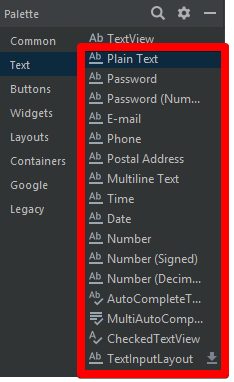

Для быстрой разработки текстовые поля снабдили различными свойствами и дали разные имена: Plain Text, Person Name, Password, Password (Numeric), E-mail, Phone, Postal Address, Multiline Text, Time, Date, Number, Number (Signed), NumberDecimal.

#### Plain Text

**Plain Text** - самый простой вариант текстового поля без наворотов.

#### Password и Password (Numeric)

При использовании Password в ``android:inputType`` используется значение textPassword. При вводе текста сначала показывается символ, который заменяется на звёздочку. Если используется элемент Password (Numeric), то у атрибута inputType используется значение numberPassword. В этом случае на клавиатуре будут только цифры вместо букв. Вот и вся разница.

```xml
<EditText
    android:id="@+id/editText2"
    android:layout_width="match_parent"
    android:layout_height="wrap_content"
    android:ems="10"
    android:inputType="textPassword" />
```

#### E-mail

У элемента E-mail используется атрибут android:inputType="textEmailAddress". В этом случае на клавиатуре появляется дополнительная клавиша с символом @, который обязательно используется в любом электронном адресе.

#### Phone

У элемента Phone используется атрибут android:inputType="phone". Клавиатура похожа на клавиатуру из старого кнопочного сотового телефона с цифрами, а также с кнопками звёздочки и решётки.

#### Multiline Text

У Multiline Text используется атрибут android:inputType="textMultiLine" позволяющий сделать текстовое поле многострочным. Дополнительно можете установить свойство Lines (атрибут android:lines), чтобы указать количество видимых строк на экране.

```xml
<EditText
    android:id="@+id/editText1"
    android:layout_width="wrap_content"
    android:layout_height="wrap_content"
    android:inputType="textMultiLine"
    android:lines="5" >
```    

#### Текст-подсказка

Веб-мастера знают о таком атрибуте HTML5 как placeholder, когда в текстовом поле выводится строчка-подсказка приглушенным (обычно серым цветом).

Подсказка видна, если текстовый элемент не содержит пользовательского текста. Как только пользователь начинает вводить текст, то подсказка исчезает. Соответственно, если удалить пользовательский текст, то подсказка появляется снова. Это очень удобное решение во многих случаях, когда на экране мало места для элементов.

В Android у многих элементов есть свойство Hint (атрибут hint), который работает аналогичным образом. Установите у данного свойства нужный текст и у вас появится текстовое поле с подсказкой.

#### Вызов нужной клавиатуры

Не во всех случаях нужна стандартная клавиатура с буковками и цифрами. Если вы пишете калькулятор, то проще показать пользователю цифровую клавиатуру. А если нужно ввести электронный адрес, то удобнее показать клавиатуру, где уже есть символ @. Ну а если ваше приложение пишется для котов, то достаточно вывести только те буквы, из которых можно составить слова Мяу и Жрать давай (к сожалению, такой клавиатуры ещё нет, но Google работает в этом направлении).

У элемента EditText на этот случай есть атрибут inputType:

```xml
<EditText android:id="@+id/etWidth1"
    android:hint="@string/catname"
    android:inputType="textCapWords"
    android:layout_height="wrap_content"
    android:layout_width="wrap_content"/>
```

В данном случае с атрибутом inputType="textCapWords" каждый первый символ каждого слова при вводе текста автоматически будет преобразовываться в прописную. Удобно, не так ли?

Значение **textCapSentences** делает прописным каждый первый символ предложения.

Если вам нужен режим CapsLock, то используйте значение textCapCharacters и все буквы сразу будут большими при наборе.

Для набора телефонного номера используйте phone, и тогда вам будут доступны только цифры, звездочка (*), решетка (#).

Для ввода веб-адресов удобно использовать значение textUri. В этом случае у вас появится дополнительная кнопочка .com (при долгом нажатии на нее появятся альтернативные варианты .net, .org и др.).

Вот вам целый список доступных значений (иногда различия очень трудно различимы)

* text
* textCapCharacters (клавиатура с символами в верхнем регистре)
* textCapWords
* textCapSentences
* textAutoCorrect
* textAutoComplete
* textMultiLine
* textImeMultiLine
* textNoSuggestions (без подсказок при вводе текста)
* textUri
* textEmailAddress
* textEmailSubject
* textShortMessage
* textLongMessage
* textPersonName
* textPostalAddress
* textPassword
* textVisiblePassword (без автокоррекции)
* textWebEditText
* textFilter
* textPhonetic
* number
* numberSigned
* numberDecimal
* phone
* datetime
* date
* time

#### Заблокировать текстовое поле

Для блокировки текстового поля присвойте значения false свойствам Focusable, Long clickable и Cursor visible.

#### Другие свойства

**minLines и maxLines**

Позволяют ограничить количество строк текста, которое можно ввести в текстовом поле

**maxLength**

Позволяет задать максимальное количество символов для ввода

**Методы**

Основной метод класса EditText — getText(), который возвращает текст, содержащийся в текстовом поле. Возвращаемое значение имеет специальный тип Editable, а не String.

```kt
val strCatName = nickNameEditText.getText().toString() // приводим к типу String
```

Соответственно, для установки текста используется метод setText().

Большинство методов для работы с текстом унаследованы от базового класса TextView: setTypeface(null, Typeface), setTextSize(int textSize), SetTextColor(int Color).


#### Обработка нажатий клавиш

Для обработки нажатий клавиш необходимо зарегистрировать обработчик View.OnKeyListener, используя метод setOnKeyListener() элемента EditText. Например, для прослушивания события нажатия клавиши Enter во время ввода текста пользователем (или котом), используйте следующий код:


```kt
editText.setOnKeyListener(OnKeyListener {v, keyCode, event ->
    if (keyCode == KeyEvent.KEYCODE_ENTER && event.action == KeyEvent.ACTION_UP) {
        //Perform Code
        return@OnKeyListener true
    }
    false
})
```

### Кнопка (Button)

Кнопка - один из самых распространенных элементов управления в программировании. Наследуется от TextView и является базовым классом для класса СompoundButton. От класса CompoundButton в свою очередь наследуются такие элементы как CheckBox, ToggleButton и RadioButton. В Android для кнопки используется класс android.widget.Button. На кнопке располагается текст и на кнопку нужно нажать, чтобы получить результат. Альтернативой ей может служить компонент ImageButton (android.widget.ImageButton), у которого вместо текста используется изображение.

В студии кнопка представлена компонентом Button в разделе Buttons. Управлять размером шрифта, цветом текста и другими свойствами можно через атрибут textAppearance, который задействует системные стили. Выпадающий список данного свойства содержит огромный перечень вариантов. Также вы можете вручную задать конкретные индивидуальные настройки через отдельные свойства.

Если вы растягиваете кнопку по всей ширине экрана (android:layout_width="match_parent"), то дополнительно рекомендую использовать атрибут android:layout_margin (или родственные ему layout_marginRight и layout_marginLeft) для создания отступов от краев экрана (веб-мастера знакомы с этими терминами).

Так как кнопка является наследником TextView, то использует многие знакомые атрибуты: textColor, textSize и др.

#### Три способа обработки событий нажатий на кнопку

Если вы разместили на экране кнопку и будете нажимать на неё, то ничего не произойдёт. Необходимо написать код, который будет выполняться при нажатии. Существует несколько способов обработки нажатий на кнопку.

**Первый способ - атрибут onClick**

Относительно новый способ, специально разработанный для Android - использовать атрибут onClick (на панели свойств отображается как On Click):

```
android:onClick="onMyButtonClick"
```

Имя для события можно выбрать произвольное, но лучше не выпендриваться. Далее нужно прописать в классе активности придуманное вами имя метода, который будет обрабатывать нажатие. Метод должен быть открытым (public) и с одним параметром, использующим объект View. Вам нужно выучить пять слов для создания метода, а сам метод поместить в класс:

```kt
fun onMyButtonClick(view: View)
{  
    // выводим сообщение
    Toast.makeText(this, "Зачем вы нажали?", Toast.LENGTH_SHORT).show()
}  
```

Когда пользователь нажимает на кнопку, то вызывается метод onMyButtonClick(), который в свою очередь генерирует всплывающее сообщение.

> Данный способ не будет работать в фрагментах. Кнопка должна быть частью активности, а не фрагмента.

**Второй способ - метод setOnClickListener()**

Более традиционный способ в Java - через метод setOnClickListener(), который прослушивает нажатия на кнопку. Так как для начинающего программиста код может показаться сложным, то рекомендуется использовать подсказки студии. Вот как это будет выглядеть. Предположим, у вас на экране уже есть кнопка button. 

Следующий шаг - написание метода для нажатия. Напечатайте имя элемента и поставьте точку button. - среда разработки покажет вам список доступных выражений для продолжения кода. Вы можете вручную просмотреть и выбрать нужный вариант, а можно продолжать набирать символы, чтобы ускорить процесс. Так как с нажатиями кнопок вам часто придётся работать, то запомните название его метода (хотя бы первые несколько символов) - набрав четыре символа (seto), вы увидите один оставшийся вариант, дальше можно сразу нажать клавишу Enter, не набирая оставшиеся символы. У вас появится строка такого вида:

```kt
button.setOnClickListener {  }
```

**Третий способ - интерфейс OnClickListener**

Третий способ является родственным второму способу и также является традиционным для Java. Кнопка присваивает себе обработчика с помощью метода setOnClickListener (View.OnClickListener), т.е. подойдет любой объект с интерфейсом View.OnClickListener. Мы можем указать, что наш класс Activity будет использовать интерфейс View.OnClickListener.

Опять стираем код от предыдущего примера. Далее после слов extends Activity дописываем слова implements OnClickListener. При появлении подсказки не ошибитесь. Обычно первым идёт интерфейс для диалогов, а вторым нужный нам View.OnClickListener.

Название вашего класса будет подчёркнуто волнистой красной чертой, щёлкните слово public и дождитесь появления красной лампочки, выберите вариант Implement methods. Появится диалоговое окно с выделенным методом onClick. Выбираем его и в коде появится заготовка для нажатия кнопки.

```kt
override fun onClick(v: View) {
    
}
```

Метод будет реализован не в отдельном объекте-обработчике, а в Activity, который и будет выступать обработчиком. В методе onCreate() присвоим обработчик кнопке. Это будет объект this, т.е. текущий объект нашей активности.

```kt
button.setOnClickListener(this)
```

**Один обработчик для нескольких кнопок**

Если у вас несколько кнопок, то не обязательно для каждой прописывать свой метод, можно обойтись и одним, а уже в самом методе разделять код по идентификатору кнопки. Если вы посмотрите на код в предыдущих примерах, то увидите, что в методе присутствует параметр View, который и позволяет определить, для какой кнопки предназначен кусок кода:

```kt
fun onMyButtonClick(view:View)
{
    when(view.getId())  {
        R.id.button -> {
            showAlertDialog()
        }        
    }
}
```

**Сделать кнопку недоступной**

Иногда нужно сделать кнопку недоступной и активировать её при определённых условиях. Через XML нельзя сделать кнопку недоступной (нет подходящего атрибута). Это можно сделать программно через метод setEnabled():

```kt
button.setEnabled(false)
```

Как альтернативу можете рассмотреть атрибут android:clickable, который позволит кнопке не реагировать на касания, но при этом вид кнопки останется обычным.

#### Сделать кнопку плоской

Стандартная кнопка на экране выглядит выпуклой. Но в некоторых случаях желательно использовать плоский интерфейс. Раньше для этих целей можно было использовать TextView с обработкой щелчка. Но теперь рекомендуют использовать специальный стиль borderlessButtonStyle:

```xml
<Button
    android:id="@+id/button1"
    style="?android:attr/borderlessButtonStyle"
    android:layout_width="match_parent"
    android:layout_height="wrap_content"
    android:onClick="onClick"
    android:text="Button" />
```

Кнопка сохранит своё привычное поведение, будет менять свой цвет при нажатии и т.д.

С появлением Material Design добавились другие стили, например, style="@style/Widget.AppCompat.Button.Borderless", который является предпочтительным вариантом. Попробуйте также style="@style/Widget.AppCompat.Button.Borderless.Colored"

**Коснись меня нежно**

Если вы внимательно понаблюдаете за поведением кнопки, то увидите, что код срабатывает в тот момент, когда вы отпускаете свою лапу, извините, палец с кнопки. Для обычных приложений это вполне нормально, а для игр на скорость такой подход может оказаться слишком медленным. В подобных случаях лучше обрабатывать ситуацию не с нажатием кнопки, а с его касанием. В Android есть соответствующий слушатель OnTouchListener()

#### Получить текст с кнопки

Задача - получить текст кнопки в методе onClick(). У метода есть параметр типа View, у которого нет метода getText(). Для этого нужно привести тип к типу Button.

```kt
    (view as Button).text.toString()
}
```

Если у вас несколько кнопок привязаны к методу onClick(), то щелчок покажет текст нажатой кнопки.

### ImageButton (Кнопка-изображение)

Компонент ImageButton представляет собой кнопку с изображением (вместо текста). По умолчанию ImageButton похож на обычную кнопку.

В режиме дизайна изображение на кнопке определяется атрибутом android:src

```xml
<ImageButton 
android:id="@+id/imageButton" 
...
android:src="@drawable/cat"/>
```

#### Методы

Программно можно установить изображения через различные методы.

**setImageBitmap()**

Используется, чтобы указать в качестве изображения существующий экземпляр класса 
Bitmap

**setImageDrawable()**

Используется, чтобы указать в качестве изображения существующий экземпляр класса Drawable

**setImageResource()**

Используется, чтобы указать в качестве изображения существующий идентификатор ресурса

**setImageURI()**

Используется, чтобы указать в качестве изображения существующий адрес типа Uri. В некоторых случаях элемент кэширует изображение и после изменения изображения по прежнему выводит старую версию. Рекомендуется использовать инструкцию setImageURI(null) для сброса кэша и повторный вызов метода с нужным Uri

#### Продолжительное нажатие

Кроме обычного клика, в Android есть особый вид нажатия на кнопку - продолжительное нажатие. Это событие происходит, когда пользователь нажимает и удерживает кнопку в течение одной секунды. Этот тип нажатия обрабатывается независимо от обычного щелчка.

Для обработки продолжительного нажатия нужно реализовать класс View.OnLongClickListener и передать его в метод setOnLongClickListener(). Класс OnLongClickListener имеет один обязательный метод OnLongClick(). В принципе это похоже на метод OnClick(), только имеет возвращаемое значение.

```kt
imageButton.setOnLongClickListener {
    val toast = Toast.makeText(applicationContext,
        "Long Click",
        Toast.LENGTH_SHORT)
    toast.setGravity(Gravity.CENTER, 0, 0)
    toast.show()
    false
}
```        

Запустите проект и убедитесь, что при быстром нажатии ничего не происходит, а при более продолжительном нажатии всплывает сообщение.

### CheckBox (Флажок)

Компонент CheckBox является флажком, с помощью которого пользователь может отметить (поставить галочку) определенную опцию. Очень часто флажки используются в настройках, когда нужно выборочно выбрать определенные пункты, необходимые для комфортной работы пользователю.

Компонент находится в группе Buttons

Для управления состояниями флажка используйте методы setChecked() или togglе(). Чтобы узнать текущее состояние флажка, вызовите свойство isChecked.

Если потребуется задействовать специфическую логику, в соответствии с которой флажок будет включаться или выключаться, зарегистрируйте событие, вызвав setOnCheckedChangeListener() с реализацией интерфейса OnCheckedChangeListener. Затем будет нужно реализовать метод onCheckedChanged(), который будет вызываться при изменении состояния флажка.

#### Собственный вид

Если вас не устраивает стандартный вид элементов CheckBox, то не составит никакого труда реализовать свои представления о дизайне.

В папке res/drawable создаём файл checkbox_selector.xml:

```xml
<?xml version="1.0" encoding="utf-8"?>
<selector xmlns:android="http://schemas.android.com/apk/res/android">

    <item android:drawable="@drawable/star_down" android:state_checked="true"/>
    <item android:drawable="@drawable/star" android:state_checked="false"/>

</selector>
```

Также необходимо подготовить два изображения для двух состояний флажков - выбран и не выбран. В нашем случае это две звезды - серая и жёлтая.

Осталось прописать селектор в компоненте CheckBox (атрибут android:button):

```
android:button="@drawable/checkbox_selector"
```

### RadioButton и RadioGroup

Познакомимся с компонентом RadioButton. Главная особенность элемента состоит в том, что он не используется в одиночестве. Всегда должно быть два и более переключателя и только один из них может быть выбранным. Это похоже на кнопки на старых радиоприёмниках, когда нажимая на одну из кнопок, вы заставляете отключиться другую нажатую кнопку.

Находится в разделе Buttons.

Компоненты RadioButton (переключатель) используются в составе контейнера RadioGroup. Обратите внимание на два момента. Первое - в контейнер RadioGroup можно включать не только RadioButton, но и другие элементы, например, TextView. Второе - переключатели работают в своём контейнере, т.е. если у вас два контейнера RadioGroup, то переключатели из одного контейнера не влияют на поведение переключателей второго контейнера.

#### Методы

Основным методом для переключателя является toggle(), который инвертирует состояние переключателя. Также представляют интерес методы isChecked(), который возвращает состояние кнопки, и setChecked(), изменяющий состояние кнопки в зависимости от параметра.

Для уведомления о переходе положения переключателя в активное или неактивное состояние в результате определенных событий, нужно вызывать метод setOnCheckedChangeListener() с применением слушателя OnCheckedChangeListener.

#### Добавление картинок к переключателю

Вы можете добавить изображение в левой, правой, верхней и нижней части переключателя, используя либо определённые атрибуты XML или программно.

Через атрибут drawableRight и ему подобных:

```xml
<RadioButton
    android:id="@+id/radioButton"
    ...
    android:drawableRight="@drawable/ic_launcher"
    android:text="RadioButton" />
```

Программно через метод setCompoundDrawables(left, top, right, bottom):

```java
radioButton.setCompoundDrawables(null, null, getResources().getDrawable(R.drawable.rightpic), null);
```

В этом примере мы указали только одно значение для правого края, остальным присвоили значение null. Можно одновременно задействовать все стороны переключателя.

#### Метод clearCheck()

Когда пользователь выберет любой из переключателей, то он уже не сможет снять с него отметку. Какой-нибудь из переключателей обязательно будет выбран в одном контейнере с ним. Единственный способ очистить все переключатели - программно вызвать метод clearCheck(), который относится к классу RadioGroup.

#### Метод getCheckedRadioButtonId()
У RadioGroup есть также метод getCheckedRadioButtonId(), который позволяет узнать идентификатор выбранного переключателя.

Также можно узнать индекс выбранного переключателя через метод indexOfChild()

#### Собственный вид

Если вас не устраивает стандартный вид элементов RadioButton, то не составит никакого труда реализовать свои представления о дизайне.

В папке res/drawable создаём файл radiobutton_selector.xml:

```xml
<?xml version="1.0" encoding="utf-8"?>
<selector xmlns:android="http://schemas.android.com/apk/res/android">

    <item android:drawable="@drawable/radio_down" android:state_checked="true"/>
    <item android:drawable="@drawable/radio" android:state_checked="false"/>

</selector>
```

Также необходимо подготовить два изображения для двух состояний - выбран и не выбран.

Осталось прописать селектор в элементе RadioButton при размещении на экране

```
android:button="@drawable/radiobutton_selector"
```

### ToggleButton (Кнопка-переключатель)

Компонент ToggleButton по своей функциональности похож на флажок (checkbox) или переключатель (radiobutton) - это кнопка, которая может находиться в одном из двух состояний: активна (On) или неактивна (Off). По умолчанию на кнопке написано "Оn", если она активна, и "Off" - если нет. По внешнему виду это обычная кнопка с декоративной полоской в нижней части, которая подсвечивается в включенном состоянии (имитация LED-индикатора).

Находится в разделе Buttons:

Если надписи On/Off для вашей программы не подходят, их можно изменить при помощи свойств Text on (атрибут android:textOn) и Text off (атрибут android:textOff). Поскольку надписи Оn и Off на кнопке-переключателе являются отдельными атрибутами, атрибут android: text не используется, он доступен, так как наследуется от ТextView, но в данном случае без него можно обойтись. В программном коде им соответствуют методы setTextOff() и setTextOn().

По умолчанию, ToggleButton находится в выключенном состоянии, чтобы его "включить", установите свойство checked в значение true. Свойству соответствует метод setChecked(boolean checked).

Основное событие ToggleButton — изменение состояния кнопки onCheckedChanged().

### Switch

Switch - ещё один вид переключателей, который появился в Android 4.0 (API 14). Находится в разделах Commons и Buttons. Фактически, это замена немного устаревшего ToggleButton. В новых проектах лучше использовать Switch.

Компонент используется в том случае, когда нужно переключиться на противоположное состояние - да/нет, вкл./выкл., открыть/закрыть.

Компонент представляет собой полоску с двумя состояниями и сопровождающим текстом. Переключиться можно сдвиганием ползунка или касанием экрана в области компонента (не только на самом ползунке, но и на сопровождающем тексте).

По умолчанию виджет находится в выключенном состоянии. Чтобы установить его в включенном состоянии на этапе разработки, используйте атрибут android:checked="true".

Сопровождающий текст задаётся в атрибуте android:text. А текст на самом переключателе задаётся при помощи атрибутов android:textOn (методы getTextOn() и setTextOn()) и android:textOff (методы getTextOff() и setTextOff()). Обратите внимание, что сопровождающий текст может быть очень большим и положение самого переключателя относительно этого текста можно регулировать при помощи атрибута android:gravity (смотри пример ниже). Если сопровождающий текст вам не нужен, то не используйте атрибут android:text.

Момент переключения можно отслеживать при помощи прослушки событий setOnCheckedChangeListener.

# Ссылки на несколько оригинальных лекций

* [ConstraintLayout](https://metanit.com/java/android/3.8.php)
* [Размеры элементов в ConstraintLayout](https://metanit.com/java/android/3.7.php)
* [Цепочки элементов в ConstraintLayout](https://metanit.com/java/android/3.15.php)
* [LinearLayout](https://metanit.com/java/android/3.2.php)
