# Проект "Калькулятор". Вёрстка, стили и темы, ресурсы, события, ориентация экрана, сохранение состояния приложения

* [Вёрстка простого калькулятора](#вёрстка-простого-калькулятора)
* [Стили и темы](#стили-и-темы)
* [Работа с ресурсами](#работа-с-ресурсами)
* [Фигуры в качестве фона для визуальных элементов](#фигуры-в-качестве-фона-для-визуальных-элементов)
* [Обработка событий (клик по кнопке)](#обработка-событий-клик-по-кнопке)
* [Ориентация экрана](#ориентация-экрана)
* [Сохранение состояния приложения](#сохранение-состояния-приложения)

## Вёрстка простого калькулятора

Используя **LinearLayout** нарисовать разметку для калькулятора (за основу взять калькулятор Mac):


В простом калькуляторе можно выделить 3 разные области (по вертикали):

1. Текстовое поле для отображения результата **фиксированной** высоты
2. Блок одинаковых по размеру кнопок, которые удобно делать с помошью **TableLayout**
3. Блок, где количество или размеры кнопок отличаются от стандартных (в виндовом калькуляторе это кнопки работы с памятью)

**Во-первых** создадим новый файл разметки `portrait_layout.xml` с корневым элементом **LinearLayout**:

```xml
<?xml version="1.0" encoding="utf-8"?>
<LinearLayout 
    xmlns:android="http://schemas.android.com/apk/res/android"
    android:layout_width="match_parent"
    android:layout_height="match_parent"
    android:orientation="vertical" >
 
</LinearLayout>
```

Высота и ширина по размеру эрана телефона (*match_parent*)

### Вес элемента

**LinearLayout** поддерживает такое свойство, как **вес** элемента, которое передается атрибутом `android:layout_weight`. Это свойство принимает значение, указывающее, какую часть контейнера по отношению к другим объектам займет данный элемент. Например, если один элемент у нас будет иметь для свойства `android:layout_weight` значение `2`, а другой - значение `1`, то в сумме они дадут `3`, поэтому первый элемент будет занимать `2/3` пространства контейнера, а второй - `1/3`.

>При использовании атрибута "вес" нужно соответствующий размер установить  = "0dp". Т.е. для горизонтального контейнера ширину, а для вертикального - высоту.

Если все элементы имеют значение `android:layout_weight="1"`, то все эти элементы будут равномерно распределены по всей площади контейнера.

Если мы хотим, чтобы какой-то элемент не менял свой размер, то укзываем вес = "0".

Например, именно так мы выделим область для текстового поля с результатами:

```xml
<TextView
    android:layout_width="match_parent"
    android:layout_height="100dp"
    android:text="0"
    android:layout_weight="0" />
```

В таком случае, при расчёте размеров элементов, сначала из общего размера контейнера вычитаются размеры элементов с фиксированнами габаритами, а потом уже оставшееся свободное место делится на те элементы, размер которых расчитывается динамически (задан вес)

Во **втором** блоке у нас таблица из одинаковых кнопок. Можно сделать несколько **LinearLayout**, а можно использовать **TableLayout** - у этого контейнера количество столбцов вычисляется по наибольшему количеству ячеек в строках, а сами строки (**TableRow**) являются наследниками **LinearLayout**:

```xml
<TableLayout
    android:layout_width="match_parent"
    android:layout_height="wrap_content"
    android:layout_weight="4"
    >
    <TableRow
        android:layout_height="0dp"
        android:layout_weight="1">
        ...
    </TableRow>
    ...
</TableLayout>
```

Для всей таблицы мы задаем вес = `4` (по количеству строк). И внутри таблицы всем строкам задаём одинаковый вес.

В третьем блоке у нас широкая кнопка для цифры `0`. Заворачиваем этот ряд в отдельный **LinearLayout** с весом = `1` и используем для этой кнопки вес = `2`.

## Стили и темы

### Стили

Мы можем настроить элемент с помощью различных атрибутов, которые задают высоту, ширину, цвет фона, текста и так далее. Но если у нас несколько элементов используют одни и те же настройки, то мы можем объединить эти настройки в стили.

Например, пусть у нас есть несколько элементов **TextView**:

```xml
<?xml version="1.0" encoding="utf-8"?>
<androidx.constraintlayout.widget.ConstraintLayout
    xmlns:android="http://schemas.android.com/apk/res/android"
    xmlns:app="http://schemas.android.com/apk/res-auto"
    android:layout_width="match_parent"
    android:layout_height="match_parent">
 
    <TextView
        android:id="@+id/textView1"
        android:layout_width="0dp"
        android:layout_height="wrap_content"
        android:gravity="center"
        android:textSize="28sp"
        android:textColor="#3f51b5"
        android:text="Android Lollipop"
 
        app:layout_constraintLeft_toLeftOf="parent"
        app:layout_constraintRight_toRightOf="parent"
        app:layout_constraintTop_toTopOf="parent"
        app:layout_constraintBottom_toTopOf="@+id/textView2"
        />
    <TextView
        android:id="@+id/textView2"
        android:layout_width="0dp"
        android:layout_height="wrap_content"
        android:gravity="center"
        android:textSize="28sp"
        android:textColor="#3f51b5"
        android:text="Android Marshmallow"
 
        app:layout_constraintLeft_toLeftOf="parent"
        app:layout_constraintRight_toRightOf="parent"
        app:layout_constraintBottom_toTopOf="@+id/textView3"
        app:layout_constraintTop_toBottomOf="@+id/textView1"
        />
    <TextView
        android:id="@+id/textView3"
        android:layout_width="0dp"
        android:layout_height="wrap_content"
        android:gravity="center"
        android:textSize="28sp"
        android:textColor="#3f51b5"
        android:text="Android Nougat"
 
        app:layout_constraintLeft_toLeftOf="parent"
        app:layout_constraintRight_toRightOf="parent"
        app:layout_constraintBottom_toBottomOf="parent"
        app:layout_constraintTop_toBottomOf="@+id/textView2"
        />
 
</androidx.constraintlayout.widget.ConstraintLayout>
```

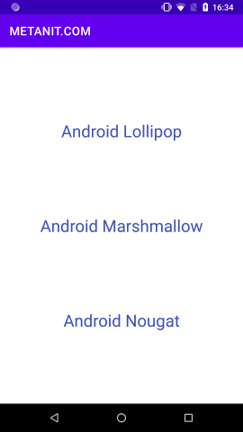

Все эти **TextView** имеют одинаковый набор свойств, и, к примеру, если нам захочется изменить цвет текста, то придется менять его у всех трёх **TextView**. Данный подход не оптимален, а более оптимальный подход представляет использование стилей, которые определяются в проекте в папке `res/values`.

Итак, добавим в проект в папку `res/values` новый элемент Value Resourse File, который назовем `styles.xml`:


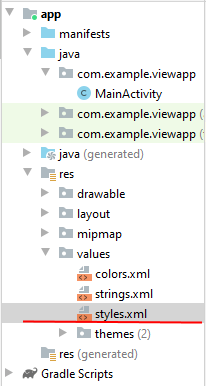

Определим в файле styles.xml следующее содержимое:

```xml
<?xml version="1.0" encoding="utf-8"?>
<resources>
    <style name="TextViewStyle">
        <item name="android:layout_width">0dp</item>
        <item name="android:layout_height">wrap_content</item>
        <item name="android:textColor">#3f51b5</item>
        <item name="android:textSize">28sp</item>
        <item name="android:gravity">center</item>
    </style>
</resources>
```

Здесь определен новый стиль с именем **TextViewStyle**, который с помощью элементов **item** задает значения для атрибутов.

Стиль задается с помощью элемента `<style>`. Атрибут **name** указывает на название стиля, через которое потом можно ссылаться на него. Необязательный атрибут **parent** устанавливает для данного стиля родительский стиль, от которого дочерний стиль будет наследовать все свои характеристики.

С помощью элементов **item** устанавливаются конкретные свойства виджета, который принимает в качестве значения атрибута **name** имя устанавливаемого свойства.

Теперь применим стиль элементов TextView в файле `activity_main.xml`:

```xml
<TextView
    android:id="@+id/textView1"
    style="@style/TextViewStyle"
    android:text="Android Lollipop"
    app:layout_constraintLeft_toLeftOf="parent"
    app:layout_constraintRight_toRightOf="parent"
    app:layout_constraintTop_toTopOf="parent"
    app:layout_constraintBottom_toTopOf="@+id/textView2"
    />
```

Используя определение `style="@style/TextViewStyle"` текстовое поле связывается с определением стиля. Итоговый результат будет тот же, что и раньше, только кода становится меньше. А если мы захотим поменять какие-то характеристики, то достаточно изменить нужный элемент item в определении стиля.

### Темы

Кроме применение отдельных стилей к отдельным элементам, мы можем задавать стили для всего приложения или activity в виде тем. Тема предтавляет коллекцию атрибутов, которые применяются в целом ко всему приложению, классу activity или иерархии виджетов.

Мы можем сами создать тему. Однако Android уже предоставляет несколько предустановленных тем для стилизации приложения, например, Theme.AppCompat.Light.DarkActionBar и ряд других.

По умолчанию приложение уже применяет темы. Так, откроем файл AndroidManifest.xml. В нем мы можем увидеть следующее определение элемента application, представляющего приложение:

```xml
<application
    android:allowBackup="true"
    android:icon="@mipmap/ic_launcher"
    android:label="@string/app_name"
    android:roundIcon="@mipmap/ic_launcher_round"
    android:supportsRtl="true"
    android:theme="@style/Theme.ViewApp">
```        

Задание темы происходит с помощью атрибута *android:theme*. В данном случае используется ресурс, который называется в моем случае *Theme.ViewApp*. По умолчанию файлы тем определены в папке `res/values`. В частности, здесь можно найти условный каталог `themes`, в котором по умолчанию есть два элемента: `themes.xml`:

Дальше про темы читайте в [оригинальной лекции](https://metanit.com/java/android/6.2.php)

## Работа с ресурсами

Ресурс в приложении Android представляет собой файл, например, файл разметки интерфейса или некоторое значение, например, простую строку. То есть ресурсы представляют собой и файлы разметки, и отдельные строки, и звуковые файлы, файлы изображений и т.д. Все ресурсы находятся в проекте в каталоге `res`. Для различных типов ресурсов, определенных в проекте, в каталоге res создаются подкаталоги. Поддерживаемые подкаталоги:

* **animator**: xml-файлы, определяющие анимацию свойств
* **anim**: xml-файлы, определяющие tween-анимацию
* **color**: xml-файлы, определяющие список цветов
* **drawable**: Графические файлы (.png, .jpg, .gif) или описание фигур в .xml формате
* **mipmap**: Графические файлы, используемые для иконок приложения под различные разрешения экранов
* **layout**: xml-файлы, определяющие пользовательский интерфейс приложения
* **menu**: xml-файлы, определяющие меню приложения
* **raw**: различные файлы, которые сохраняются в исходном виде
* **values**: xml-файлы, которые содержат различные используемые в приложении значения, например, ресурсы строк
* **xml**: Произвольные xml-файлы
* **font**: файлы с определениями шрифтом и расширениями .ttf, .otf или .ttc, либо файлы XML, который содержат элемент `<font-family>`

### Применение ресурсов

Существует два способа доступа к ресурсам: в файле исходного кода и в файле xml.

#### Ссылка на ресурсы в коде

Тип ресурса в данной записи ссылается на одно из пространств (вложенных классов), определенных в файле `R.java`, которые имеют соответствующие им типы в xml:

* **R.drawable** (ему соответствует тип в xml drawable)
* **R.id** (id)
* **R.layout** (layout)
* **R.string** (string)
* **R.attr** (attr)
* **R.plural** (plurals)
* **R.array** (string-array)

Например, для установки ресурса `activity_main.xml` в качестве графического интерфейса в коде **MainActivity** в методе *onCreate()* есть такая строка:

```kt
setContentView(R.layout.activity_main)
```

Через выражение **R.layout.activity_main** мы и ссылаемся на ресурс `activity_main.xml`, где **layout** - тип ресурса, а **activity_main** - имя ресурса.

Подобным образом мы можем получать другие ресурсы. Например, в файле `res/values/strings.xml` определен ресурс **app_name**:

```xml
<resources>
    <string name="app_name">ViewApp</string>
</resources>
```

Этот ресурс ссылается на строку. Чтобы получить ссылку на данный ресурс в коде, мы можем использовать выражение **R.string.app_name**.

#### Доступ в файле xml

Нередко возникает необходимость ссылаться на ресурс в файле xml, например, в файле, который определяет визуальный интерфейс, к примеру, в `activity_main.xml`. Ссылки на ресурсы в файлах xml имеют следующую формализованную форму: `@[имя_пакета:]тип_ресурса/имя_ресурса`

* имя_пакета представляет имя пакета, в котором ресурс находится (указывать необязательно, если ресурс находится в том же пакете)

* тип_ресурса представляет подкласс, определенный в классе R для типа ресурса

* имя_ресурса имя файла ресурса без расширения или значение атрибута android:name в XML-элементе (для простых значений).

Например, мы хотим вывести в элемент **TextView** строку, которая определена в виде ресурса в файле `strings.xml`:

```xml
<TextView
    android:id="@+id/textView"
    android:layout_width="wrap_content"
    android:layout_height="wrap_content"
    android:text="@string/app_name" />
```

В данном случае свойство *text* в качестве значения будет получать значение строкового ресурса **app_name**.

Подробнее про ресурсы можно посмотреть в [отдельной лекции](https://metanit.com/java/android/2.5.php)

## Фигуры в качестве фона для визуальных элементов

Часто применяется для круглых (или прямоугольных со скруглёнными углами) кнопок.

Вообще для задания цвета фона используется атрибут *android:background*, но в андроиде невозможно задать скругленные углы, чтобы получить круглые кнопки (или прямоугольные со скруглёнными углами).

Для реализации такой фичи можно в качестве фона задать *drawable* ресурс: `@drawable/название_файла_ресурса`

А в качестве *drawable* ресурса может быть, как мы уже знаем, картинка или фигура.

Про фигуры расскажу подробнее:

В каталоге `res/drawable` создайте "Drawable Resource File" c корневым элементом **shape** ([фигура](https://developer.android.com/guide/topics/resources/drawable-resource#Shape))

В качестве фигуры можно использовать 4 примитива. 

* **rectangle** - прямоугольник
* **oval** - овал
* **line** - горизонтальная линия
* **ring** - кольцо

Для фигуры **ring** в теге **shape** могут быть определены дополнительные атрибуты:

* **android:innerRadius** - внутренний радиус

Также в теге **shape** могут быт вложенные теги для настройки фигур:

* **stroke** - можно задать толщину и цвет границы фигуры, например овал с тонкой черной границей:

    ```xml
    <?xml version="1.0" encoding="utf-8"?>
    <shape
        xmlns:android="http://schemas.android.com/apk/res/android"
        android:shape="oval">
        <stroke
            android:width="1dp"
            android:color="#000000">
        </stroke>
    </shape>
    ```

    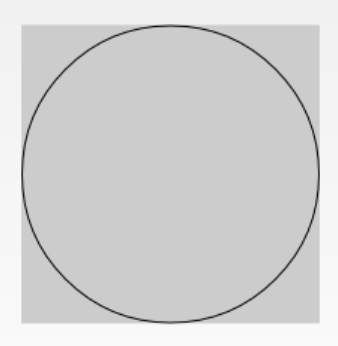

    ещё у тега **stroke** есть атрибуты *android:dashWidth* - ширина пунктирной линии и *android:dashGap* - промежуток между линиями

* **solid** - задаёт цвет заливки фигуры
    
    ```xml
    <?xml version="1.0" encoding="utf-8"?>
    <shape
        xmlns:android="http://schemas.android.com/apk/res/android"
        android:shape="rectangle">
        <stroke
            android:width="2dp"
            android:color="#0000FF">
        </stroke>
        <solid
            android:color="#00FF00">
        </solid>
    </shape>
    ```

    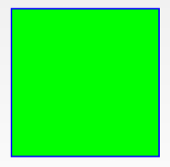

* **size** - по умолчанию фигура занимает всё доступное ей пространство, но мы можем явно указать её размер с помощью тега size.

    ```xml
    <?xml version="1.0" encoding="utf-8"?>
    <shape
        xmlns:android="http://schemas.android.com/apk/res/android"
        android:shape="rectangle">
        <stroke
            android:width="2dp"
            android:color="#0000FF">
        </stroke>
        <size
            android:width="100dp"
            android:height="100dp">
        </size>
    </shape>
    ```

    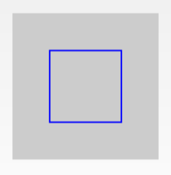

* **padding** - позволяет нам задать величину отступа внутри фигуры. Это актуально, например, для **TextView**. Отступ будет учтен при размещении текста.

    ```xml
    <?xml version="1.0" encoding="utf-8"?>
    <shape
        xmlns:android="http://schemas.android.com/apk/res/android"
        android:shape="rectangle">
        <stroke
            android:width="2dp"
            android:color="#0000FF">
        </stroke>
        <padding
            android:bottom="5dp"
            android:top="20dp"
            android:left="50dp"
            android:right="30dp">
        </padding>
    </shape>
    ```

    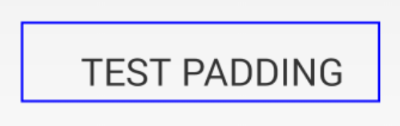

* **gradient** - заливка с переходом из одного цвета в другой (можно с переходом через третий цвет). Градиенту можно указать угол и тип (линейный, радиальный).

* **corners** - с помощью этого тега мы можем задать скруглённые углы для прямоугольника

    ```xml
    <?xml version="1.0" encoding="utf-8"?>
    <shape
        xmlns:android="http://schemas.android.com/apk/res/android"
        android:shape="rectangle">
        <stroke
            android:width="1dp"
            android:color="#000000">
        </stroke>
        <corners
            android:radius="40dp">
        </corners>
    </shape>
    ```

    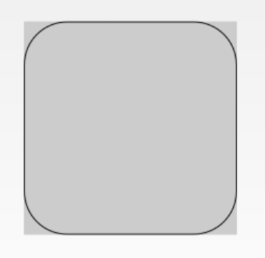

    Причем можно задать свой радиус для каждого угла

    ```xml
    <?xml version="1.0" encoding="utf-8"?>
    <shape
        xmlns:android="http://schemas.android.com/apk/res/android"
        android:shape="rectangle">
        <stroke
            android:width="1dp"
            android:color="#000000">
        </stroke>
        <corners
            android:topLeftRadius="15dp"
            android:topRightRadius="30dp"
            android:bottomRightRadius="45dp"
            android:bottomLeftRadius="60dp">
        </corners>
    </shape>
    ```

    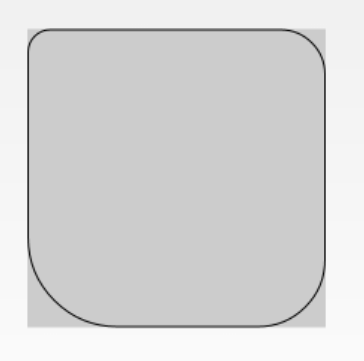

* **ring** - кольцо. Для кольца мы можем настроить два параметра: размер внутреннего радиуса и толщина кольца. Причем, эти два параметра мы можем указывать в абсолютном и относительном выражении.

    ```xml
    <?xml version="1.0" encoding="utf-8"?>
    <shape
        xmlns:android="http://schemas.android.com/apk/res/android"
        android:innerRadius="50dp"
        android:shape="ring"
        android:thickness="40dp"
        android:useLevel="false">
        <solid
            android:color="#FF0000">
        </solid>
        <size
            android:height="200dp"
            android:width="200dp">
        </size>
    </shape>
    ```

    

    Подробнее про режимы отображения кольца (и других фигур) можно посмотреть [здесь](https://startandroid.ru/ru/uroki/vse-uroki-spiskom/377-urok-162-grafika-drawable-shape-gradient.html)

## Обработка событий (клик по кнопке)

Существует несколько способов задать обработчики событий:

1. Атрибут **onClick**

Для кнопок (тег **Button**) можно задать обработчик клика, для этого в разметке добавьте атрибут *android:onClick* и задайте имя функции обработчика:

```xml
<Button
    android:onClick="onOperationClick"/>
```

Чтобы не писать вручную код этой функцию можно нажать на её названии клавиши `Alt+Enter` и выбрать действие "Create onOperationClick(view) in MainActivity"

>Если мы вручную добавляли новую *activity*, то нужно в корневой элемент добавить ссылку на класс, который будет работать с этой *activity*: `tools:context=".MainActivity"`

Плюс этого метода в том, что один и тот же обработчик можно назначить нескольким кнопкам (в калькуляторе можно сделать всего два обработчика: один для числовых кнопок, а второй для функциональных)

В коде обработчика мы должны либо привести параметр *view* к типу **Button**: 

```kt
fun onOperatorClick(view: View) {
    when((view as Button).text){
        "*" -> {
            ...
        }
    }
}
```

Либо в разметке добавить кнопкам атрибут *android:tag* и в коде анализировать его содержимое (ему приведение типов не нужно, т.к. он объявлен в классе **View**)

2. Программное добавление обработчика в классе:

Сначала надо получить указатель на визуальный элемент (для этого используется функция **findViewById**), затем назначить ему событие:

```kt
val someButton = findViewById<Button>(R.id.btn_one)
if (someButton != null) {
    someButton.setOnClickListener {
        textView.text="hello"
    }
}
```

## Ориентация экрана

>Взято [отсюда](http://developer.alexanderklimov.ru/android/orientation.php#whereorientation)

При разработке мобильных приложений со сложным дизайном нередки ситуации, когда при изменении ориентации экрана все выглядит совсем не так, как Вам хотелось бы. В таких случаях выходом из ситуации может стать использование различных шаблонов для книжной и альбомной ориентации устройства. При этом переключение между шаблонами может осуществляться в автоматическом или динамическом (ручном) режиме.

Для автоматического режима достаточно создать дополнительнай файл шаблона для альбомной ориентации.

Создадим дополнительный шаблон с "инженерной" версией калькулятора:

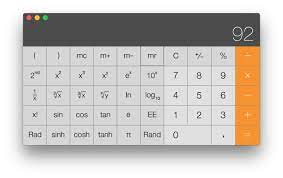

Для этого добавим **одноимённый** шаблон, указав ему ориентацию:

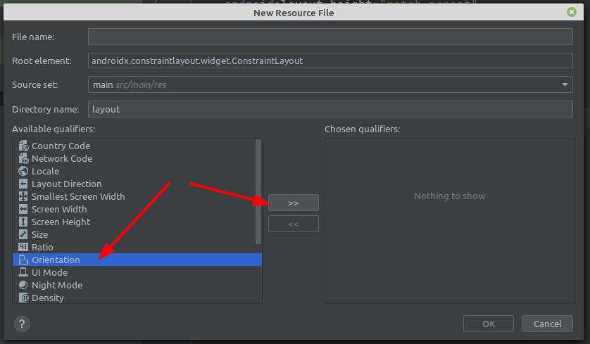
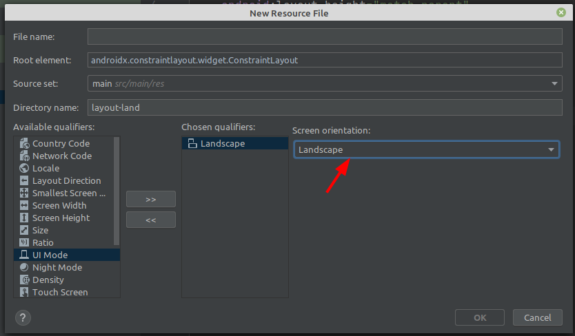

**Android Studio** автоматически создаст каталог `layout-land` и сохранит туда новый шаблон.

Когда вы создаёте альтернативную разметку, то не забывайте проверять наличие элементов, к которым будете обращаться программно, иначе получите ошибку.

## Сохранение состояния приложения

Ранее был рассмотрен жизненный цикл *Activity* в приложении на Android. Нам интересны два метода, которые вызываются при принудительном закрытии activity (в нашем случае, при повороте экрана). Перед завершением работы вызывается метод **onSaveInstanceState**, который сохраняет состояние *Actiity*, а после создания *Activity* вызывается метод **onRestoreInstanceState**, который восстанавливает её состояние. Оба этих метода в качестве параметра принимают объект **Bundle**, который как раз и хранит состояние *activity*:

```java
protected void onRestoreInstanceState(Bundle saveInstanceState);
protected void onSaveInstanceState(Bundle saveInstanceState);
```

Когда система завершает *activity* в принудительном порядке, чтобы освободить ресурсы для других приложений, пользователь может сохранить важные данные (в нашем случае буфер и операцию). Чтобы зафиксировать состояние *activity* перед её уничтожением, в классе активности необходимо реализовать метод **onSaveinstancestate()**.

Сам метод вызывается прямо перед методом **onPause()**. Он предоставляет возможность сохранять состояние пользовательского интерфейса активности в объект **Bundle**, который потом будет передаваться в методы **onCreate()** и **onRestoreInstanceState()**. В объект **Bundle** можно записать параметры, динамическое состояние активности как пары "ключ-значение". Когда *activity* будет снова вызвана, объект **Bundle** передаётся системой в качестве параметра в методы **onCreate()** и **onRestoreInstanceState()**, которые вызываются после **onStart()**, чтобы один из них или они оба могли установить *activity* в предыдущее состояние. Прежде чем передавать изменённый параметр **Bundle** в обработчик родительского класса, сохраните значения с помощью методов **putXXX()** и восстановите с помощью **getXXX()**.

В отличие от базовых методов, методы **onSaveInstanceState()** и **onRestoreInstanceState()** не относятся к методам жизненного цикла *activity*. Система будет вызывать их не во всех случаях. Например, Android вызывает **onSaveinstancestate()** прежде, чем *activity* становится уязвимой к уничтожению системой, но не вызывает его, когда экземпляр *activity* разрушается пользовательским действием (при нажатии клавиши BACK). В этом случае нет никаких причин для сохранения состояния активности.

Метод **onSaveInstanceState()** вызывается системой в случае изменения конфигурации устройства в процессе выполнения приложения (например, при вращении устройства пользователем или выдвижении физической клавиатуры устройства.

Поскольку метод **onSaveinstanceState()** вызывается не во всех случаях, его необходимо использовать только для сохранения промежуточного состояния активности. Для сохранения данных лучше использовать метод **onPause()**.

```kt
var buffer = ""

override fun onSaveInstanceState(outState: Bundle, outPersistentState: PersistableBundle) {
    outState.putString("buffer", buffer)
    super.onSaveInstanceState(outState, outPersistentState)
}

override fun onRestoreInstanceState(savedInstanceState: Bundle) {
    super.onRestoreInstanceState(savedInstanceState)
    buffer = savedInstanceState.getString("buffer") ?: ""
}
```

>Этим методом не получится сохранить операцию (лямбда-функцию), поэтому просто сохранённый буфер запишите в EditText при восстановлении данных после поворота

# ВАЖНО!!!

В мастере создания нового проекта Android Studio для многих шаблонов проект использует библиотеку компонентов MaterialDesign для Android. И он устанавливает тему по умолчанию на основе Theme.MaterialComponents.DayNight.DarkActionBar.

Побочным эффектом этого является то, что любые элементы `<Button>` в макете превращаются в виджеты **MaterialButton**, а не в обычные виджеты **Button**. **MaterialButton** игнорирует атрибут *android:background*.

Если вам нужна кнопка с индивидуальным фоном, и ваша тема настроена на использование *Theme.MaterialComponents*, вы можете переключить элемент XML в макете на `<android.widget.Button>` вместо `<Button>`.

# Практическое задание

Создайте приложение "калькулятор":
* в качестве контейнеров используйте LinearLayout или TableLayout
* используя стили раскрасить функциональные и цифровые кнопки калькулятора (разные стили для разных категорий кнопок)
* сделать прямоугольные кнопки со скругленными углами используя фигуры
* создайте обработчики нажатия кнопок и реализуйте работу калькулятора

Логика работы калькулятора:

- при нажатии на цифры вы просто накапливаете итоговую строку в какую-то переменную класса (буфер), учитывая, что при пустой строке нужно выводить цифру `0`, а при вводе числа лидирующие нули убирать
- при нажатии на функциональную кнопку, вы должны сохранить текущую операцию в лямбда выражение и сбросить отображаемое число (в буфере оно у вас осталось)
- при нажатии кнопки `=`, вы смотрите есть ли буфер, есть ли лямбда-функция и есть ли данные в **TextEdit**. При выполнении всех условий выполняете лямбда-функцию с параметрами взятыми из буфера и EditText

```kt
typealias Operation = (double, double) -> double
var operation: Operation? = null
var buffer: String = "0"
...

fun onFunctionClick(view: View) 
{
    when ((view as Button).text) {
        "*" -> {
                operation = {a, b -> a*b}
                myEditText.text = "0"
            }
        // тут реализуйте остальные операции
        "=" -> {
            if (operation == null) return

            // тут остальные проверки

            myEditText.text = operation(
                buffer.toDouble(),
                myEditText.text.toString().toDouble()
            ).toString()
        }
    }
}
```