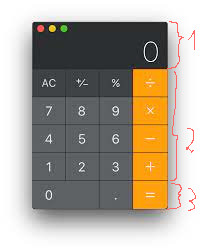

# Проект "Калькулятор"

Используя **LinearLayout** нарисовать разметку для калькулятора (за основу взять калькулятор Mac):



В простом калькуляторе можно выделить 3 разные области (по вертикали):

1. Текстовое поле для отображения результата **фиксированной** высоты
2. Блок одинаковых по размеру кнопок, которые удобно делать с помошью **TableLayout**
3. Блок, где количество или размеры кнопок отличаются от стандартных (в виндовом калькуляторе это кнопки работы с памятью)

**Во-первых** создадим новый файл разметки `portrait_layout.xml` с корневым элементом **LinearLayout**:

```xml
<?xml version="1.0" encoding="utf-8"?>
<LinearLayout xmlns:android="http://schemas.android.com/apk/res/android"
    android:layout_width="match_parent"
    android:layout_height="match_parent"
    android:orientation="vertical" >
 
</LinearLayout>
```

Высота и ширина по размеру эрана телефона (*match_parent*)

## Вес элемента

**LinearLayout** поддерживает такое свойство, как вес элемента, которое передается атрибутом `android:layout_weight`. Это свойство принимает значение, указывающее, какую часть контейнера по отношению к другим объектам займет данный элемент. Например, если один элемент у нас будет иметь для свойства `android:layout_weight` значение 2, а другой - значение 1, то в сумме они дадут 3, поэтому первый элемент будет занимать 2/3 пространства контейнера, а второй - 1/3.

>При использовании атрибута "вес" нужно соответствующий размер установить  = "0dp". Т.е. для горизонтального контейнера ширину, а для вертикального - высоту.

Если все элементы имеют значение `android:layout_weight="1"`, то все эти элементы будут равномерно распределены по всей площади контейнера.

Если мы хотим, чтобы какой-то элемент не менял свой размер, то укзываем вес = "0".

Например, именно так мы выделим область для текстового поля с результатами:

```xml
<TextView
    android:layout_width="match_parent"
    android:layout_height="100dp"
    android:text="0"
    android:layout_weight="0" />
```

В таком случае, при расчёте размеров элементов, сначала из общего размера контейнера вычитаются размеры элементов с фиксированнами габаритами, а потом уже оставшееся свободное место делится на те элементы, размер которых расчитывается динамически (задан вес)

Во **втором** блоке у нас таблица из одинаковых кнопок. Можно сделать несколько **LinearLayout**, а можно использовать **TableLayout** - у этого контейнера количество столбцов вычисляется по наибольшему количеству ячеек в строках, а сами строки (**TableRow**) являются наследниками **LinearLayout**:

```xml
<TableLayout
    android:layout_width="match_parent"
    android:layout_height="wrap_content"
    android:layout_weight="4"
    >
    <TableRow
        android:layout_height="0dp"
        android:layout_weight="1">
        ...
    </TableRow>
    ...
</TableLayout>
```

Для всей таблицы мы задаем вес = "4" (по количеству строк). И внутри таблицы всем строкам задаём одинаковый вес.

В третьем блоке у нас широкая кнопка для цифры "0". Заворачиваем этот ряд в отдельный **LinearLayout** с весом = "1" и используем для этой кнопки вес = "2".
