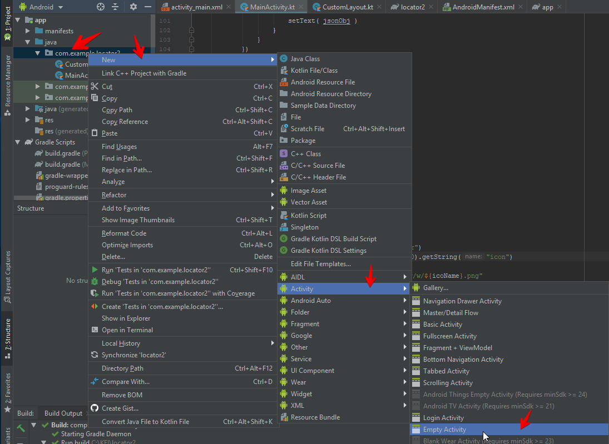
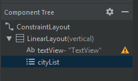
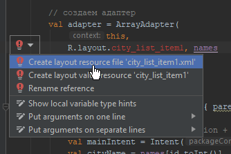
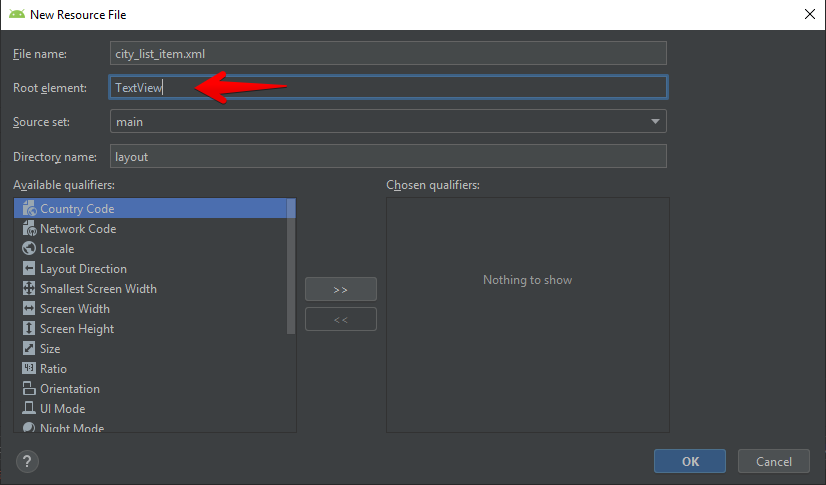

# Завершение проекта "Погода". Вывод списка городов (ArrayAdapter). Получение результата запуска Intent-a.

**Внимание!!!** в коде этой лекции рассматривается запрос одиночной погоды (weather), но мы уже должны работать со списком (forecast) - поменяйте сами все вызовы и разбор ответа.

## Выбор города

В приложении "Погода" может возникнуть необходимость получить данные о погоде не по текущим координатам, а по населённому пункту. 

**OpenWeatherMap** поддерживает [*геокодирование*](https://openweathermap.org/current), т.е. может найти координаты (и, соответственно, погоду по ним) по названию города:

```txt
http://api.openweathermap.org/data/2.5/weather?q={city name}&appid={API key}
```

где, *city_name* название города

То есть нам нужно сделать выбор города из списка и получить данные сформировав запрос с учётом города.

>В принципе список можно вывести прямо в главном окне (на форму кинуть **ListView** и с помощью атрибута *elevation* поместить его поверх всех элементов), но в таком случае не будет реализован выход по кнопке *Назад*, что может сказаться на юзабилити. 

Поэтому, будем реализовывать "классический" вариант со списком в отдельном **activity**. Заодно научимся получать ответ от **activity**.

1. Создаем новую форму (**Activity**) с именем *CityListActivity*

    

2. На главном окне реализуем обработчик клика по кнопке перехода на экран выбора города:

    ```kt
    startActivityForResult( 
        Intent(this, CityListActivity::class.java), 
        1)
    ```

    Здесь *startActivityForResult* - метод запуска нужной **activity**. 

    **Интент (Intent)** – это объект для обмена между *activity*, который абстрактно представляет собой **намерение** выполнить какое-либо действие. В основном интенты используются для запуска *activity*. Как только интент отправляется, его получает система Android, и считывает информацию в нем. Для открытия второго экрана, нам нужно создать и отправить объект **Intent** с указанием *activity*, которое нужно открыть. Затем вызвать метод *startActivity()* с передачей объекта **Intent**, который отправит это сообщение фреймворку Android, который откроет это активити.

    Второй параметр метода *startActivityForResult* - идентификатор задачи. Дело в том, что результат будет получен асинхронно в методе класса *onActivityResult*, а у нас в активности может быть несколько вызовов внешних активностей.

3. На форму *activity_city_list* кидаем вертикальный **LinearLayout**, в него **TextView** (для заголовка "Выберите город") и **ListView**. **ListView** присваиваем id *cityList*

    


4. В классе *CityListActivity* 

    * создаем массив городов (в реальном приложении этот список, конечно, нужно получать от АПИ или КЛАДР)

        ```kt
        private var cityNames = arrayOf(
            "Moscow",
            "Yoshkar-Ola",
            "Kazan"
        )
        ```

    * в конструкторе получаем указатель на **ListView**

        ```kt
        cityListView = findViewById(R.id.cityList)
        ```

    * задаем для списка **ArrayAdapter**. **ArrayAdapter** связывает массив данных с шаблоном элемента списка.

        ```kt
        cityListView.adapter = ArrayAdapter(
            this,
            R.layout.city_list_item,
            cityNames
        )
        ```

        Android Studio покажет ошибку, что не знает что такое `city_list_item` - в контекстном меню добавляем реализацию:

        

        **Внимание!** RootElement поменять на TextView

        

        Созданный шаблон можно настроить (установить высоту, добавить границы...)

    * задаём обработчик клика по элементу списка

        ```kt
        cityListView.setOnItemClickListener { parent, view, position, id ->
            // получаем название города
            val cityName = cityNames[position]

            // запоминаем выбранное название города в параметрах
            val newIntent = Intent()
            newIntent.putExtra("cityName", cityName)
            setResult(RESULT_OK, newIntent)

            // заверщаем текущий activity
            finish();
        }
        ```

        **Передача информации между активити**

        На первом экране при возврате должно отображаться название выбранного города (и данные о погоде). Для этого первому *activity* требуется получить выбранное название города. Мы можем передать эту информацию в интенте, используя метод *putExtra()*. *Activity* может получить интент, который запустил его (или вернулся как результат вызова другого *activity*), и извлечь данные из этого интента.

5. В классе главного окна для получения результата выбора реализуем метод *onActivityResult*

    ```kt
    override fun onActivityResult(requestCode: Int, resultCode: Int, data: Intent?) {
        if (data == null) {
            return
        }
        val name = data.getStringExtra("cityName")

        // тут запускаем http-запрос по имени города
        Http.call(
            "https://api.openweathermap.org/data/2.5/weather?q=${name}&appid=${appid}&lang=ru&units=metric", 
            weatherCallback)
    }
    ```

    >Метод *onActivityResult* гугл объявил устаревшим (deprecated), на это не обращаем внимание.


## Выделение лямбда-выражения в отдельную переменную

Для обработки результатов мы результаты запроса обрабатывли в месте получения. 

Но теперь тот же код будет использоваться для получения погоды по городу. Поэтому имеет смысл обработку результата оформить отдельной лямбда-функцией:

```kt
// weatherCallback - свойство класса, объявляется в теле класса
private val weatherCallback: HttpCallback = {
    response, error ->
        try {
            if (error != null) throw error
            if (!response!!.isSuccessful) throw Exception(response.message)

            // начинаем обработку ответа    

            val json = JSONObject(response.body!!.string())
            val wheather = json.getJSONArray("weather")
            val icoName = wheather.getJSONObject(0).getString("icon")

            // обращение к UI должно быть в контексте UiThread
            runOnUiThread {
                textView.text = json.getString("name")
            }

            Http.call("https://openweathermap.org/img/w/${icoName}.png")
            {response, error ->
                try {
                    if (error != null) throw error
                    if (!response!!.isSuccessful) throw Exception(response.message)

                    val bitmap = BitmapFactory
                        .decodeStream(
                            response.body!!.byteStream()
                        )

                    runOnUiThread {
                        ico.setImageBitmap(
                            bitmap      
                        )
                    }

                } catch (e: Exception) {
                }
            }
        } catch (e: Exception) {
            // любую ошибку показываем на экране
            runOnUiThread {
                AlertDialog.Builder(this)
                    .setTitle("Ошибка")
                    .setMessage(e.message)
                    .setPositiveButton("OK", null)
                    .create()
                    .show()
            }
        }
    }
}

...

// при запросе погоды используем переменную, объявленную выше
Http.call(
    "https://api.openweathermap.org/data/2.5/weather?lat=56.638372&lon=47.892991&appid=${appid}&lang=ru&units=metric", 
    weatherCallback)
```

