# Проект "Каршеринг"

## Техническое задание

**Модуль 1** 

Разработка мобильного приложения для бронирования автомобилей (каршеринг)

Необходимо разработать мобильное приложение для смартфона, удовлетворяющее следующим требованиям:

Приложение должно поддерживать следующие версии ОС:

* Android 9.0 и новее
* iOS 13.0 и новее

В работе необходимо использовать систему контроля версий **Git**.

Необходимо загрузить результаты выполнения модуля в отдельную ветку с именем `Module_X`, где `Х` – это номер модуля. Каждый модуль должен быть в отдельном репозитории.

Необходимо корректно обрабатывать запросы к серверу. В случае получения ошибки от сервера или отсутствия соединения с сетью Интернет необходимо отобразить соответствующий текст ошибки с помощью диалогового окна.

Необходимо строго следовать предложенному дизайну. Макеты приложения доступны по ссылке:
TODO добавить ссылку на фигму

Описание протокола API доступно по ссылке:
http://swagger.kolei.ru/?url=http://carsharing.kolei.ru/swagger/api.yml

Проект приложения должен быть структурирован по экранам, то есть исходные файлы конкретного экрана должны быть в соответствующей папке. Общие для нескольких экранов классы необходимо поместить в папку `common`.

Необходимо реализовать следующий функционал:

1. Создайте проект. Настройте иконку приложения согласно макету. Следует учесть разницу в отображении иконок на различных версиях операционной системы.

2. Реализуйте экран *Launch Screen* согласно макету. Текст должен быть отдельным элементом. Логотип приложения должен быть расположен по центру экрана. При первом запуске приложения после `Launch Screen` должен отображаться `SignUp Screen`. При последующих - `SignIn Screen`.

3. Реализуйте экран `SignUp Screen` согласно макету:
    * При нажатии на кнопку "Зарегистрироваться" необходимо проверять поля для ввода на пустоту, а также телефон на корректность (требования к телефону описаны в документации к API). При некорректном заполнении необходимо отобразить ошибку с помощью диалогового окна. Так же необходимо проверять равенство пароля и его повтора.
    * При корректном заполнении формы необходимо отправлять запрос регистрации на сервер. При получении ошибки от сервера ее необходимо отобразить с помощью диалогового окна. При успешной регистрации нужно автоматически осуществить авторизацию и перейти на `Main Screen`.
    * При нажатии на кнопку "У меня уже есть аккаунт" необходимо осуществлять переход на `SignIn Screen`.
    * при нажатии на ссылку "Оферта" необходимо открыть web-страничку с текстом оферты

4. Реализуйте экран `SignIn Screen` согласно макету:
    * При нажатии на кнопку "Войти" необходимо проверять поля для ввода на пустоту, а также телефон на корректность (требования к телефону описаны в документации к API). При некорректном заполнении необходимо отобразить ошибку с помощью диалогового окна. При корректном заполнении формы необходимо отправить на сервер соответствующий запрос.
    * При нажатии на кнопку "Регистрация" необходимо осуществлять переход на `SignUp Screen`.
    * При успешной авторизации необходимо осуществлять переход на экран `Main Screen` или `Profile Screen`, в зависимости от состояния пользователя (см. п.6 технического задания). При получении ошибки от сервера необходимо отобразить её с помощью диалогового окна.

5. Реализуйте экран `Profile Screen` согласно макету:
    * На экране необходимо отобразить аватарку пользователя. Рамка вокруг аватарки должна быть разного цвета в зависимости от состояния профиля:
        - *желтый*: не загружены фотографии водительских прав или паспорта
        - *красный*: есть штрафы от ГИБДД или претензии от владельца каршеринга
        - *зелёный*: всё OK (активный профиль)
    * При нажатии на аватарку открыть приложение "Камера" и полученную миниатюру отправить на сервер и заменить ею существующую аватрку.
    * При нажатии на кнопки "Загрузить фото водительских прав" или "Загрузить файл паспорта" открыть приложение "Галерея" и выбранный файл отправить на сервер.

6. Реализуйте экран `Main Screen` согласно макету:
    * На экране необходимо отобразить google-карту с текущей позицией и маркерами автомобилей (список доступных автомобилей получить с сервера).
    * при клике на маркер автомобиля показывать краткую информацию об автомобиле (popup): марка автомобиля, фото, кнопки "забронировать" и "маршрут". Кнопка "забронировать" должна быть только у активного пользователя
    * при клике на кнопку "Забронировать" открыть окно `Booking Screen`
    * При клике на кнопку "маршрут" закрыть popup и проложить маршрут от текущей позиции пользователя до выбранного автомобиля
    * При нажатии на иконку профиля необходимо переходить на `Profile Screen`.

7. Реализуйте экран `Booking Screen` согласно макету:

## Формирование данных в JSON формате (регистрация и авторизация). Получение, хранение и применение токена авторизации (способы авторизации). LiveData, глобальные свойства в классе приложения.

Создание приложения с иконкой, репозитория и ветки для модуля 1 я расписывать не буду, с этим вы уже знакомы. 

### Хранение данных в памяти устройства

Разберёмся как узнать: в первый раз мы запустили приложение или нет.

Подробно [тут](https://startandroid.ru/ru/uroki/vse-uroki-spiskom/73-urok-33-hranenie-dannyh-preferences.html)

Мы в качестве внешнего хранилища будем использовать **Preferences**. Это знакомый уже нам способ хранения данных в виде пары: **имя**, **значение**. Данные записываются в память телефона и доступны нам после перезапуска приложения.

Для получения экземпляра хранилища мы должны вызвать метод *getSharedPreferences*:

```kt
val myPreferences = getSharedPreferences(
    "settings", 
    MODE_PRIVATE)
```

где:
* "settings" - произвольное название вашего хранилища (их у вас может быть несколько)
* Константа MODE_PRIVATE используется для настройки доступа и означает, что после сохранения, данные будут видны только этому приложению

После получения экземпляра хранилища мы можем читать и писать в него значения.

Чтение простое:

```kt
val isFirstEnter = myPreferences
    .getBoolean(
        "isFirstEnter", 
        true)
```

Используя get-методы (*getString*, *getBoolean* и т.д.) мы можем получить сохранённые данные или значения по-умолчанию, если такого параметра нет в хранилище

Таким образом при первом входе в приложение мы получим `isFirstEnter = true`. 

Теперь нам необходимо записать в этот параметр значение `false`, чтобы при следующем входе знать, что это уже не первый вход в приложение.

Процесс записи несколько сложнее:

```kt
val editor = myPreferences.edit()
try {
    editor.putBoolean(
        "isFirstEnter", 
        false )
} finally {
    editor.commit()
}
```

Мы должны получить объект **Editor**, в котором реализованы методы сохранения данных (*putString*, *putBoolean* ...), вызвать нужный метод и после записи данных вызвать подтверждение записи в хранилище (метод *commit*)

### Регистрация и авторизация. Swagger.

Сначала об автоматическом переходе по ссылке на веб-сайт из текстового поля (да, можно по клику запускать интент и система откроет браузер, но можно и проще):

```xml
<TextView
    android:autoLink="web"
    android:linksClickable="true"
    android:text="Оферта: carsharing.kolei.ru/public/oferta.html"
/>
```

Элемент **TextView** поддерживает автоматический переход по ссылкам, достаточно указать какие типы ссылок искать в тексте (у нас указано искать веб-адреса `android:autoLink="web"`, но можно в этот атрибут добавить ключевое слово `phone` и можно будет позвонить).

**Swagger** - это фреймворк для спецификации *RESTful API*. Его прелесть заключается в том, что он дает возможность не только интерактивно просматривать спецификацию, но и отправлять запросы.

Открываем [ссылку](http://swagger.kolei.ru?url=http://carsharing.kolei.ru/swagger/api.yml) на описание АПИ и смотрим что там есть:

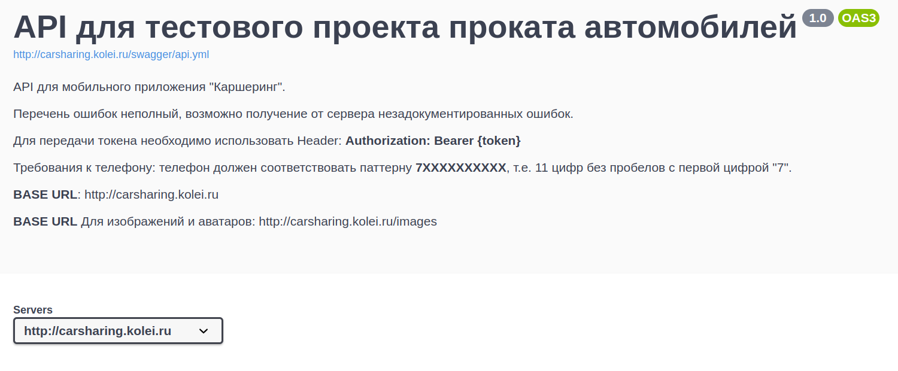

В начале идёт общая информация. Нам тут пока интереснен только так называемый базовый URL. Здесь он находится в блоке **Servers** (`http://carsharing.kolei.ru`), но может быть написан и просто текстом (как базовый урл для картинок).

Дальше идут описания методов АПИ. Рассмотрим подробно метод "Регистрация":

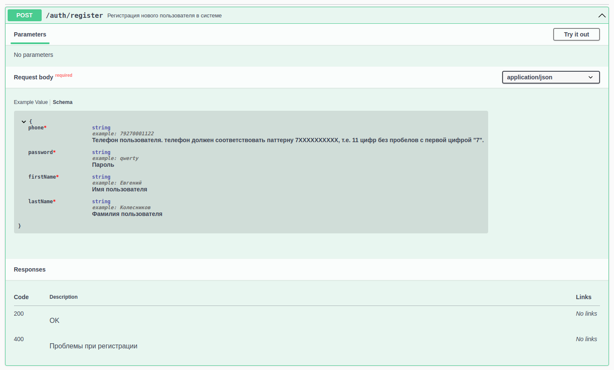

1. В заголовке указано какой метод и "путь" используются для запроса. К пути надо добавить "базовый урл" и получим полный адрес запроса: `http://carsharing.kolei.ru/auth/register`

1. В параметрах (*Parameters*) указываются параметры GET-запросов, передаваемые в строке запроса. У нас тут пусто.

1. Тело запроса (*Request body*). Тут указано что тело запроса обязательно должно присутсвовать (**required**) и формат `application/json`

    В теле запроса должна быть JSON-строка. Пример её можно посмотреть на вкладке **Example value**, но нам интереснее вкладка **schema** - на ней описаны типы данных (string), описание поля (что это такое вообще) и, возможно, обязательность использования поля. Например, для поля **phone** расписан шаблон, которому оно должно соответсвовать.

1. Коды ответов (*Responses*)

    Тут надо быть внимательным, коды могут отличаться.

Ну и самое приятное в **Swagger** - можно прямо в нём проверить результат работы. Кликаем кнопку "Try it out", вводим в открывшемся окне тело запроса и нажимаем выполнить (*Execute*). Таким образом нам не нужны ни **Postman** ни **VSCode** с плагинами

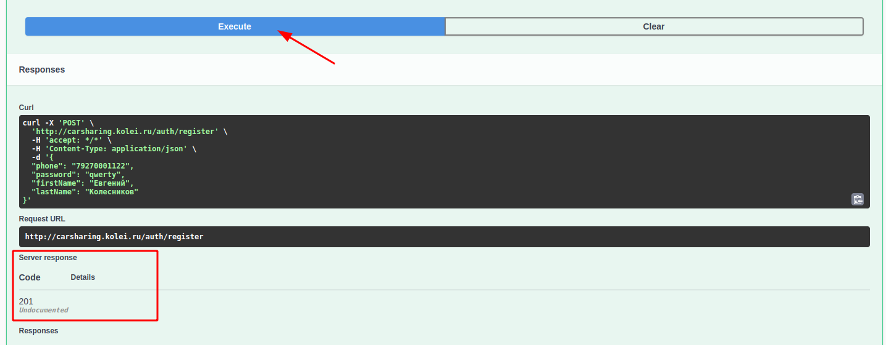

Пример отправки запроса регистрации:

```kt
val json = JSONObject()
json.put("phone", phone)
json.put("password", password)
json.put("firstName", firstName)
json.put("lastName", lastName)

Http.call(
    Http.buildRequest(
        "http://carsharing.kolei.ru/auth/register",
        json.toString()
    )
) { response, error -> ... }
```

С запросом авторизации аналогично, только параметров ещё меньше.

Ответ на запрос авторизации у меня возвращает информацию о пользователе, чтобы можно было принять решение на какой экран переходить после авторизации.

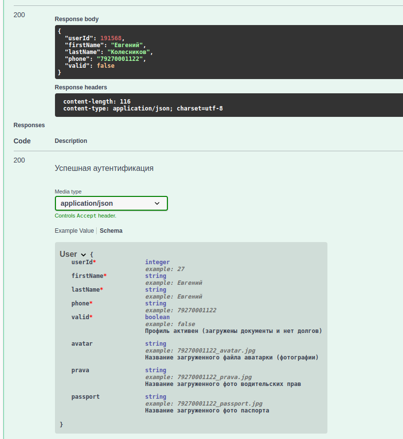

### Хранение данных в работающем приложении

Мы помним, что при пересоздании активности все её данные теряются. Нам нужно сохранить информацию о пользователе, так как остальные запросы в заголовке должны иметь токен авторизации (у меня это значение *userId*)

Теоретически можно хранить данные используя **Preferences**, но, **во-первых**, это хранилище может хранить только *скалярные* типы данных, а **во-вторых**, данные хранятся во флеш-памяти и частая её перезапись может навредить смартфону.

Есть ещё варианты: локальный сервер **SQLite** (слишком сложно для первого проекта), передача параметров через **Intent** (те же ограничения по скалярным данным), класс приложения, и механизм **ViewModel + LiveData**.

Механизм **ViewModel + LiveData** считается предпочтительным для хранения данных при работе приложения, но всё-таки сложноват для первого проекта. При желании вы можете с ним разобраться найдя статьи в интернете, например: 
* [ViewModel и LiveData. Сохранение и передача состояния активити при повороте устройства](https://www.fandroid.info/urok-7-androiddev-na-kotlin-sohranenie-i-peredacha-sostoyaniya-aktiviti-pri-povorote-ustrojstva-onsaveinstancestate-ili-viewmodel-livedata-kotlin-android-extensions/)
* [Использование ViewModel для хранения данных пользовательского интерфейса](https://swiftbook.ru/post/tutorials/android-lifecycle/)

Мы же будем использовать **хранение данных в классе приложения**.

Этот метод редко упоминается в литературе, но достаточно прост в реализации.

Рассматривая жизненный цикл андроид приложения все почему-то описывают только жизненный цикл отдельной активности (иногда ещё фрагмента), но не упоминают про само приложение. А оно между тем продолжает существовать и при смене активностей и при засыпании телефона. 

Есть возможность определить свой класс приложения и хранить в нём нужные данные, которые будут доступны в любой активности:

1. Создайте класс **MyApp**, который наследуется от класа **Application** и внутри опишите **публичные** переменные (рассмотрим на примере информации о пользователе, класс **User** реализуем ниже):

    ```kt
    class MyApp: Application() {
        var user: User? = null
    }
    ```

2. В манифесте в тег **application** добавьте атрибут `android:name=".MyApp"`, где `.MyApp` это имя созданного нами ранее класса

3. В классах, где нам нужны глобальные переменные создаем переменную, которая будет хранить указатель на **MyApp**

    ```kt
    private lateinit var app: MyApp
    ```

    В конструкторе класса проинициализируйте её

    ```kt
    app = applicationContext as MyApp
    ```

    И дальше в коде можно её использовать

    ```kt
    if(app.user?.userId != null){
        // 
    }
    ```

Класс **User** (поля берём из ответа сервера):

```kt
data class User(
    var userId: Int,
    var firstName: String,
    var lastName: String,
    var phone: String,
    var valid: Boolean,
    var avatar: String? = null,
    var prava: String? = null,
    var passport: String? = null
)
```

Поля, которые в ответе сервера не обязательны (фотографии), мы делаем *нуллабельными* и задаём значения по-умолчанию. 

Пример получения профиля:

```kt
val jsonObj = JSONObject(response.body!!.string())
app.user = User(
    jsonObj.getInt("userId"),
    jsonObj.getString("firstName"),
    jsonObj.getString("lastname"),
    jsonObj.getString("phone"),
    jsonObj.getBoolean("valid"),
    if(jsonObj.has("avatar")) jsonObj.getString("avatar") else null
)

if(jsonObj.has("prava"))
    app.user!!.prava = jsonObj.getString("avatar")
```

Обратите внимание, *нуллабельные* параметры *avatar* и *prava* я заполнил по-разному (оба варианта правильные):

* аватар мы заполнили используя возможность использовать оператор `if` как функцию
* права мы заполнили не при создании классаа, а отдельно

## Экран профиля. Получение данных из "галереи" и "камеры". Отправка **multipart** запросов

### Скруглённые углы у постера

Аватарка пользователя в профиле должна быть круглой. Фон "фигурой", как можно бы было надеятся тут не работает.

Можно использовать контейнер **CardView**: элемент **ImageView** заворачивается в контейнер **androidx.cardview.widget.CardView**, которому и задаётся радиус (половина размера). Кроме радиуса можно задать тень:

```xml
<androidx.cardview.widget.CardView
    android:layout_width="100dp"
    android:layout_height="100dp"
    app:cardCornerRadius="50dp"
>
    <ImageView
        android:layout_width="match_parent"
        android:layout_height="match_parent"
        android:adjustViewBounds="true"
        android:scaleType="centerCrop"
    />
</androidx.cardview.widget.CardView>
```

Изображению не забываем настроить режим: масштабирование с обрезкой.

### Использование диалогового окна для выбора вариантов

С диалоговыми окнами мы уже знакомы (мы их используем для вывода текста ошибок). У класса **AlertDialog** есть метод, позволяющий сделать выбор из массива:

```kt
// сначала объявляем массив строк для выбора
val choiceItems = arrayOf("Галерея","Камера")

// создаём и показываваем диалог
AlertDialog.Builder(this)
    .setTitle("Выберите источник")
    .setNegativeButton("Отмена", null)
    .setSingleChoiceItems(choiceItems, -1){
        dialog, index ->
        Toast.makeText(this, "$index", Toast.LENGTH_LONG).show()
        dialog.dismiss()
    }
    .create()
    .show()
```

При создании диалога добавился вызов метода *setSingleChoiceItems*, который как раз и задаёт массив элементов для выбора. **Первым** параметром этого метода задаётся массив **строк**, **вторым** - активный по-умолчанию элемент (можно указать `-1`, если не нужно выбирать что-то по-умолчанию) и **третьим** параметром задаётся лямбда функция, которая вызывается при выборе элемента списка. 

В лямбда функцию передаётся два параметра: 
* *dialog* - указатель на экземпляр диалога
* *index* - позиция выбранного элемента в массиве

Я в примере выше просто вывожу на экран номер выбранного элемента и закрываю диалог (*dialog.dismiss()*).

### Запуск "Камеры" и получение фотографии (миниатюры)

Полноценный вариант читать [тут](http://developer.alexanderklimov.ru/android/photocamera.php)

Здесь приведён только простой вариант, который получает от камеры миниатюру (thumbinail). Для получения полноценной фотографии нужно иметь права на запись, сформировать имя файла и передать "камере"...

```kt
private val REQUEST_IMAGE_CAPTURE = 1

...

val takePictureIntent = Intent(MediaStore.ACTION_IMAGE_CAPTURE)
try {
    startActivityForResult(
        takePictureIntent, 
        REQUEST_IMAGE_CAPTURE)
} catch (e: ActivityNotFoundException) {
    // показать ошибку
}
```

Получение результата от активности мы уже разбирали, когда делали выбор города в проекте "погода". Обработчик результата всего один для класса активности. Поэтому при запуске активности мы и передаём уникальный код запроса, чтобы при разборке ответа знать от кого он пришёл:

```kt
override fun onActivityResult(requestCode: Int, resultCode: Int, intent: Intent?) 
{
    super.onActivityResult(requestCode, resultCode, intent)
    when(requestCode){
        REQUEST_IMAGE_CAPTURE -> {
            if (resultCode == Activity.RESULT_OK  && intent != null) {
                val thumbnailBitmap = intent?.extras?.get("data") as Bitmap
                avatar.setImageBitmap(thumbnailBitmap)

                sendFile(
                    bitmap2InputStream(thumbnailBitmap),
                    "avatar.jpg"    // название фиксировано, описано в swagger-e
                )
            }
        }
    }
}

// преобразует битмап в поток (stream)
private fun bitmap2InputStream(bm: Bitmap): InputStream? {
    val baos = ByteArrayOutputStream()
    bm.compress(Bitmap.CompressFormat.JPEG, 75, baos)
    return ByteArrayInputStream(baos.toByteArray())
}
```

Данные на сервер отправляются потоком, поэтому все исходные варианты я привожу к этому типу. Реализация метода *sendFile* будет ниже.

### Получение файла изображения из галереи

Для получения каких-то данных из "галереи" используется тип намерения **Intent.ACTION_PICK**.

Для конкретизации типа данных указывается свойство *type* и уникальный код запроса (REQUEST_JPG_FROM_GALERY):

```kt
// константа для анализа результата объявляется на уровне класса
private val REQUEST_JPG_FROM_GALERY = 2
```

В обработчике клика на кнопку запустить выбор изображения из галереи:

```kt
val photoPickerIntent = Intent(Intent.ACTION_PICK)
// фильтр
photoPickerIntent.type = "image/jpg"

//запускаем запрос, указав что ждём результат 
startActivityForResult(photoPickerIntent, REQUEST_JPG_FROM_GALERY)
```

Дописываем блок в метод *onActivityResult*:

```kt
REQUEST_JPG_FROM_GALERY -> {
    // убеждаемся что выполнено успешно (пользователь мог ничего и не выбрать в галерее)
    if (resultCode == Activity.RESULT_OK  && intent != null) {
        // галерея возвращает URI картинки в свойстве data параметра intent
        fileImageView.setImageURI( intent.data!! )

        val fileStream = contentResolver
            .openInputStream(intent.data!!)

        sendFile(
            fileStream,
            "prava.jpg")
    }
}
```

### Отправка **multipart** запроса

>Класс **StreamHelper** лежит в файле [`../data/StreamHelper.kt`](../data/StreamHelper.kt) этого репозитория.

```kt
private fun sendFile(
    fileStream: InputStream?,   // поток, который надо отправить
    fileName: String            // имя файла
) 
{
    if (fileStream != null) 
    {
        // поток преобразуем в RequestBody
        val fileBody: RequestBody = StreamHelper
            .create(
                "image/jpg".toMediaType(),
                fileStream
            )

        // из токена и файла формируем MultipartBody запрос    
        val requestBody = MultipartBody.Builder()
            .setType(MultipartBody.FORM)
            .addFormDataPart("token", app.user?.userId.toString())
            .addFormDataPart(
                "file", // название части запроса
                fileName,
                fileBody    // тело файла
            )
            .build()

        val request = Request.Builder()
            .url("http://carsharing.kolei.ru/user/photo")
            .post(requestBody)
            .build()

        Http.call(request) { response, error ->
            try {
                if (error != null) throw error
                if (!response!!.isSuccessful)
                    throw Exception(response.message)
            } catch (e: Exception) {
                // вывести алерт
            }
        }
    }
}
```

## Работа с гугл-картой. Добавление на карту маркеров.

Основано на этих статьях: 
* [Шаблон Google Maps Activity](http://developer.alexanderklimov.ru/android/google_maps.php) 
* [Google maps. Создание и настройка проекта. Карта, камера, события](https://startandroid.ru/ru/uroki/vse-uroki-spiskom/306-urok-139-google-maps-sozdanie-i-nastrojka-proekta-karta-kamera-sobytija.html) 
* [Introduction to Google Maps API for Android with Kotlin](https://www.raywenderlich.com/230-introduction-to-google-maps-api-for-android-with-kotlin)

1. Добавляем в приложение новую активность с шаблоном "Google Maps Activity" (в контекстном меню пакета: `New -> Google -> Google Maps Activity`)

    После создания активности откроется манифест, где написаны дальнейшие инструкции:

    ```xml
    <!--
        TODO: Before you run your application, you need a Google Maps API key.

        To get one, follow the directions here:

        https://developers.google.com/maps/documentation/android-sdk/get-api-key

        Once you have your API key (it starts with "AIza"), define a new property in your
        project's local.properties file (e.g. MAPS_API_KEY=Aiza...), and replace the
        "YOUR_API_KEY" string in this file with "${MAPS_API_KEY}".
    -->
    ```

    Тут написано, что прежде чем запускать приложение, нужно перейти по ссылке и получить `Google Maps API key`.

    Полученный ключ вписать в настройки проекта. Пройдёмся пошагово по этому процессу:

    Первым делом предлагают выбрать платформу, у нас, естественно, Android:

    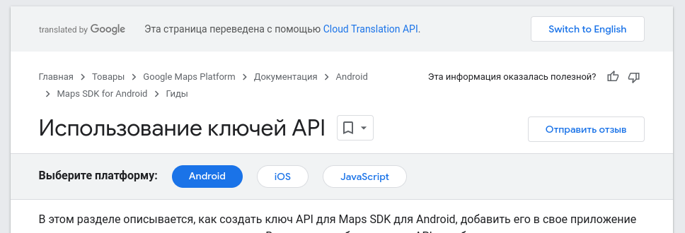

    Пролистываем ниже и кликаем по кнопке "Перейти на страницу учётных данных" (тут, скорее всего, предложит авторизоваться с гугл-аккаунтом)

    

    В открывшемся окне жмёте "CREATE PROJECT" (создать проект)

    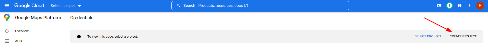

    Задаёте имя проекта (организацию можно не заполнять) и жмёте CREATE

    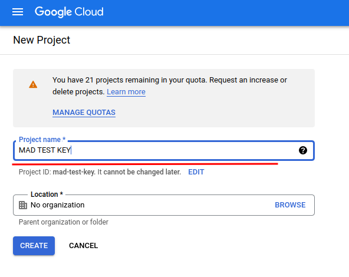

    После создания проекта автоматически откроется страница проекта, на которой надо кликнуть "CREATE CREDENTIALS" и в выпадающем списке выбрать "API key". После создания ключ отобразится во всплывающем окне, но его всегда можно посмотреть позже

    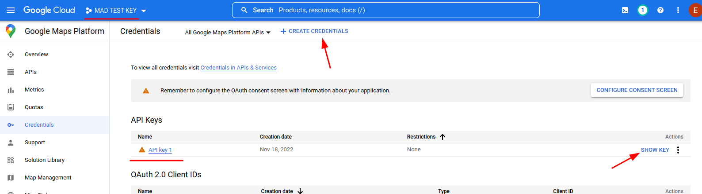


    Копируем ключ и возвращаемся в Android Studio (сайт с ключом пока не закрывайте). В файл `local.properties` вписываем этот ключ

    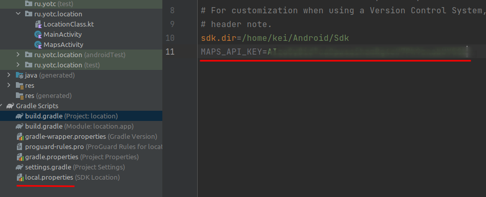

    И в файле манифеста вписываем ссылку на него

    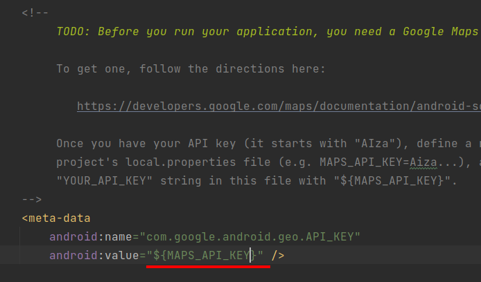

    >Вставлю пару слов про файл `local.properties`. Как понятно из названия, в нём хранятся локальные настройки. В частности в нём прописан путь к SDK. Этот файл **нельзя** включать в репозиторий, т.к. во-первых, путь к SDK на другой машине может отличаться, а во-вторых, в нём могут храниться секретные данные (как в случае с ключом гугла)

    После создания ключа нужно его активировать. Возвращаеися в Google Cloud,  переходим в меню "Enabled APIs & services" и кликаем "ENABLE APIS AND SERVICES"

    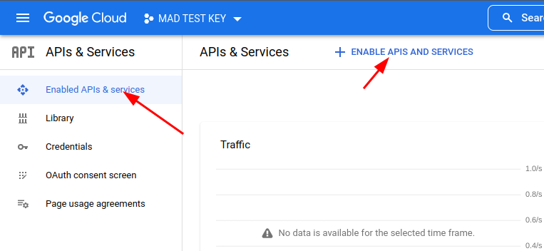

    Сервисов у гугла много - выбираем нужный

    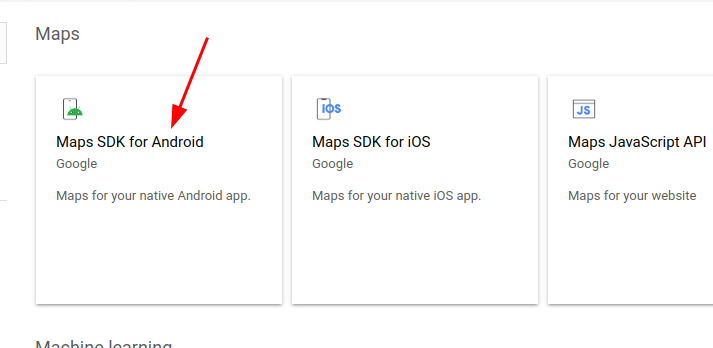

    Активируем ключ

    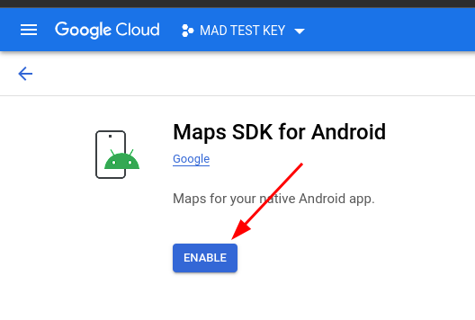

    После активации гугл скажет, что у нас не настроен биллинг, но тестовой работе это пока не мешает.

    На этом этапе приложение должно запускаться и показывать карту австралии (мы пока никак не настраивали карту в приложении)

1. Получение координат

    Геолокацию мы уже делали в приложении "Погода". Но я завернул всю ту кашу в отдельный [LocationClass](../data/LocationClass.kt). В шапке файла написано как его подключить, но напишу ещё раз:

    ```kt
    private lateinit var locationClass: LocationClass

    ...

    locationClass = LocationClass(this){lat, lon ->
        // при успешной геолокации переходим на активность карты
        if(lat != null && lon != null) {
            val mapIntent = Intent(this, MapsActivity::class.java)
            mapIntent.putExtra("lat", lat)
            mapIntent.putExtra("lon", lon)
            startActivity(mapIntent)
        }
    }

    ...

    // как перенаправить ответ на запрос разрешений 
    // в свой класс я не нашёл, поэтому нужна эта обёртка
    override fun onRequestPermissionsResult(
        requestCode: Int, 
        permissions: Array<String>,
        grantResults: IntArray
    ) {
        super.onRequestPermissionsResult(
            requestCode, permissions, grantResults)

        // пробрасываем событие в locationClass
        locationClass.onRequestPermissionsResult(
            requestCode, grantResults)
    }
    ```

1. Правим карту

    По-умолчанию карта показывает координаты Сиднея с очень большим масштабом, нам для каршеринга это, естественно не подходит. Поэтому мы первым делом извлекаем координаты, полученные при геолокации (либо из класса приложения, либо из extra параметров интента). Затем правим метод *onMapReady* (этот метод вызывается когда карта проинициализирована и готова к работе). В этом методе обычно и добавляются маркеры геолокации и других объектов.

    ```kt
    // по-умолчанию заданы координаты колледжа
    private var lat: Double = 56.639439
    private var lon: Double = 47.892384

    ...

    // в конструкторе читаем реальные значения
    lat = intent.getDoubleExtra("lat", lat)
    lon = intent.getDoubleExtra("lon", lon)

    ...

    override fun onMapReady(googleMap: GoogleMap) {
        mMap = googleMap

        // здесь lat, lon - координаты полученные при геолокации
        val sydney = LatLng(lat, lon)

        // тут я убрал текст маркера
        mMap.addMarker(
            MarkerOptions().position(sydney))

        // и для камеры использую другой метод, который задаёт не только координаты, но и зум (масштаб карты)
        mMap.moveCamera(
            CameraUpdateFactory
                .newLatLngZoom(sydney, 16f))
    }
    ```

1. Отображение маркеров автомобилей на карте

    Основано на [этой](https://startandroid.ru/ru/uroki/vse-uroki-spiskom/307-urok-140-google-maps-svoi-obekty-na-karte.html) статье


    >Получение списка автомобилей я не расписываю, тут ничего нового. Единственно - их запрашивать имеет смысл не в конструторе, а в методе *onMapReady* (т.к. карта может и не открыться)

    При получении списка автомобилей из АПИ добавляем их на карту (иконку автомобиля надо положить в `res/drawable`):

    ```kt
    runOnUiThread {
        for (i in 0 until jsonArray.length()) {
            val item = jsonArray.getJSONObject(i)
            val coord = LatLng(
                item.getDouble("lat"),
                item.getDouble("lon")
            )

            val marker = MarkerOptions()
                .position(coord)
                .title(item.getString("model"))
                .icon(BitmapDescriptorFactory
                    .fromResource(R.drawable.car2))

            mMap.addMarker(marker)
        }
    }
    ```

    Должно получиться что-то подобное:

    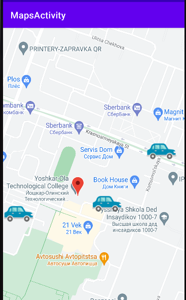

1. Вывод подробной информации об автомобиле во всплывающем окне

    По умолчанию, при клике на маркер, отображается текст, заданный методом *title*

    Намного интереснее поместить туда фото автомобиля, модель, запас хода...

    * Для начала нам нужно сохранить информацию об автомобилях (и экземпляре маркера), создадим класс:

        ```kt
        data class Car(
            val model: String,
            val photoUrl: String?,
            var marker: Marker? = null,
            var photoDownloaded: Boolean = false
        )
        ```

        Про свойство *photoDownloaded* расскажу позже, а вы самостоятельно добавьте недостающие свойства.

        В классе окна с картой объявите список:

        ```kt
        private var carList = arrayListOf<Car>()
        ```

        При разборе ответа сервера создайте экземпляр класса **Car**, на его основе создайте маркер для карты и сохраните маркер в объекте *car*:

        ```kt
        // этот блок выполняется в цикле разбора массива автомобилей
        val car = Car(
            item.getString("model"),
            if(item.has("photo")) 
                "http://carsharing.kolei.ru/images/${item.getString("photo")}" 
            else null
        )

        val marker = MarkerOptions()
            .position(coord)
            .icon(
                BitmapDescriptorFactory
                    .fromResource(R.drawable.car2))

        car.marker = marker
        mMap.addMarker(marker)
        carList.add(car)
        ```

    * Теперь мы готовы рисовать кастомный попап:

        Окно с информацией у гуглокарт называеся **InfoWindow** и карта позволяет задать адаптер, который и будет заниматься отрисовкой этого окна:

        ```kt
        mMap.setInfoWindowAdapter(
            CustomInfoWindowAdapter(
                this,
                carList))
        ```

        При отрисовке информационного окна как обычно используется отдельный файл разметки, у меня он называется `marker_popup.xml`. В корне я поместил элемент **CardView**, чтобы можно было сделать скруглённые углы, внутри него горизонтальный **LinearLayout**, в котором расположены фото автомобиля и название модели (остальную информацию добавьте самостоятельно):

        ```xml
        <?xml version="1.0" encoding="utf-8"?>
        <androidx.cardview.widget.CardView
            xmlns:android="http://schemas.android.com/apk/res/android"
            xmlns:app="http://schemas.android.com/apk/res-auto"
            android:layout_width="200dp"
            android:background="@color/white"
            android:layout_height="100dp"
            app:cardUseCompatPadding="true"
            app:cardElevation="5dp"
            app:cardCornerRadius="16dp">
            <LinearLayout
                android:layout_width="match_parent"
                android:layout_height="match_parent"
                android:orientation="horizontal"
                >
                <ImageView
                    android:id="@+id/photoImageView"
                    android:layout_width="100dp"
                    android:layout_height="100dp"
                    android:adjustViewBounds="true"
                    android:scaleType="centerInside"
                    />
                <TextView
                    android:id="@+id/modelTextView"
                    android:padding="10dp"
                    android:textStyle="bold"
                    android:layout_width="wrap_content"
                    android:layout_height="wrap_content"
                    android:layout_gravity="center_horizontal"
                    android:text="Модель автомобиля"
                    />
            </LinearLayout>
        </androidx.cardview.widget.CardView>
        ```

        **CustomInfoWindowAdapter** - класс, который мы пишем самостоятельно, поэтому параметры мы ему передаём какие хотим, нам нужны указатель на активность и список автомобилей.

        **InfoWindow** выводит не рабочие компоненты, а практически только скриншот окна, поэтому при изменении данных мы должны окно перерисовать (а фото у нас загружается асинхронно). 

        Я несколько лет назад, когда в первый раз делал эту лекцию, для загрузки картинок взял библиотеку **Picasso** (`implementation 'com.squareup.picasso:picasso:2.71828'`), пока её и оставил. 
        
        >Хотя сейчас уже можно обойтись без неё: битмап можно хранить в классе **Car** и вызывать перерисовку окна при получении фотографии...

        Рассмотрим реализацию этого адаптера:

        ```kt
        // класс должен реализовывать интерфейс GoogleMap.InfoWindowAdapter
        class CustomInfoWindowAdapter(
            val mContext: Context, 
            val carList: ArrayList<Car>) : GoogleMap.InfoWindowAdapter
        {
            // получаем указатель на файл разметки marker_popup
            var mWindow: View = LayoutInflater
                .from(mContext)
                .inflate(R.layout.marker_popup, null)

            // получаем указатели на фото и текст
            val modelTextView = mWindow.findViewById<TextView>(R.id.modelTextView)
            val photoImageView = mWindow.findViewById<ImageView>(R.id.photoImageView)

            // этот и следующий за ним метод мы обязаны реализовать, наследуя интерфейс
            // оба метода возвращают заполненное данными текущего маркера окно
            override fun getInfoContents(p0: Marker): View? {
                setInfoWindowText(p0)
                return mWindow
            }

            override fun getInfoWindow(p0: Marker): View? {
                setInfoWindowText(p0)
                return mWindow
            }

            // собственно метод, который заполняет содержимое окна
            private fun setInfoWindowText(marker: Marker) {
                modelTextView.text = marker.title

                // в списке автомобилей ищем тот, у которого текущий маркер
                val car = carList.find{car -> car.marker == marker}
                if(car != null) {
                    // вот тут уже всплывает свойство photoDownloaded
                    // если картинка уже загружена, то мы получаем её из кеша
                    if (car.photoDownloaded)
                        Picasso.get().load(car.photoUrl).into(photoImageView)
                    else
                        // если картинка ещё не загружалась, то указываем класс InfoWindowRefresher,
                        // который сработает после загрузки
                        Picasso.get().load(car.photoUrl).into(
                            photoImageView,
                            InfoWindowRefresher(car)
                        )
                }
            }

            internal inner class InfoWindowRefresher(private val car: Car) : Callback {
                override fun onError(e: Exception?) {}

                // по готовности ресурса перерисовываем информационное окно маркера
                override fun onSuccess() {
                    car.photoDownloaded = true
                    car.marker?.showInfoWindow()
                }
            }
        }
        ```
        
        Получается что-то такое:

        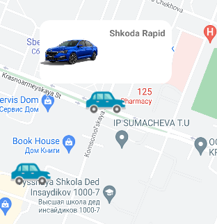
