# Проект "Каршеринг" (часть IV)

## Работа с гугл-картой. Добавление на карту маркеров.

>Это устаревший вариант и дальше поддерживаться не будет

Основано на этих статьях: 
* [Шаблон Google Maps Activity](http://developer.alexanderklimov.ru/android/google_maps.php) 
* [Google maps. Создание и настройка проекта. Карта, камера, события](https://startandroid.ru/ru/uroki/vse-uroki-spiskom/306-urok-139-google-maps-sozdanie-i-nastrojka-proekta-karta-kamera-sobytija.html) 
* [Introduction to Google Maps API for Android with Kotlin](https://www.raywenderlich.com/230-introduction-to-google-maps-api-for-android-with-kotlin)

1. Добавляем в приложение новую активность с шаблоном "Google Maps Activity" (в контекстном меню пакета: `New -> Google -> Google Maps Activity`)

    После создания активности откроется манифест, где написаны дальнейшие инструкции:

    ```xml
    <!--
        TODO: Before you run your application, you need a Google Maps API key.

        To get one, follow the directions here:

        https://developers.google.com/maps/documentation/android-sdk/get-api-key

        Once you have your API key (it starts with "AIza"), define a new property in your
        project's local.properties file (e.g. MAPS_API_KEY=Aiza...), and replace the
        "YOUR_API_KEY" string in this file with "${MAPS_API_KEY}".
    -->
    ```

    Тут написано, что прежде чем запускать приложение, нужно перейти по ссылке и получить `Google Maps API key`.

    Полученный ключ вписать в настройки проекта. Пройдёмся пошагово по этому процессу:

    Первым делом предлагают выбрать платформу, у нас, естественно, Android:

    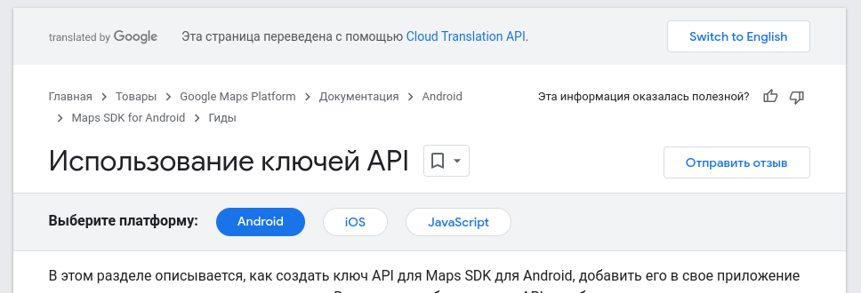

    Пролистываем ниже и кликаем по кнопке "Перейти на страницу учётных данных" (тут, скорее всего, предложит авторизоваться с гугл-аккаунтом)

    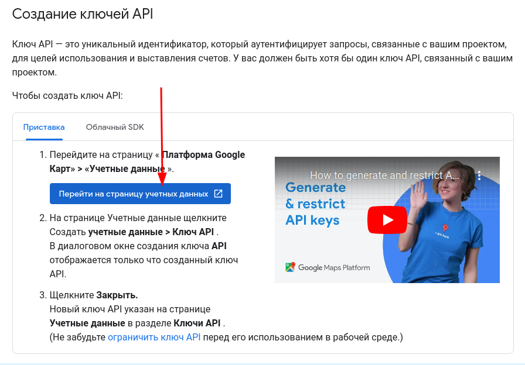

    В открывшемся окне жмёте "CREATE PROJECT" (создать проект)

    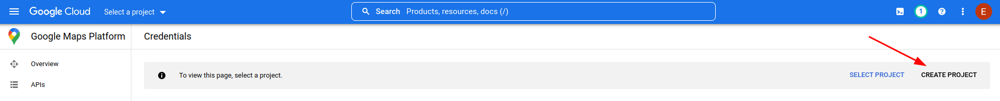

    Задаёте имя проекта (организацию можно не заполнять) и жмёте CREATE

    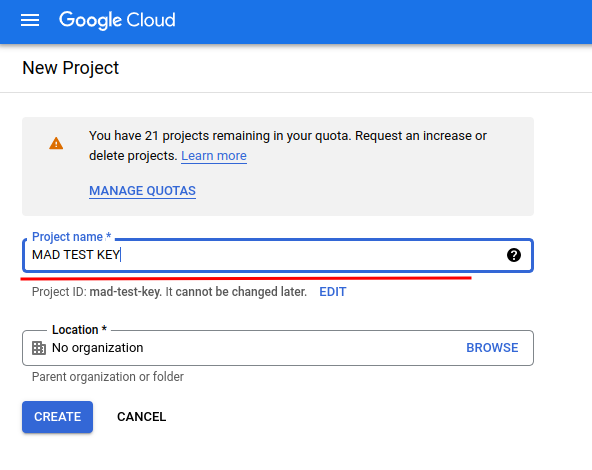

    После создания проекта автоматически откроется страница проекта, на которой надо кликнуть "CREATE CREDENTIALS" и в выпадающем списке выбрать "API key". После создания ключ отобразится во всплывающем окне, но его всегда можно посмотреть позже

    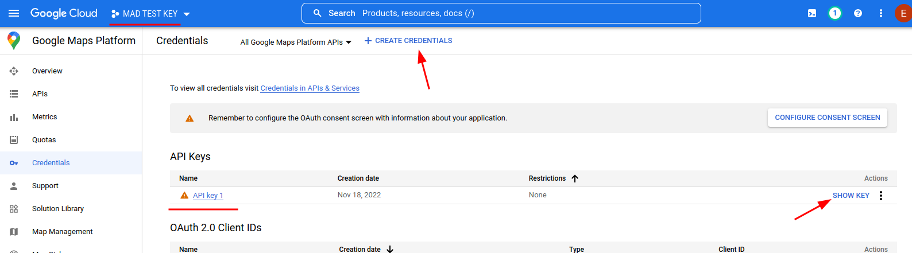


    Копируем ключ и возвращаемся в Android Studio (сайт с ключом пока не закрывайте). В файл `local.properties` вписываем этот ключ

    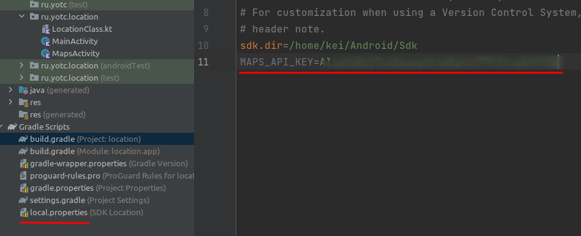

    И в файле манифеста вписываем ссылку на него

    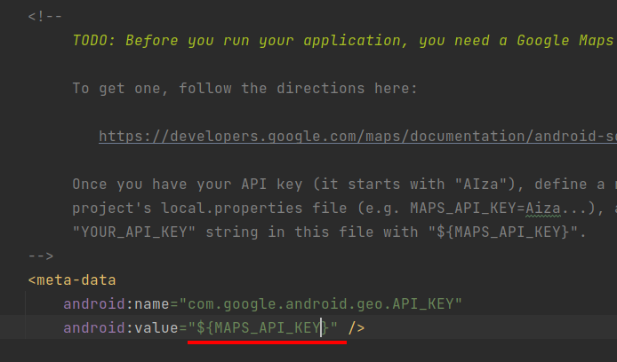

    >Вставлю пару слов про файл `local.properties`. Как понятно из названия, в нём хранятся локальные настройки. В частности в нём прописан путь к SDK. Этот файл **нельзя** включать в репозиторий, т.к. во-первых, путь к SDK на другой машине может отличаться, а во-вторых, в нём могут храниться секретные данные (как в случае с ключом гугла)

    После создания ключа нужно его активировать. Возвращаеися в Google Cloud,  переходим в меню "Enabled APIs & services" и кликаем "ENABLE APIS AND SERVICES"

    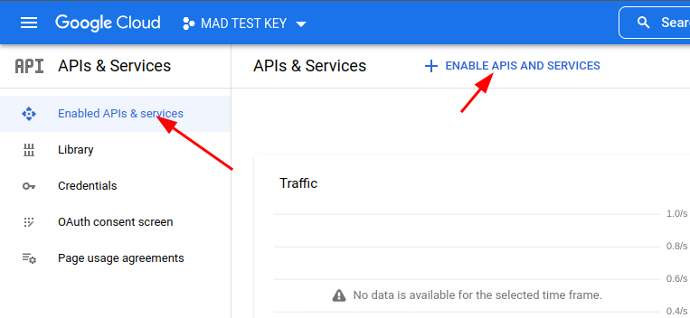

    Сервисов у гугла много - выбираем нужный

    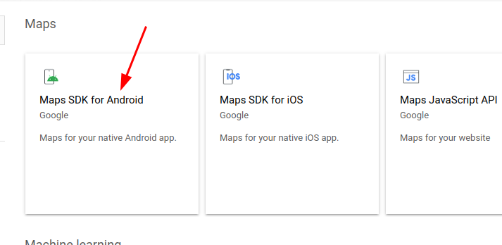

    Активируем ключ

    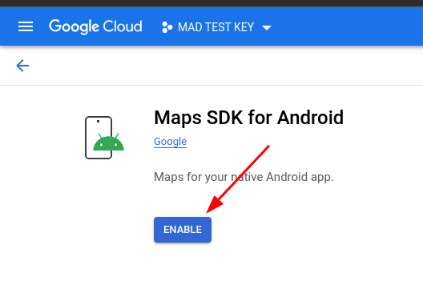

    После активации гугл скажет, что у нас не настроен биллинг, но тестовой работе это пока не мешает.

    На этом этапе приложение должно запускаться и показывать карту австралии (мы пока никак не настраивали карту в приложении)

1. Получение координат

    Геолокацию мы уже делали в приложении "Погода". Но я завернул всю ту кашу в отдельный [LocationClass](../data/LocationClass.kt). В шапке файла написано как его подключить, но напишу ещё раз:

    ```kt
    private lateinit var locationClass: LocationClass

    ...

    locationClass = LocationClass(this){lat, lon ->
        // при успешной геолокации переходим на активность карты
        if(lat != null && lon != null) {
            val mapIntent = Intent(this, MapsActivity::class.java)
            mapIntent.putExtra("lat", lat)
            mapIntent.putExtra("lon", lon)
            startActivity(mapIntent)
        }
    }

    ...

    // как перенаправить ответ на запрос разрешений 
    // в свой класс я не нашёл, поэтому нужна эта обёртка
    override fun onRequestPermissionsResult(
        requestCode: Int, 
        permissions: Array<String>,
        grantResults: IntArray
    ) {
        super.onRequestPermissionsResult(
            requestCode, permissions, grantResults)

        // пробрасываем событие в locationClass
        locationClass.onRequestPermissionsResult(
            requestCode, grantResults)
    }
    ```

1. Правим карту

    По-умолчанию карта показывает координаты Сиднея с очень большим масштабом, нам для каршеринга это, естественно не подходит. Поэтому мы первым делом извлекаем координаты, полученные при геолокации (либо из класса приложения, либо из extra параметров интента). Затем правим метод *onMapReady* (этот метод вызывается когда карта проинициализирована и готова к работе). В этом методе обычно и добавляются маркеры геолокации и других объектов.

    ```kt
    // по-умолчанию заданы координаты колледжа
    private var lat: Double = 56.639439
    private var lon: Double = 47.892384

    ...

    // в конструкторе читаем реальные значения
    lat = intent.getDoubleExtra("lat", lat)
    lon = intent.getDoubleExtra("lon", lon)

    ...

    override fun onMapReady(googleMap: GoogleMap) {
        mMap = googleMap

        // здесь lat, lon - координаты полученные при геолокации
        val sydney = LatLng(lat, lon)

        // тут я убрал текст маркера
        mMap.addMarker(
            MarkerOptions().position(sydney))

        // и для камеры использую другой метод, который задаёт не только координаты, но и зум (масштаб карты)
        mMap.moveCamera(
            CameraUpdateFactory
                .newLatLngZoom(sydney, 16f))
    }
    ```

1. Отображение маркеров автомобилей на карте

    Основано на [этой](https://startandroid.ru/ru/uroki/vse-uroki-spiskom/307-urok-140-google-maps-svoi-obekty-na-karte.html) статье


    >Получение списка автомобилей я не расписываю, тут ничего нового. Единственно - их запрашивать имеет смысл не в конструкторе, а в методе *onMapReady* (т.к. карта может и не открыться)

    При получении списка автомобилей из АПИ добавляем их на карту (иконку автомобиля надо положить в `res/drawable`):

    ```kt
    runOnUiThread {
        for (i in 0 until jsonArray.length()) {
            val item = jsonArray.getJSONObject(i)
            val coord = LatLng(
                item.getDouble("lat"),
                item.getDouble("lon")
            )

            val marker = MarkerOptions()
                .position(coord)
                .title(item.getString("model"))
                .icon(BitmapDescriptorFactory
                    .fromResource(R.drawable.car2))

            mMap.addMarker(marker)
        }
    }
    ```

    Должно получиться что-то подобное:

    

1. Вывод подробной информации об автомобиле во всплывающем окне

    По умолчанию, при клике на маркер, отображается текст, заданный методом *title*

    Намного интереснее поместить туда фото автомобиля, модель, запас хода...

    * Для начала нам нужно сохранить информацию об автомобилях (и экземпляре маркера), создадим класс:

        ```kt
        data class Car(
            val model: String,
            val photoUrl: String?,
            var marker: Marker? = null,
            var photoDownloaded: Boolean = false
        )
        ```

        Про свойство *photoDownloaded* расскажу позже, а вы самостоятельно добавьте недостающие свойства.

        В классе окна с картой объявите список:

        ```kt
        private var carList = arrayListOf<Car>()
        ```

        При разборе ответа сервера создайте экземпляр класса **Car**, на его основе создайте маркер для карты и сохраните маркер в объекте *car*:

        ```kt
        // этот блок выполняется в цикле разбора массива автомобилей
        val car = Car(
            item.getString("model"),
            if(item.has("photo")) 
                "http://carsharing.kolei.ru/images/${item.getString("photo")}" 
            else null
        )

        val marker = MarkerOptions()
            .position(coord)
            .icon(
                BitmapDescriptorFactory
                    .fromResource(R.drawable.car2))

        car.marker = marker
        mMap.addMarker(marker)
        carList.add(car)
        ```

    * Теперь мы готовы рисовать кастомный попап:

        Окно с информацией у гуглокарт называеся **InfoWindow** и карта позволяет задать адаптер, который и будет заниматься отрисовкой этого окна:

        ```kt
        mMap.setInfoWindowAdapter(
            CustomInfoWindowAdapter(
                this,
                carList))
        ```

        При отрисовке информационного окна как обычно используется отдельный файл разметки, у меня он называется `marker_popup.xml`. В корне я поместил элемент **CardView**, чтобы можно было сделать скруглённые углы, внутри него горизонтальный **LinearLayout**, в котором расположены фото автомобиля и название модели (остальную информацию добавьте самостоятельно):

        ```xml
        <?xml version="1.0" encoding="utf-8"?>
        <androidx.cardview.widget.CardView
            xmlns:android="http://schemas.android.com/apk/res/android"
            xmlns:app="http://schemas.android.com/apk/res-auto"
            android:layout_width="200dp"
            android:background="@color/white"
            android:layout_height="100dp"
            app:cardUseCompatPadding="true"
            app:cardElevation="5dp"
            app:cardCornerRadius="16dp">
            <LinearLayout
                android:layout_width="match_parent"
                android:layout_height="match_parent"
                android:orientation="horizontal"
                >
                <ImageView
                    android:id="@+id/photoImageView"
                    android:layout_width="100dp"
                    android:layout_height="100dp"
                    android:adjustViewBounds="true"
                    android:scaleType="centerInside"
                    />
                <TextView
                    android:id="@+id/modelTextView"
                    android:padding="10dp"
                    android:textStyle="bold"
                    android:layout_width="wrap_content"
                    android:layout_height="wrap_content"
                    android:layout_gravity="center_horizontal"
                    android:text="Модель автомобиля"
                    />
            </LinearLayout>
        </androidx.cardview.widget.CardView>
        ```

        **CustomInfoWindowAdapter** - класс, который мы пишем самостоятельно, поэтому параметры мы ему передаём какие хотим, нам нужны указатель на активность и список автомобилей.

        **InfoWindow** выводит не рабочие компоненты, а практически только скриншот окна, поэтому при изменении данных мы должны окно перерисовать (а фото у нас загружается асинхронно). 

        Я несколько лет назад, когда в первый раз делал эту лекцию, для загрузки картинок взял библиотеку **Picasso** (`implementation 'com.squareup.picasso:picasso:2.71828'`), пока её и оставил. 
        
        >Хотя сейчас уже можно обойтись без неё: битмап можно хранить в классе **Car** и вызывать перерисовку окна при получении фотографии...

        Рассмотрим реализацию этого адаптера:

        ```kt
        // класс должен реализовывать интерфейс GoogleMap.InfoWindowAdapter
        class CustomInfoWindowAdapter(
            mContext: Context, 
            private val carList: ArrayList<Car>) : GoogleMap.InfoWindowAdapter
        {
            // получаем указатель на файл разметки marker_popup
            var mWindow: View = LayoutInflater
                .from(mContext)
                .inflate(R.layout.marker_popup, null)

            // получаем указатели на фото и текст
            val modelTextView = mWindow.findViewById<TextView>(R.id.modelTextView)
            val photoImageView = mWindow.findViewById<ImageView>(R.id.photoImageView)

            // этот и следующий за ним метод мы обязаны реализовать, наследуя интерфейс
            // оба метода возвращают заполненное данными текущего маркера окно
            override fun getInfoContents(p0: Marker): View? {
                setInfoWindowText(p0)
                return mWindow
            }

            override fun getInfoWindow(p0: Marker): View? {
                setInfoWindowText(p0)
                return mWindow
            }

            // собственно метод, который заполняет содержимое окна
            private fun setInfoWindowText(marker: Marker) {
                modelTextView.text = marker.title

                // в списке автомобилей ищем тот, у которого текущий маркер
                val car = carList.find{car -> car.marker == marker}
                if(car != null) {
                    // вот тут уже всплывает свойство photoDownloaded
                    // если картинка уже загружена, то мы получаем её из кеша
                    if (car.photoDownloaded)
                        Picasso.get().load(car.photoUrl).into(photoImageView)
                    else
                        // если картинка ещё не загружалась, то указываем класс InfoWindowRefresher,
                        // который сработает после загрузки
                        Picasso.get().load(car.photoUrl).into(
                            photoImageView,
                            InfoWindowRefresher(car)
                        )
                }
            }

            internal inner class InfoWindowRefresher(private val car: Car) : Callback {
                override fun onError(e: Exception?) {}

                // по готовности ресурса перерисовываем информационное окно маркера
                override fun onSuccess() {
                    car.photoDownloaded = true
                    car.marker?.showInfoWindow()
                }
            }
        }
        ```
        
        Получается что-то такое:

        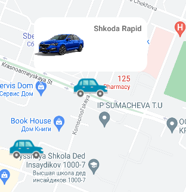
