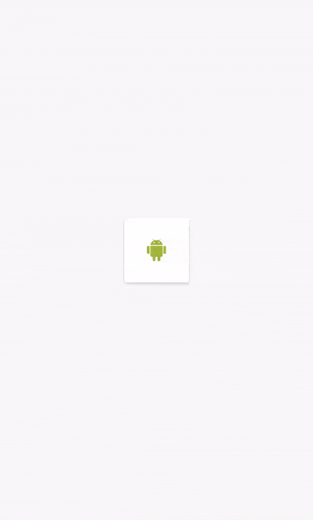

# Анимация (Часть II)

[Анимации в Android по полочкам (Часть 2. Комплексные анимации)](https://habr.com/ru/post/348336/)

Приведённые в предыдущей части инструменты были относительно низкоуровневыми и в Android есть куда более простые способы добиться красивых анимаций не прибегая к прямому рисованию графики или изменению свойств объектов.

В этой части мы рассмотрим как можно минимумом усилий получить красивые анимации.

## [Анимация изменений лэйаута (aka animateLayoutChanges)](https://developer.android.com/develop/ui/views/animations/layout)


Всё, что нам нужно сделать, чтобы добиться анимации как на гифке выше — это добавить флаг *animateLayoutChanges* в наш **ViewGroup** в xml. Теперь, когда мы удаляем или добавляем элемент в наш контейнер, либо изменяем его свойства, они автоматически будут анимированы.

```xml
<AnyViewGroup
    ...
    android:animateLayoutChanges="true">
```

Ладно, я немного слукавил когда говорил, что чтобы получить анимацию как на гифке выше, нужно всего лишь установить флаг. Добавление animateLayoutChanges на самом деле устанавливает LayoutTransition нашей ViewGroup. Но LayoutTransition по умолчанию анимирует только изменение видимости объектов в лэйауте. Поэтому если мы хотим изменять свойства объекта (например ширину и высоту) нужно включить эту опцию отдельно:

```kt
val layoutTransition = viewGroup.layoutTransition
layoutTransition.enableTransitionType(LayoutTransition.CHANGING)
```

Теперь точно всё. Если захочется как-то кастомизировать это поведение, то у LayoutTransition есть метод setAnimator позволяющий задать свою собственную анимацию изменений. Ну самые хардкорные ребята всегда могут написать свой LayoutTransition.

* Применение:

    Базовая анимация изменений объектов на сцене.

* Достоинства:

    Минимальные трудозатраты

* Недостатки:

    Слабая кастомизация

## [Transitions framework](https://developer.android.com/develop/ui/views/animations/transitions)



Начиная с API 19 в Android появился новый фреймворк позволяющий создавать сложные анимации с участием большого количества элементов и минимумом кода.

Есть два основных варианта его использования:

1. Использование TransitionManager.beginDelayedTransition(ViewGroup)

    Чтобы создать анимацию необходимо перед внесением изменений в наши View вызвать TransitionManager.beginDelayedTransition(ViewGroup) и передать в него ViewGroup, который мы хотим анимировать. Фрэймворк запомнит состояние View и запустит анимацию на следующем кадре.

    ```kt
    TransitionManager.beginDelayedTransition(viewGroup)
    ```

2. Создание сцен

    Создание анимации в этом случае сводится к созданию двух похожих xml, отвечающих за начальное и конечное состояние ваших анимаций. Соответственно, id объектов в xml должны совпадать, чтобы дать фреймворку возможность найти соответствие (На самом деле beginDelayedTransition тоже создаёт сцены, одну в момент вызова, а вторую на следующем кадре. После чего запускает анимацию между ними).

    ```kt
    var sceneA = Scene.getSceneForLayout(viewGroup, R.layout.scene_a, context)
    var sceneB = Scene.getSceneForLayout(viewGroup, R.layout.scene_b, context)
    private fun expand() {
        TransitionManager.go(sceneB)
    }
    private fun collapse() {
        TransitionManager.go(sceneA)
    }
    ```

Кастомизация в Transitions framework достигается за счёт передачи объекта Transition вторым параметром. По умолчанию используется AutoTransition(), так что код ниже будет работать абсолютно так-же, как и код выше.

```kt
TransitionManager.go(sceneA, AutoTransition())
```

или

```kt
TransitionManager.beginDelayedTransition(viewGroup, AutoTransition())
```

И если заглянуть внутрь AutoTransition можно заметить что анимации будут происходить в последовательно в следующем порядке:

- анимируются исчезающие объекты
- анимируются изменения размеров
- анимируются появляющиеся объекты

```kt
setOrdering(ORDERING_SEQUENTIAL);
addTransition(new Fade(Fade.OUT)).
addTransition(new ChangeBounds()).
addTransition(new Fade(Fade.IN));
```

* Применение:

    Анимация большого количества объектов

* Достоинства:

    Минимальные трудозатраты

    Доступная кастомизация

Все примеры можно [посмотреть и изучить здесь](https://github.com/JuzTosS/AnimationsDemo)
