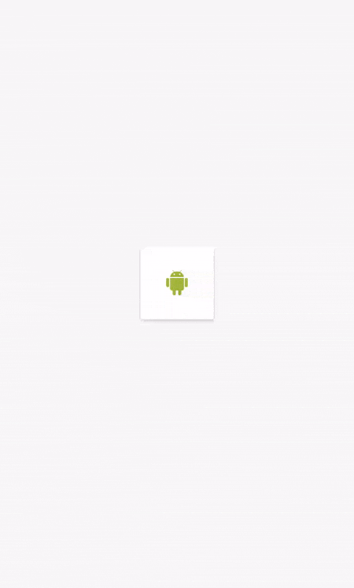

# Анимация (Часть III)


[Анимации в Android по полочкам (Часть 3. «Низкоуровневые» анимации)](https://habr.com/ru/post/348664/)

Все методы рассмотренные в предыдущих частях хороши и удобны, однако если нам нужно анимировать большое количество объектов, они могут оказаться не подходящими. В данной части мы рассмотрим способы которые нам позволят работать с действительно большим количеством объектов и создавать программно сложные анимации.

## [Рисование на канвасе View](https://developer.android.com/develop/ui/views/graphics/drawables)



Первый способ который мы рассмотрим это рисование в методе onDraw нашего объекта View. Реализуется данный способ просто, достаточно переопределить onDraw и в конце вызвать postInvalidateOnAnimation().

В данном примере наш drawable будет перемещаться по оси x.

```kt
override fun onDraw(canvas: Canvas) {
    super.onDraw(canvas)
    x += resources.getDimension(R.dimen.speed)
    drawable.setBounds(x, y, x + size, y + size)
    drawable.draw(canvas)
    postInvalidateOnAnimation()
}
```

Пример со снежинками выше будет занимать несколько больше кода, т.к. нам нужно хранить состояние каждой отдельной снежинки отдельно.

<details>

<summary>Покажите мне код!</summary>

```kt
class SnowAnimation : View {
    ...
    private lateinit var snowflakes: Array<Snowflake>

    override fun onLayout(changed: Boolean, left: Int, top: Int, right: Int, bottom: Int) {
        snowflakes = Array(10, {
            Snowflake(right - left, bottom - top,
                    context.getDrawable(R.drawable.snowflake),
                    resources.getDimension(R.dimen.max_snowflake_size),
                    resources.getDimension(R.dimen.max_snowflake_speed))
        })
    }

    override fun onDraw(canvas: Canvas) {
        super.onDraw(canvas)
        snowflakes.forEach {
            it.update()
            it.draw(canvas)
        }
        postInvalidateOnAnimation()
    }
}
```

```kt
internal class Snowflake(private val containerWidth: Int,
                         private val containerHeight: Int,
                         private val drawable: Drawable,
                         private val maxSize: Float,
                         private val maxSpeed: Float) {

    private var size: Double = 0.0
    private var speed: Double = 0.0
    private var x: Double = 0.0
    private var y: Double = 0.0

    init {
        reset()
    }

    private fun reset() {
        size = Math.random() * maxSize / 2 + maxSize / 2
        speed = Math.random() * maxSpeed / 2 + maxSpeed / 2
        y = -size;
        x = Math.random() * containerWidth
    }

    fun update() {
        y += speed
        if (y > containerHeight) {
            reset()
        }
    }

    fun draw(canvas: Canvas?) {
        if (canvas == null) {
            return
        }
        drawable.setBounds(x.toInt(), y.toInt(), (x + size).toInt(), (y + size).toInt())
        drawable.draw(canvas)
    }
}
```

</details>

Применение:

* Случаи в которых легче нарисовать анимацию программно

Достоинства:

* Можно создавать анимации зависящие абсолютно от любых параметров
* Нет лишних затрат на объекты View

Недостатки:

* Расчёты анимации и отрисовка происходят в UI thread

## [Рисование на канвасе SurfaceView](https://developer.android.com/develop/ui/views/graphics/drawables)

Что если расчёт следующего шага анимации будет занимать значительное время? Мы всё ещё можем воспользоваться первым способом и вынести расчёты в отдельный поток. Но это всё равно не приведёт к 100% плавности в анимации т.к. UI thread может быть загружен ещё чем либо помимо нашей анимации.

Android позволяет отвязаться от основного цикла(main loop) отрисовки с помощью компонента SurfaceView. А раз мы больше не привязаны к основному циклу, то нам придётся держать свой поток для расчётов и отрисовки. SurfaceView предоставляет коллбэки в которых мы можем запустить и остановить наш поток. В потоке по окончанию расчётов мы будем отрисовывать нашу анимацию.

Реализация той же анимации снежинок будет выглядеть следующим образом:

<details>

<summary>Покажите мне код!</summary>

```kt
class MySurfaceView : SurfaceView, SurfaceHolder.Callback {
    ...
    private lateinit var drawThread: DrawThread;

    init {
        holder.addCallback(this)
    }

    override fun surfaceCreated(holder: SurfaceHolder) {
        //Создаём поток при создании surface
        drawThread = DrawThread(getHolder(), context, measuredWidth, measuredHeight)
        drawThread.start()
    }

    override fun surfaceDestroyed(holder: SurfaceHolder) {
        var retry = true
        //Прерываем поток при уничтожении surface
        drawThread.cancel();
        //Документация требует чтобы к моменту выхода из этой функции к канвасу, гарантированно, не было обращений. По этому мы дожидаемся завершения нашего потока прежде чем выйти из метода.
        while (retry) {
            try {
                drawThread.join()
                retry = false
            } catch (e: InterruptedException) {

            }
        }
    }
}

internal class DrawThread(private val surfaceHolder: SurfaceHolder, context: Context, width: Int, height: Int) : Thread() {
    private var snowflakes: Array<Snowflake>
    private var cancelled: Boolean = false

    init {
        snowflakes = Array(10, {
            Snowflake(width, height,
                    context.getDrawable(R.drawable.snowflake),
                    context.resources.getDimension(R.dimen.max_snowflake_size),
                    context.resources.getDimension(R.dimen.max_snowflake_speed))
        })
    }

    override fun run() {
        while (!cancelled) {
        	//Блокируем canvas на время отрисовки
            var canvas: Canvas? = surfaceHolder.lockCanvas()
            try {
            	//В отличие от onDraw в View канвас приходит уже с предыдущим состоянием, поэтому если мы не хотим следов от предыдущего кадра, нужно очистить всю поверхность.
                canvas?.drawColor(Color.WHITE)
                snowflakes.forEach {
                    it.update()
                    it.draw(canvas)
                }
            } finally {
                if (canvas != null) {
                    //Разблокируем canvas после отрисовки
                    surfaceHolder.unlockCanvasAndPost(canvas)
                }
            }
        }
    }

    fun cancel() {
        cancelled = true
    }
}
```

</details>

Применение:

* Случаи в которых легче нарисовать анимацию программно
* Игры

Достоинства:

* Можно создавать анимации зависящие абсолютно от любых параметров
* Нет лишних затрат на объекты View

Недостатки:

* Сложность реализации

## [OpenGL](https://developer.android.com/develop/ui/views/graphics/opengl)

Точно также, как и на холсте (canvas), мы можем рисовать используя OpenGL API. Если вы задумали что-либо сложнее чем куб на картинке, то стоит посмотреть в сторону какого-либо движка, например libgdx. К сожалению, даже базовый пример займёт здесь довольно много места, поэтому ограничимся только этим кратким превью.

Применение:

* Сложные эффекты
* 3D
* Игры

Достоинства:

* Высокая производительность и управление памятью, шейдеры

Недостатки:

* Сложность реализации

Все примеры можно [посмотреть и изучить здесь](https://github.com/JuzTosS/AnimationsDemo).
