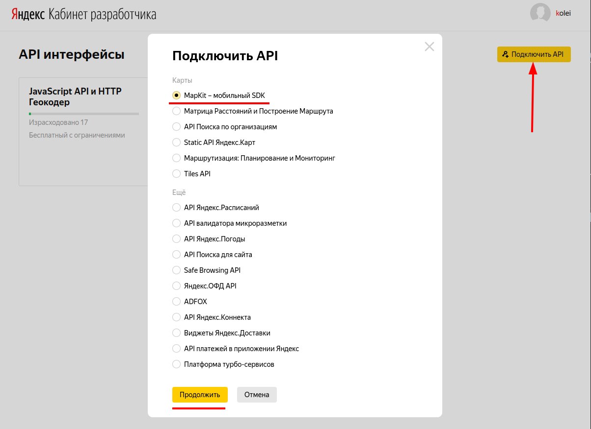
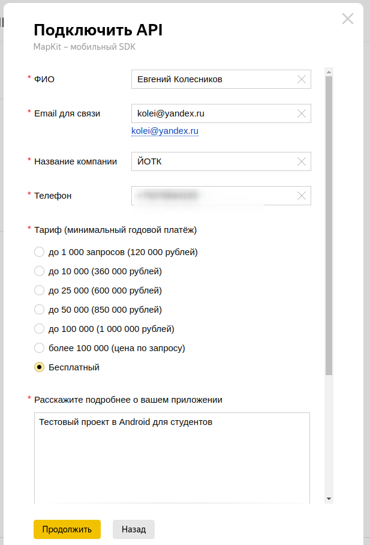
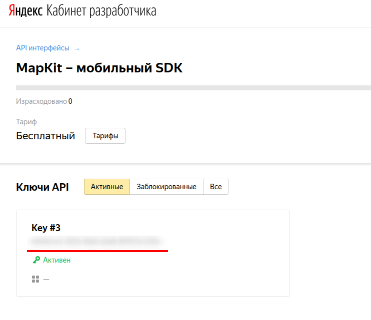

# Яндекс карты

[MapKit](https://yandex.ru/dev/maps/mapkit/doc/intro/concepts/about.html?from=mapkit)

## Начало работы

### Шаг 1. Получите ключ для работы с MapKit

Переходим по [ссылке](https://developer.tech.yandex.ru/services/) (если у вас нет аккаунта yandex, то нужно сделать)

Нажмите "Подключить API" и выберите пакет "MapKit - мобильный SDK".



Заполните форму



В итоге у вас будет ключ



### Шаг 2. Установите библиотеку MapKit

Создайте проект, откройте `build.gradle` **проекта**, В секции `buildscript/repositories` добавьте репозитории **Maven Central** и **Google Maven** (этот блок должен быть ДО секции `plugins`):

```txt
buildscript {
    repositories {
        mavenCentral()
        maven {
            url "https://maven.google.com/"
        }
    }
}
```

Откройте файл `build.gradle` приложения (модуля). В секции *dependencies* добавьте зависимость:

```txt
implementation 'com.yandex.android:maps.mobile:4.2.2-full'
```

### Шаг 3. Настройте библиотеку

